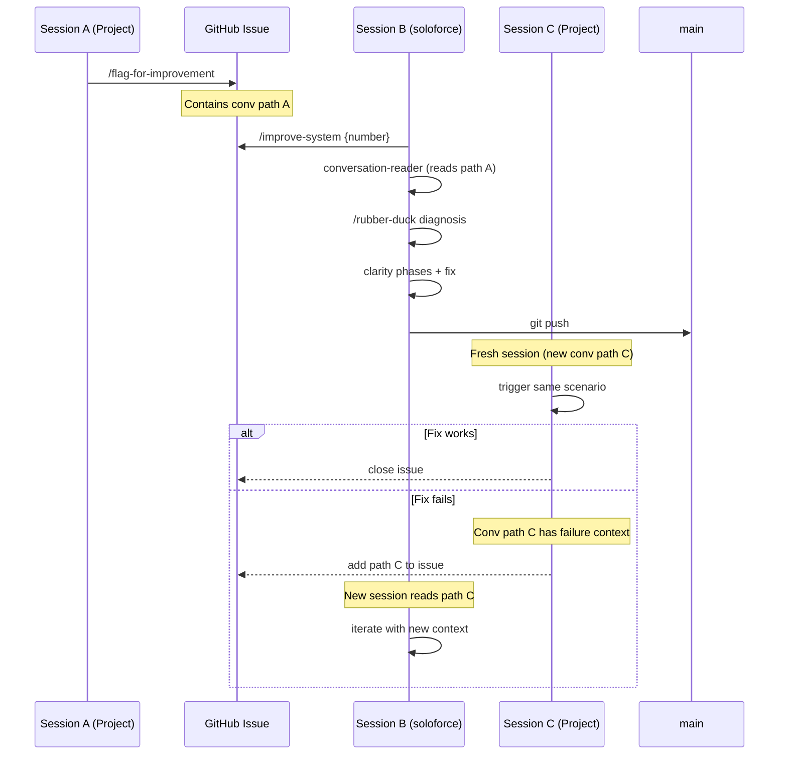

[[claude-code-architecture]]

# /improve-system Architecture

Implementation blueprint for the instruction artifact improvement ecosystem.

## Overview

Two commands orchestrate a multi-session workflow for fixing instruction artifacts (skills, commands, hooks, protocol).

| Command                          | Session       | Purpose                                            |
| -------------------------------- | ------------- | -------------------------------------------------- |
| `/flag-for-improvement`          | A (Project)   | Capture failure: introspect + create issue         |
| `/improve-system [issue_number]` | B (soloforce) | Fix workflow: load context + guide phases + verify |

## Prerequisites

**Critical dependency:** The conversation path must be available for context extraction.

| Component | Location | Purpose |
|-----------|----------|---------|
| SessionStart hook | `~/.claude/settings.json` | Sets `CLAUDE_CONVERSATION_PATH` env var |
| onboarding_bootstrap.py | `~/.claude/lib/` | Reads env var, outputs in session context |

**Hook configuration** (in settings.json):
```json
"SessionStart": [{
  "hooks": [{
    "type": "command",
    "command": "jq -r '.transcript_path' | xargs -I{} sh -c 'echo \"export CLAUDE_CONVERSATION_PATH=\\\"{}\\\"\" >> \"$CLAUDE_ENV_FILE\"'"
  }]
}]
```

Without this hook, conversation-reader cannot extract context from the failing session.

## Session A: Failure Capture

| Step | Action | Notes |
|------|--------|-------|
| 1 | User notices issue | - |
| 2 | `/flag-for-improvement "description"` | - |
| 3 | AI introspects: "Why did I do that?" | Traces reasoning chain |
| 4 | Preview issue before creating | Like deliverable-tracking pattern |
| 5 | Create issue | Includes: conversation path from `~/.claude/projects/` |

**Issue contains:**
- What failed (user description)
- AI reasoning trace (introspection output)
- Suspected artifact (command/skill/protocol/hook)
- Conversation path for later extraction
- Label: `CLAUDE-CODE-IMPROVEMENTS`

## Session B: Diagnosis & Fix

### Issue Selection

| Step | Action | Notes |
|------|--------|-------|
| 1 | `/improve-system {issue_number}` | Pass issue number directly |

No FIFO queue - user knows which issue to work on.

### Context Extraction

| Step | Action | Notes |
|------|--------|-------|
| 2 | `conversation-reader` skill | Extracts conversation from path in issue body |
| 3 | `/rubber-duck` diagnosis | Analyze failure, determine artifact type |

**Artifact types:**
- Command (instruction-based) → fix with /stage
- Skill (reusable workflow) → fix with skill-creator
- Hook (automatic enforcement) → fix via settings.json
- Protocol (core patterns) → fix via CLAUDE.md edit

### Fix Workflow

| Step | Action                    | Notes                                            |
| ---- | ------------------------- | ------------------------------------------------ |
| 4    | `/requirements-clarity`   | WHAT to fix                                      |
| 5    | `/implementation-clarity` | HOW to fix → `manage-artifact` skill discovered  |
| 6    | `/evaluation-clarity`     | Success criteria                                 |
| 7    | Execute fix               | `manage-artifact` skill loads relevant reference |
| 8    | `git push`                | Direct to main (non-code artifacts)              |

### Verification & Iteration

After push, start new project session:
- Use same conversation path from the issue
- Trigger the scenario that originally failed
- Observe: fixed or not?

**If failed:** Start new Session B with updated context. The issue body now contains:
- Original failure + conversation path
- First fix attempt results
- New failure observations

Iterate until verified.

## Artifact Type Diagnostic

Part of `/rubber-duck` diagnosis - the fix depends on artifact type:

| Artifact Type | Enforcement | When to Use |
|---------------|-------------|-------------|
| **Command** | Instruction-based | AI follows written guidance |
| **Skill** | Instruction-based | Reusable workflow/domain knowledge |
| **Hook** | Automatic | Enforcement that doesn't rely on AI compliance |
| **Protocol** | Foundational | Core behavioral patterns |

**Example:** "AI didn't use AskUserQuestion" could be:
- Command fix: Strengthen `/rubber-duck` instruction
- Hook fix: Stop hook that blocks plain-text questions

## Theme-Level Workflow

When multiple observations share a root behavioral pattern, they form a **theme**.
Themes are the unit of work for release-level instruction changes.

### Observation → Theme Pipeline

| Step | Action | Output |
|------|--------|--------|
| 1 | Observations accumulate from organic work | Individual issues with conversation paths |
| 2 | Group related observations | Theme with deduplicated conversation IDs |

### Session B at Theme Level

Same A/B/C architecture. Session B reads all deduplicated conversations in main context.

| Aspect | Single Observation | Theme |
|--------|-------------------|-------|
| Input | 1 conversation | N deduplicated conversations |
| Diagnosis | One failure instance | Pattern across instances |
| Context loading | Sub-agent acceptable | Main context required |

**Why main context:** Instruction artifact fixes require seeing the actual exchanges —
success and failure cases. Summaries from sub-agents lose behavioral nuance.
Conversations are the design material, not an intermediate artifact.

### Design Doc Promotion

Design methodology docs reflect verified patterns only.

| Timing | Rule |
|--------|------|
| After Session B | Push instruction fix. Methodology doc unchanged. |
| After Session C confirms | Promote to methodology doc. |
| After Session C fails | Iterate Session B with new conversation as evidence. |

## Session C: Verification

| Step | Action | Notes |
|------|--------|-------|
| 1 | New project session | Fresh context |
| 2 | Trigger same scenario | Use conversation path from issue |
| 3 | Observe: fixed or not? | - |

**For themes:** Session C is organic — continue real work using the position. The next natural session IS the test. Do not manufacture scenarios.

**Issue Closure:** Close issue manually after verified fix, or use `Fixes DaveX2001/claude-code-improvements#{number}` in commit message.

## Sequence Diagram



## Component Inventory

| Component | Purpose |
|-----------|---------|
| `/flag-for-improvement` | Session A entry point |
| `/improve-system` | Session B orchestrator |
| `/rubber-duck` | Externalize thinking, diagnose |
| Clarity commands | `/requirements`, `/implementation`, `/evaluation` |
| `manage-artifact` skill | Layer 2 context loader + monitoring loop |
| `worktree` skill | Isolated development branches |
| `skill-creator` skill | Skill modifications |
| `conversation-reader` skill | Conversation extraction |

## Introspection Reference

Anthropic research on triggering introspection: [Introspection Research](https://www.anthropic.com/research/introspection)

Key finding: Direct instruction ("think about your reasoning") can trigger introspection, but it's unreliable (~20% success rate). Framing around consequences may help.

For `/flag-for-improvement`: When AI introspects "why did I do that?", expect potential confabulation. Session B verification catches inaccurate self-diagnosis.

---

**Related:**
- ADR: [Three-Session Model](three-session-instruction-artifact-improvement.md)
- Implementation tracking: [Issue #49](https://github.com/DaveX2001/deliverable-tracking/issues/49)
- Theme-level workflow source: [CCI #607](https://github.com/DaveX2001/claude-code-improvements/issues/607) behavioral verification session
