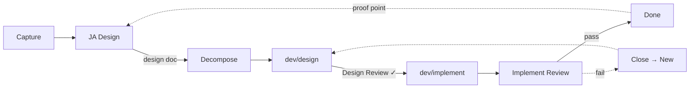
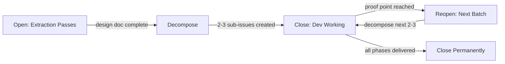
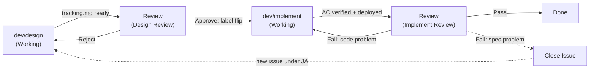

# Issue Lifecycle Router
[[claude-code-architecture]]

Defines the refinement pipeline that routes issues from capture to delivery, the positions accountable at each stage, and the ceremonies that gate progression.

---

## Problem Statement

Issues are the single source of truth for all work — fed from multiple sources (email, transcripts, conversations), some captured manually, some automatically. Issues move from cheap reminders to finished deliverables through progressive refinement. This document defines what each stage of refinement means, what comes out of it, and which position is accountable.

Capturing is nearly free. Everything after capture is refinement — routing work through positions that each add specific value. Without defined routing, every decision flows through one person. This document is the operating recipe that makes each position self-sufficient: read it, and you know how to process work through the pipeline.

**Preconditions:**
- Multiple concurrent client engagements with different forcing functions
- AI-augmented positions operating through Claude Code sessions (Developer, Junior Architect, Dev Lead)
- Autonomous Developer (Ralph) producing implementation work without human-in-the-loop
- Design-first methodology: JA extraction passes → design docs → Developer decomposition
- Board-based project management using GitHub Projects with sub-issues
- Three-tier issue hierarchy: Commitment Epic → JA Design Issue → Dev Sub-Issues

---

## Success Definition

| Element | Definition |
|---------|-----------|
| **Goal** | Each position in the delivery pipeline — VP/Delivery, Junior Architect, Developer, Dev Lead — operates from this document and their Position Agreement, without requiring the founder to make routing decisions or personally gate every review. |
| **Success** | The full refinement pipeline (capture → JA design → decomposition → spec → implementation → review → delivery) flows continuously. Review happens as work arrives — not gated by a single daily review block. Each position knows what they're accountable for, which ceremony to run, and when to hand off. |
| **Done test** | A new team member in any position can follow the pipeline from this document and their PA — knowing when they own the work, which ceremony to perform, and where to hand off — without asking the founder "what do I do next?" |

---

## Approach

### Part 1 — The Refinement Pipeline

Three tiers route work from client relationship to delivered code. Two ceremonies gate progression.

```mermaid
graph LR
    A["Capture"] --> B["JA Design"]
    B -->|"design doc"| C["Decompose"]
    C --> D["dev/design"]
    D -->|"Design Review ✓"| E["dev/implement"]
    E --> F["Implement Review"]
    F -->|"pass"| G["Done"]
    F -.->|"fail"| H["Close → New"]
    H -.-> D
    G -.->|"proof point"| B
```

**Three Tiers:**

| Tier | What It Is | Lifecycle | Owner |
|------|-----------|-----------|-------|
| **Commitment Epic** | Client relationship container | Always open (closes when relationship ends) | VP/Delivery |
| **JA Design Issue** | Project phase within a relationship | Breathing: open during design, closed during implementation, reopens at proof points | Junior Architect |
| **Dev Sub-Issue** | Implementation task under a JA issue | Dual cycle: dev/design → dev/implement → Done | Developer |

**Two Ceremonies:**

| Ceremony | What It Gates | Owner |
|----------|--------------|-------|
| **Design Review** | Developer's spec (tracking.md with DoD + ACs) is sound before implementation begins | Dev Lead |
| **Implement Review** | Running system works as designed — human witness at the gemba | Dev Lead |

**See also:** [Organization Chart](https://mariuswilsch.github.io/public-wilsch-ai-pages/global/organization-chart-wilsch-ai-services) — the position hierarchy these tiers map to. Position Agreements define each role's full accountability: [Dev Lead PA](https://mariuswilsch.github.io/public-wilsch-ai-pages/global/dev-lead-position-agreement-wilsch-ai-services), [Developer PA](https://mariuswilsch.github.io/public-wilsch-ai-pages/global/developer-position-agreement-wilsch-ai-services), [JA PA](https://mariuswilsch.github.io/public-wilsch-ai-pages/global/junior-architect-position-agreement-wilsch-ai-services).

VP/Delivery creates the Commitment Epic. The JA produces a design doc within it. The Developer decomposes that design doc into sub-issues under the JA issue. Each sub-issue cycles through dev/design → dev/implement, gated by Design Review and Implement Review. The Developer runs AC verification internally before claiming implementation is ready for review. When the witness fails, the sub-issue closes and a fresh one starts (clean trace). Proof points route back to the JA issue for the next decomposition batch.

### Part 2 — Commitment Epic

A Commitment Epic represents an ongoing client relationship — not a single deliverable. It stays open as long as the relationship is active. Closing it signals the relationship has ended.

**What it contains:**

| Section | Content | Changes? |
|---------|---------|----------|
| **What** | What this client engagement is about | Never |
| **Why** | Why it matters | Never |

No closing criteria, no tracking section, no DoD. The epic is a thin shell — a commitment signal, not an active work container.

**Sub-issues are JA Design issues.** Each JA issue represents a project phase within the relationship (e.g., #1093 = Phase 1 data pipeline, #1276 = Phase 2 UI integration). The JA issues open and close as project phases start and complete. The Commitment Epic stays open throughout.

**Capacity signal:** The number of active JA Design issues — not the number of Commitment Epics — tells you how many projects are in flight. Commitment Epics tell you how many client relationships exist. Too many active JA issues = capacity overcommit. Too many Commitment Epics = too many relationships (a strategic decision, not a delivery one).

**GitHub mapping:**

| Signal | Mechanism |
|--------|-----------|
| **Title prefix** | `Epic: {client name}` — human-scannable |
| **Label** | `epic` — programmatically filterable |
| **Sub-issues** | JA Design issues linked via `gh sub-issue` |
| **Assignee** | Primary relationship owner (delegation signage) |

**Commitments Board:** Shows only Commitment Epics. The sub-issue progress bar (X of Y JA issues complete) provides at-a-glance status. This board functions as a lightweight CRM — visible relationships, not active work.

### Part 3 — JA Design Container

A JA Design issue is the active-work container for a project phase. It holds the design doc, the dev sub-issues, and the proof-point evidence — everything needed to understand what was designed, what was built, and what was validated.

**Breathing lifecycle:**

```mermaid
graph LR
    A["Open: Extraction Passes"] -->|"design doc complete"| B["Decompose"]
    B -->|"2-3 sub-issues created"| C["Close: Dev Working"]
    C -->|"proof point reached"| D["Reopen: Next Batch"]
    D -->|"decompose next 2-3"| C
    C -->|"all phases delivered"| E["Close Permanently"]
```

| Phase | JA Issue State | What Happens |
|-------|---------------|-------------|
| **Design** | Open | JA runs extraction passes, produces design doc. SA/VP reviews. |
| **Decompose** | Open → Close | Developer reads design doc, creates 2-3 sub-issues as children of JA issue. JA closes. |
| **Implementation** | Closed | Dev sub-issues cycle through dev/design → dev/implement. JA is dormant. |
| **Proof Point** | Reopen | Evidence routes to JA issue as comment. Next decomposition batch created. |
| **Complete** | Closed permanently | All sub-issues done, no more decomposition needed. |

The JA issue's open/close state signals who has the ball — design team or dev team.

**What lives under the JA issue:**

| Artifact | Location |
|----------|----------|
| **Design doc** | Published via hippocampus, linked from JA issue body |
| **Project Index** | `.claude/tracking/issue-{N}/project-index.md` — centralizes transcripts, data artifacts, external references |
| **Dev sub-issues** | Children of JA issue (via `gh sub-issue`) |
| **Proof-point comments** | Posted on JA issue — the institutional memory across decomposition cycles |

**Decomposition is the Developer's act.** The JA produces the design doc. The Developer reads it and creates sub-issues under the JA issue. At least one grooming session separates design doc completion from decomposition — the handoff goes through the existing gate mechanism. The Dev Lead's comprehension gate catches misunderstanding at the starting point.

**Trunk-first:** The Developer creates only 2-3 sub-issues up to the first proof point. Everything beyond the proof point stays in the design doc, not on the board. This prevents approved-but-invalid issues (evidence: [IITR Post-Mortem](https://mariuswilsch.github.io/public-wilsch-ai-pages/project/iitr/iitr-post-mortem), [Archibus Post-Mortem](https://mariuswilsch.github.io/public-wilsch-ai-pages/project/archibus-fm-assistant/archibus-post-mortem)).

**See also:** [General Decomposition Design](https://mariuswilsch.github.io/public-wilsch-ai-pages/project/WILSCH-AI-INTERNAL/general-decomposition-design) — trunk-first methodology, spike-or-issues gate, proof point types.

### Part 4 — Sub-Issue Dual Cycle

Every dev sub-issue starts as `dev/design` and cycles through two phases in the same issue. The label changes; the issue doesn't.

```mermaid
graph LR
    A["dev/design<br/>(Working)"] -->|"tracking.md ready"| B["Review<br/>(Design Review)"]
    B -->|"Reject"| A
    B -->|"Approve: label flip"| C["dev/implement<br/>(Working)"]
    C -->|"AC verified + deployed"| D["Review<br/>(Implement Review)"]
    D -->|"Pass"| E["Done"]
    D -.->|"Fail: spec problem"| F["Close Issue"]
    D -->|"Fail: code problem"| C
    F -.->|"new issue under JA"| A
```

**Phase 1 — dev/design:** The Developer creates the spec: DoD + ACs in tracking.md. When complete, the issue moves to the Review column for Design Review.

**Design Review:** The Dev Lead reads tracking.md (via Speechify for medium shift), judges whether the spec is sound. Approve → label flips to `dev/implement`, issue returns to Working. Reject → stays `dev/design`, returns to Working with feedback comment. No re-grooming needed between phases — the approval is the immediate signal.

**Phase 2 — dev/implement:** The Developer implements code, runs AC verification internally, deploys to preview environment. When ready, the issue moves to Review for Implement Review.

**Implement Review:** The Dev Lead witnesses the running system at the gemba (preview environment). Two outcomes:

| Outcome | Action |
|---------|--------|
| **Pass** | Issue moves to Done. Closes. |
| **Fail — code problem** | Returns to Working as `dev/implement`. Developer fixes. |
| **Fail — spec problem** | Issue CLOSES. New issue created under the same JA parent with fresh ACs. Old issue becomes a sealed learning artifact. |

**Why close on spec failure?** Continuing in the same issue pollutes the trace line — the new implementation would inherit comments, commits, and ACs from the failed approach. Editing ACs mid-implementation creates confusion. A fresh issue gives the next attempt a clean history. The proof point (posted on the JA parent) carries the learning forward without the noise.

**What carries to the new issue:** Only the proof point on the JA parent. The new issue gets fresh ACs, fresh comments, fresh tracking.md. Onboarding fetches the JA parent (proof-point history) + the fresh sub-issue (clean start). No trace-line pollution.

**Issue body format:**

| Section | Content | Changes? |
|---------|---------|----------|
| **What** | What this sub-issue delivers | Never |
| **Why** | Why it matters | Never |
| **Tracking** | Links to tracking.md, PR | Updated as artifacts are created |

No closing criteria in the body — closure is systemic (Design Review pass + Implement Review pass).

**Undefined:** Preview witness model — witnessing on preview environments before merge to staging. Code race condition mitigated by rebase at AC verify + Dev Lead review ([Pending Head](https://www.martinfowler.com/bliki/PendingHead.html)). Volume state reconciliation (one-directional by design) is ad-hoc. Needs dedicated design pass. See [CCI #646](https://github.com/DaveX2001/claude-code-improvements/issues/646).

**See also:** [Deployment & Runtime State Design](https://mariuswilsch.github.io/public-wilsch-ai-pages/project/WILSCH-AI-INTERNAL/deployment-runtime-state-design) — how preview environments are created and torn down (push = preview). [Dev Lead Witness & Review System](https://mariuswilsch.github.io/public-wilsch-ai-pages/global/dev-lead-witness-review-system) — the witness ceremony details (guided tour, Feynman Test, spot-check depth). [AC DoD Framework](https://mariuswilsch.github.io/public-wilsch-ai-pages/global/ac-dod-framework) — how DoD and ACs in tracking.md are structured and why they're separated.

### Part 5 — Ceremonies

Two ceremonies gate progression. Both are owned by the Dev Lead. The Review column on the Work Board IS the signal — no separate label needed.

#### Design Review

**Trigger:** Sub-issue moves to Review column with `dev/design` label.

**What the Dev Lead does:**
1. Open tracking.md (DoD + ACs)
2. Read aloud via Speechify — the medium shift reveals quality issues silent reading misses
3. Judge: are these ACs implementable? Will this produce a working system?

Design Review is the high-leverage gate. Bad ACs → bad implementation — especially with AI executing literally. Catching a spec problem here is cheap; catching it at Implement Review is expensive.

**Approve:** Change label to `dev/implement`, move back to Working + comment. Implementation begins immediately (no re-grooming).

**Reject:** Keep `dev/design`, move back to Working with feedback comment. Developer redesigns.

#### Implement Review

**Trigger:** Sub-issue moves to Review column with `dev/implement` label.

**Fail-fast checks** — stop at first failure:

| # | Check | Gate | What to verify |
|---|-------|------|----------------|
| 1 | Spec review completed | Hard | tracking.md has DoD + ACs |
| 2 | PR exists | Hard | Diff visible, automated review ran |
| 3 | Code deployed to preview | Hard | Feature live and witnessable on preview URL |
| 4 | Developer witness posted | Main | Developer ran self-witness, trace in tracking.md |

If any hard gate fails → send back to Working with specific feedback. If all pass → Dev Lead witnesses at the gemba.

**Witness at the gemba:** The Dev Lead goes to the running system (preview environment). The ceremony is the final quality gate — speed belongs in coding and verification. Here, the human experiences evidence at their own pace. Taking time IS the value.

**Approve:** Move to Done. Issue closes.

**Reject — code problem:** Move back to Working as `dev/implement`. Developer fixes, re-deploys, re-witnesses, moves back to Review.

**Reject — spec problem:** Issue CLOSES. New issue under same JA parent (see [Part 4](#part-4--sub-issue-dual-cycle)).

#### Dev Lead Review Queue

The Work Board's Review column IS the Dev Lead Review Queue. A dedicated Review view (`status:Review`) surfaces all items waiting for review, grouped by milestone.

**Processing:** Continuous — the dedicated reviewer processes items as they arrive, not in daily batches. FIFO by date (oldest first). Items in Review longer than 2 business days = escalation signal.

**See also:** [Dev Lead Position Agreement](https://mariuswilsch.github.io/public-wilsch-ai-pages/global/dev-lead-position-agreement-wilsch-ai-services) — defines the full accountability, standards, and BDP loop for the reviewer operating this queue.

### Part 6 — Board Architecture & Grooming

Two boards serve different audiences at different cadences.

| Board | Audience | Cadence | Content |
|-------|----------|---------|---------|
| **Commitments Board** | VP/Delivery | Months | Commitment Epics (client relationships) |
| **Work Board** | JA, Developer, Dev Lead | Days | Sub-issues (ja/design, dev/design, dev/implement), manager tasks, review processing |

The Commitments Board is a CRM signal — how many client relationships are active. The Work Board is the operational surface — where sub-issues flow through the dual cycle.

#### Work Board Columns

| Column | Meaning | Who Moves Here |
|--------|---------|----------------|
| **Backlog** | Not started (with or without milestone) | Grooming (triage) |
| **Working** | Someone is actively on it | Grooming (prioritize) |
| **Review** | Waiting for Dev Lead | Worker (signals "I'm done") |
| **Done** | Complete | Dev Lead (approves) |

Four universal columns — all work types (ja/design, dev/design, dev/implement, manager) flow through the same stages. Manager items skip Review (Backlog → Working → Done).

**Views:**

| View | Audience | Filter | Purpose |
|------|----------|--------|---------|
| **Sprint** | Worker, Dev Lead | `has:milestone -status:Done` | All milestoned work, grouped by milestone |
| **Grooming** | VP/Delivery + Worker | `status:Backlog,Review no:milestone` | Orphan items needing triage |
| **Review** | Dev Lead | `status:Review` | Items waiting for Design Review or Implement Review |

#### Grooming

Daily operational ceremony (VP/Delivery + Worker, 15-30 min). Two gates, every session.

**Gate 1 — Triage (Grooming View):** "Do we need to commit to this right now?" Items without milestones. Joint decision — VP has priority context, worker has capacity context. Passing this gate means the item gains a milestone.

**Gate 2 — Prioritization (Sprint View):** "What's the most impactful item to start today?" Milestones processed closest-touchpoint-first. VP moves selected items from Backlog → Working.

**Worker does NOT self-pull from Backlog between groomings.** Fires/urgency: VP has authority to bypass both gates and drop items directly into Working.

**Every new item goes through Gate 1** — even sub-issues spawned mid-sprint. No milestone inheritance. This prevents scope creep through cascading sub-issues.

#### Milestones & Forcing Functions

Milestones are the execution gate. Nothing gets worked without a milestone.

**Client touchpoints are the primary forcing function** — meeting dates with social and financial consequences. The milestone date is immovable (fixed time, variable scope). Scope adapts to fit.

**Milestone naming:** `[CLIENT-CODE] YYYY-MM-DD — forcing function name`
Example: `[ARCHIBUS] 2026-04-11 — Rein meeting`

Milestones auto-create on touchpoint date passage (agent reads cadence from closing milestone body). Closed milestones preserve history (not deleted).

**See also:** [Stakes Visibility: Forcing Function](https://mariuswilsch.github.io/public-wilsch-ai-pages/global/stakes-visibility-forcing-function) — why milestones derive their power from external consequences (social + financial), not internal deadlines.

### Part 7 — Labels & Closure

#### Label Architecture

Phase labels encode both type and position. Columns carry status — no status labels needed.

| Label | Purpose | Who |
|-------|---------|-----|
| **ja/design** | JA extraction pass work (design doc) | Junior Architect |
| **dev/design** | Developer spec phase (DoD + AC in tracking.md) | Developer |
| **dev/implement** | Developer build phase (code + AC verify) | Developer |
| **manager** | Quick admin/coordination task (no spec flow) | VP/Delivery |
| **blocked** | External dependency — signal overlay | Any |
| **epic** | Identifies Commitment Epics on Commitments Board | VP/Delivery |
| **Client labels** | Per-client filtering (e.g., `01_ARCHIBUS`) | Grooming |

**Phase label transitions:**
- Issue created → `dev/design` (Developer), `ja/design` (JA), or `manager`
- Design Review approved → Dev Lead changes label to `dev/implement` + comment
- Design Review rejected → stays `dev/design` + feedback comment
- Implement Review approved → issue closes (Done)

#### Closure Semantics

| Type | Done When | Closing Action |
|------|-----------|---------------|
| **ja/design** | Design doc published, decomposition complete | JA issue closes. Reopens at proof points (see [Part 3](#part-3--ja-design-container)). |
| **dev/design** | DoD + AC in tracking.md, Design Review approved | Label flips to `dev/implement` — issue continues, doesn't close. |
| **dev/implement** | Implement Review passed on preview | Issue closes. PR merges to staging. |
| **dev/implement (fail)** | Implement Review failed on spec problem | Issue CLOSES as learning artifact. New issue under same JA parent. |
| **manager** | Task complete | Closes directly (Backlog → Working → Done, no Review). |
| **Commitment Epic** | Client relationship concludes | VP/Delivery closes. Rare — epics stay open for the relationship duration. |

#### Conversation Audit Trail

Developer sessions (Claude Code conversations) are pushed to a shared repository and linked from issue comments. This gives the Dev Lead forensic-level access to investigate decisions point-in-time using the conversation-reader skill, without relying on the Developer's account of what happened.

---

## Source

**Supersedes:** [Issue Lifecycle Router v1](https://mariuswilsch.github.io/public-wilsch-ai-pages/global/issue-lifecycle-router-v1) — February 2026 extraction passes, archived.

**v1 extraction history (2026-02):**
- E-Myth Management Strategy interview (2026-02-06) — ILR reconciliation with Operations Manual
- Original Issue Lifecycle Router (2026-01)
- Framework: Michael Gerber, *The E-Myth Revisited*, Chapter 15
- Epic Lifecycle extraction pass (2026-02-16) — Session: 3762438b
- Dev Lead observability extraction pass (2026-02-17) — Session: 478e31b8
- Review Queue config spec extraction pass (2026-02-19) — Session: e139408b
- Epic model restructure extraction pass (2026-02-24) — Session: 73be003e
- Operational model extraction pass (2026-02-26) — Session: dc864b00
- Milestone retrofit + ILR contradiction pass (2026-02-27) — Session: 316adeee
- Ceremony definition extraction pass (2026-02-28) — Session: 83d4d2fe
- Sub-issue lifecycle extraction pass (2026-02-28) — Session: a38692bf
- Trunk-first decomposition extraction pass (2026-03-21) — Session: d2f2ef3a

**v2 extraction (2026-04):**
- ILR retrofit extraction pass (2026-04-05) — JA-as-parent, commitment epic, close-on-witness-failure, continuous review model, ceremony naming, preview witness (Undefined → #646)
- Session: /Users/verdant/.claude/projects/-Users-verdant-Documents-projects-00-WILSCH-AI-INTERNAL--soloforce/02f9a9a7-e02a-43a2-8262-b64f45ee1730.jsonl
- Sources: CCI #600, #602, #605, #646, #657. Dev Lead PA. Developer protocol. Dev Lead protocol. Ship with Confidence. Deployment & Runtime State Design.
- Evidence: Position epics (88+ observations on #605), IITR + Archibus post-mortems, March operational evidence (David operating Developer position)

---

© 2026 Wilsch AI Services OÜ. All rights reserved. Licensed under [CC BY-NC-ND 4.0](https://creativecommons.org/licenses/by-nc-nd/4.0/).
