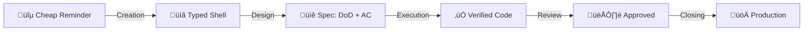

# Issue Lifecycle Router

[[life-vision]]

Issues are the single source of truth for all work. They're fed from multiple sources — email, WhatsApp, transcripts, conversations — some captured manually, some automatically (e.g., agents turning transcripts into tasks).

Issues move from cheap reminders to finished deliverables through progressive refinement. This document defines what each stage of that refinement means, what comes out of it, and which position is accountable.

The system captures everything because capturing is nearly free. Everything after capture is refinement.

---

## Refinement Pipeline



| Stage | Output |
|-------|--------|
| **Creation** | Issue with type label (shell + context) |
| **Design** | DoD + AC in tracking.md |
| **Execution** | Code on branch, backpressure verified, merged to staging |
| **Review** | Business-approved on staging |
| **Closing** | Merged to production, issue closed |

> **Gap:** Currently, issues close after merge to staging (not production). The system doesn't yet distinguish staging-merged from production-deployed.

**At epic level:** Same refinement, different scope. See [Epic Lifecycle](#epic-lifecycle) below.

---

## Foundational Principles

### Issues Are Cheap

*"We cannot rely on anybody to be aware of anything. The system must be aware of everything."*

Creating an issue is the cheapest thing in the system. The simpler it is, the more likely someone creates it. Work only exists when it's tracked.

| Principle | Meaning |
|-----------|---------|
| **Immediate capture** | Work → issue immediately. No "I'll remember." |
| **Fast closing** | Issues should close quickly, not linger |
| **Cascade creation** | Closing one → spawn next if needed |
| **No floating context** | Nothing lives outside the system |

### Closure Clarity

Every issue has clear "when is this done?"

| Type | Done When |
|------|-----------|
| **ja/design** | Design doc published (JA sub-issue closes) |
| **dev/design** | DoD + AC in tracking.md, spec review approved |
| **dev/implement** | DoD + AC verified + merged to staging |

---

## Work Types

| Type | Meaning | Context |
|------|---------|---------|
| **ja/design** | JA produces design doc via extraction passes | Needs context OUTSIDE the issue (transcripts, conversations, data artifacts) |
| **dev/design** | Developer creates specifications (DoD + AC) | Needs the JA's design doc as input |
| **dev/implement** | Implementable directly | Everything needed is IN the issue (tracking.md) |

**At task level (primary):** The Developer owns both dev types — designing (DoD + AC) and implementing (code). This is the dual cycle: every maker sub-issue starts as dev/design, cycles to dev/implement after spec review.

**At epic level (within an epic):** The JA creates a ja/design sub-issue — producing a design doc through extraction passes. Same design work, different position, different level. The SA ensures design quality but the JA does the extraction work.

**Key insight:** Type describes what KIND of refinement is happening. Position determines who does it. Level determines scope. The label architecture (`ja/design`, `dev/design`, `dev/implement`) encodes both type and position in a single glanceable signal.

### Developer Entry Points

1. **From epic** → decompose design doc into tasks → enter at Creation
2. **From cheap reminder** → enter at Creation directly

Not everything is an epic. A cheap reminder can be a task directly.

---

## Epic Lifecycle

An epic is a business outcome. It represents a single meaningful effort — client deliverable or internal initiative — that lives on the board from identification to completion. Epics are created when work is identified, not born from a design phase. All positions contribute sub-issues to the same epic: the JA designs within it, the Developer builds within it, the Dev Lead reviews within it.

### What IS an Epic

An epic is a GitHub Issue that serves as both a task container and a knowledge container:

- **Task container:** Sub-issues represent the work — each position creates sub-issues relevant to their accountability
- **Knowledge container:** Transcripts, emails, and meeting notes centralize here — the epic stays stable while sub-issues can move, change, or be recreated

**Creating an epic is cheap but rare.** The shell costs nothing (What and Why only), but each epic is a commitment to deliver a business outcome. Issues are created often — they're reminders. Epics are created rarely — they're promises.

**Two diagnostic signals:**
- **Too many Active epics** = capacity overcommit. You've promised more than you can deliver.
- **Creating epics too frequently** = strategic fragmentation. Business outcomes should be stable commitments, not reactions. If you're spawning epics weekly, you're not thinking at the right level — epics are too granular or strategy isn't guiding decisions.

**GitHub mapping:**

| Signal | Mechanism |
|--------|-----------|
| **Title prefix** | `Epic: {name}` — human-scannable in any list |
| **Label** | `epic` — programmatically filterable, board views can group by it |
| **Sub-issues** | Linked via `gh sub-issue` — structural parent-child relationship |

The epic board shows only epics. The sub-issue progress bar (X of Y) provides at-a-glance status. Manager tasks live on a separate operational board.

**Epics do NOT have:**
- Acceptance criteria or tracking.md — the epic is a container, not a verifiable unit
- A GitHub assignee — only sub-issues get assigned to the position executing them

### Epic Creation

VP/Delivery creates epics when a business outcome is identified. The epic enters the board in **Not Started** as a shell — What and Why only. No sub-issues yet.

**Routing within the epic:** VP/Delivery (or SA acting on VP/Delivery's behalf) decides whether the business outcome needs a design doc (JA creates a ja/design sub-issue) or can be built directly (Developer creates dev/design sub-issues). This routing decision determines which position creates the first sub-issue.

**Context partitioning:** Each sub-issue has its own trace line (comments, commits, conversations). The JA's extraction pass comments live on the JA's sub-issue — the Developer never needs to read them. Context is partitioned by sub-issue, not by issue lifecycle.

**Undefined:** Data artifact centralization — where do raw artifacts (spreadsheets, PDFs, test data) live across the JA-to-Developer handoff? Options: hippocampus project directory as anchor (both JA and Developer reference it), epic body (centralized but GitHub-limited), or sub-issue tracking dirs (current pattern, but orphans on close).

**Undefined:** Epic creation ceremony — what is the forcing function for creating new epics from standalone issues? Epic creation is about recognizing a new commitment, not tied to milestone cadence. A "Board Health" view (standalone issues spliced per client) could serve as the diagnostic surface — too many standalones for one client signals that work is happening without a commitment container. But the trigger, ceremony, and tooling for VP/Delivery to act on that signal are not yet defined.

### Per-Position Accountability

Each position has a distinct accountability toward the same epic. All positions contribute sub-issues — ownership is per sub-issue, not per epic.

| Position | Epic-Level Accountability | Sub-Issue Work |
|----------|--------------------------|----------------|
| **VP/Delivery** | Creates epic, moves to Done | Owns epic board transitions |
| **SA** | Design quality standards | Reviews JA's design doc output |
| **JA** | Creates ja/design sub-issue, produces design doc | Extraction passes within Active phase |
| **Dev Lead** | Moves epic to Validating, review queue processing | Comprehension gates, staging witness |
| **Developer** | Decomposes design doc into sub-issues (dev/design) | Designs (DoD+AC), implements (code), deploys |

**Decomposition is still the Developer's act — not the JA's.** The JA's ja/design sub-issue produces a design doc. The Developer reads it and creates sibling sub-issues (labeled dev/design). At least one grooming session separates the JA's design doc completion from the Developer's decomposition — the handoff goes through the existing gate mechanism. The Dev Lead's starting-point gate measures Developer comprehension — if the JA pre-decomposes, the gate becomes a rubber stamp.

**Undefined:** JA-to-Developer handoff ceremony — should there be a formal "read design doc + briefing session" step before the Developer decomposes? Or is the grooming session sufficient?

**Undefined:** Decomposition mechanics — the exact process by which the Developer breaks a design doc into sub-issues is being operationalized as a skill. The Starting-Point Sub-Issues section stays at principle level until the skill makes it concrete.

**Dev Lead gates are comprehension signals.** The starting-point review and tracking.md review measure whether the Developer understands the design doc — not just whether tasks were completed. A poor decomposition signals either a design doc clarity problem (JA) or a comprehension gap (Developer growth opportunity).

### Gate Signal Mechanism

The Review column signals "ready for review." No label needed — the column IS the signal. It appears twice per sub-issue lifecycle (spec review + staging witness) and twice at epic level (bookending the work):

**Epic level (Commitments Board):**

| When | Gate | Sub-issue progress |
|------|------|--------------------|
| **Start** — Developer just created sub-issues | Decomposition review: "Does Developer understand the design doc?" | 0 of N complete |
| **End** — all sub-issues delivered | SA final look before epic closure | N of N complete |

**Sub-issue level (Work Board → Review column):**

| When | Gate |
|------|------|
| Spec complete (DoD + AC in tracking.md) | Spec quality review |
| Deployed to staging | Human witness on staging |

Worker moves issue to Review column; the manager moves it back to Working (rejection) or to Done (approval).

#### Dev Lead Review Queue

The Work Board's Review column IS the Dev Lead Review Queue. No separate project needed — the Sprint view filtered to `status:Review` surfaces all items waiting for review, grouped by milestone.

**Processing Workflow:**

1. Worker completes spec or deploys to staging → moves issue to Review column
2. Dev Lead processes Review column via Sprint view (FIFO by date, oldest first)
3. **Approval:** Manager moves to Done (issue closes) OR moves back to Working with label change (dev/design → dev/implement)
4. **Rejection:** Manager moves back to Working + posts comment with feedback. Worker fixes, moves back to Review when ready.

**Automation (GitHub Action):**

A single GitHub Action on the `project_v2_item` event provides two signals:

| Trigger | Action |
|---------|--------|
| Item moved to Review column | Count previous Review→Working→Review cycles on this issue. Post comment: "Review cycle {N}." At cycle 3: "⚠️ Review cycle 3 — potential design doc clarity issue." |
| Daily schedule | Scan items in Review column older than 2 business days. Post ⚠️ comment: "In review queue for {N} days (SLA: 2 days)." |

The review cycle counter makes rejection frequency visible on the sub-issue itself — both Dev Lead and Developer see it. At cycle 3, the signal shifts from Developer comprehension to design doc clarity (routes back to JA). The SLA monitor is a self-accountability check — visible when opening any stale item.

### Starting-Point Sub-Issues

The Developer reads the design doc and creates the first sub-issues they can see. This is not a full decomposition — it's a starting point. More sub-issues emerge naturally as work progresses.

- **Simple epics** (e.g., 3 clear workstreams): The starting point may be the full set of sub-issues
- **Complex epics** (e.g., design doc with evolving scope): The starting point is the first 1-2 actionable sub-issues — the rest spawns from doing the work

Creating ten sub-issues where seven will be closed is bad practice. The Developer should look as far as they can see and start doing.

**Undefined:** Detailed decomposition mechanics for complex epics — pending empirical evidence from applying this to issue #373.

### Sub-Issue Quality Criteria

Closability is the primary quality signal. A sub-issue that can't be definitively closed is badly designed — it lingers on the board even with a milestone forcing function, because there's no clear done-state to reach.

**Empirical criteria (from deliverable-tracking analysis, 2026-02-28):**

| Criterion | Good | Bad |
|-----------|------|-----|
| **Title** | One verb, one outcome | Compound deliverables ("X + Y + Z") |
| **Milestone-ability** | Fits in one sprint | Can't be committed to a sprint |
| **Scope** | Single deliverable | Multiple deliverables in one issue |
| **Blocked items** | Decomposed into what CAN move | Blocked without decomposition |

The milestone gate naturally filters: unclosable items can't fit in a sprint. Grooming IS the quality gate — if an item can't be milestoned, it hasn't been thought through enough.

**Undefined:** Detailed quality criteria pending more empirical evidence from board operation. The criteria above are a starting point, not exhaustive.

### Board Architecture

Two boards serve different audiences at different cadences:

| Board | Audience | Cadence | Content |
|-------|----------|---------|---------|
| **Commitments Board** | VP/Delivery, SA, Dev Lead | Weeks/months | Business outcomes only |
| **Work Board** | Developer, Dev Lead | Days | Sub-issues, manager tasks, review processing |

The Work Board's Review column surfaces sub-issue gates for the Dev Lead to process (Sprint view filtered to `status:Review`, FIFO sort). See [Gate Signal Mechanism](#gate-signal-mechanism).

**The Commitments Board is a capacity signal.** The number of Active epics tells you how many business outcomes you've committed to. 119 issues tells you nothing about capacity. 10 Active epics tells you "we're overcommitted." The board becomes a commitment dashboard — a forcing function for saying no to new work.

### Commitments Board Columns

| Column | Meaning | Trigger | Owner |
|--------|---------|---------|-------|
| **Not Started** | Epic identified, no work begun | Default | VP/Delivery creates |
| **Active** | Work happening (any position) | First sub-issue starts | Automated |
| **Client Sign-Off** | All sub-issues done, awaiting client confirmation | Dev Lead moves | Dev Lead |
| **Done** | Client confirmed business outcome delivered | VP/Delivery closes | VP/Delivery |

"Active" replaces "In Progress" — signals long-running work without implying it should be quick. Epics may be Active for weeks or months. The sub-issue progress bar (X of Y) is the primary signal, not the column.

**Client Sign-Off gate:** When all sub-issues reach Done on the Work Board, the Dev Lead moves the epic to Client Sign-Off. The client provides a written yes/no on the delivered outcome, posted as a comment on the epic (auditable trail required). Client yes → Done. Client no → back to Active with new sub-issues addressing gaps.

### Milestone Lifecycle

Milestones are the execution gate. Nothing gets worked without a milestone. They provide what the board and epics alone cannot: a forcing function tied to an external date.

**Three-layer value proposition:**

| Layer | What it provides | Without it |
|-------|-----------------|------------|
| **Board** | Captures work (issues exist) | "What work do you pick?" — no prioritization signal |
| **Epic** | Capacity signal (commitments visible) | No way to see overcommitment |
| **Milestone** | Forcing function (date + scope) | Tasks don't move by themselves |

Epics = commitment (WHAT we promised). Milestones = temporal (WHEN we do it). Orthogonal — an epic has 1-to-N milestones over its lifetime.

**Operating model: Fixed time, variable scope** (Shape Up principle). The milestone date is immovable — it's the client touchpoint. Scope adapts to fit. Items can be added or removed mid-sprint. The forcing function creates pressure: deliver by the date, or explain why not.

**Milestone lifecycle:**

```
CREATION (agent, auto):
  → Trigger: previous milestone's touchpoint date passes
  → Agent reads cadence from closing milestone's body
  → Agent creates next milestone with same cadence + forcing function name
  → Naming convention: [CLIENT-CODE] YYYY-MM-DD — forcing function name
  → Example: [ARCHIBUS] 2026-02-28 — Rein meeting

FILLING (grooming, human):
  → During daily grooming, associate backlog items to active milestone
  → Joint decision: manager has priority context, worker has capacity context
  → Items can also be added mid-sprint (variable scope)
  → Manager can remove items at any time

ACTIVE SPRINT:
  → Workers pull from milestone Sprint view
  → Items flow: Backlog → Working → Review → Done
  → Only items moved to Working by grooming get worked
  → Fires: manager authority — same-day urgency goes directly to Working

TOUCHPOINT DATE ARRIVES:
  → Agent auto-creates NEXT milestone
  → Current milestone enters CLOSING phase

CLOSING (grooming, human):
  → Gate: milestone can ONLY close when every item has a decision
  → For each item still in the milestone:
    - Done → stays (history preserved)
    - Working/Review → move to next milestone or close
    - Backlog (never started) → return to general backlog
  → Once all items dispositioned → human closes milestone
  → Closed milestones preserve history forever (not deleted)
```

**All milestones are date-based.** Both client milestones (`[ARCHIBUS] 2026-02-28 — Rein meeting`) and internal milestones (`[INTERNAL] 2026-03-02 — Weekly sprint`). Auto-created by agent for recurring cadences, manually closed during grooming. Closed milestones don't appear in the active selection dropdown — only open ones are visible.

**Milestone body = cadence config for the auto-creation agent.** The body contains machine-readable cadence that the agent copies forward when creating the next milestone:

```
cadence: weekly friday
touchpoint: Rein meeting
date-format: YYYY-MM-DD
```

**Three cadence types:**

| Type | Body format | Agent behavior |
|------|-------------|----------------|
| **Fixed recurring** | `cadence: weekly friday` | Auto-creates confidently |
| **Approximate recurring** | `cadence: ~monthly first-friday` | Proposes date, flags for human confirmation |
| **One-off** | `cadence: none` | No auto-creation — milestone closes and that's it |

**Milestones = forcing functions, not commitments.** Epics are commitments (WHAT we promised). Milestones are temporal containers tied to external forcing functions (WHEN we do it). A single client can have multiple milestones with different forcing functions (e.g., UWI has a weekly sync + a monthly seminar). Epics do not get milestones — only sub-issues do.

**Undefined:** Reactive SLA clients (e.g., Rohdex) — fire-driven work has no recurring forcing function. Create milestones only when a specific event creates a deadline (e.g., server migration handoff). The fire IS the forcing function.

**Forcing functions by source:**

| Source | Forcing function | Milestone cadence |
|--------|-----------------|-------------------|
| **Client touchpoints** | Meeting date (social + financial consequence) | Per client meeting (weekly/biweekly) |
| **Monthly plan** | Position transition deadline (March 31: manager-only) | Weekly internal milestones |
| **March plan** | Strategic forcing function for the period | Frames all milestone cadences |

See [Stakes Visibility: Forcing Function](https://mariuswilsch.github.io/public-wilsch-ai-pages/global/stakes-visibility-forcing-function) — milestones derive their power from external forcing functions attached to the date.

### Work Board Columns

| Column | Meaning | Who Moves Here |
|--------|---------|----------------|
| **Backlog** | Not started (with or without milestone) | Grooming (triage) |
| **Working** | Someone is actively on it | Grooming (prioritize) |
| **Review** | Waiting for manager handoff | Worker (signals "I'm done") |
| **Done** | Complete | Manager (approves) |

Four universal columns — all work types (ja/design, dev/design, dev/implement, manager) flow through the same stages. Manager items skip Review (Backlog → Working → Done). Maker items cycle through Review twice: once for spec review (tracking.md), once for human witness (staging).

**One issue, cycling model.** A single issue moves through the full refinement pipeline. The phase label changes when the manager approves a spec review and the issue re-enters Working for implementation. The dual cycle runs within the same milestone — no re-grooming between cycles.

**Sub-Issue Dual Cycle:**


All maker items start as dev/design — no exceptions. The dual cycle is universal because every piece of work needs an audit trail (spec → implementation), even trivial items. Manager items skip Review entirely (Backlog → Working → Done, self-service).

The [Three-Session Model](https://mariuswilsch.github.io/public-wilsch-ai-pages/global/three-session-model) aligns: Design session = cycle 1, Implementation + Verification sessions = cycle 2, Witness = separate end session. If the witness fails, the manager routes back to dev/design (spec problem) or dev/implement (code problem) based on judgment.

Artifacts signal the current phase:

| Artifact | Phase signal |
|----------|-------------|
| No tracking.md | Needs design |
| tracking.md exists (DoD + AC) | Needs spec review or implementation |
| Code on branch | Needs human witness |
| verification.jsonl exists | Ready for final approval |

See [Three-Session Model](https://mariuswilsch.github.io/public-wilsch-ai-pages/global/three-session-model) — sessions are separated for bias prevention, but all artifacts accumulate on the same issue.

**Column transitions:**

| Transition | Type | Who | When |
|-----------|------|-----|------|
| [No milestone] → [Milestoned] | View transition (Gate 1) | Joint (grooming) | "We commit to this sprint" |
| Backlog → Working | Column transition (Gate 2) | Manager (sprint) | "Do this today" |
| Working → Review | Column transition | Worker | "I'm done, review this" |
| Review → Working | Column transition | Manager | Rejection (same label, feedback) OR Approval (label flip: dev/design → dev/implement, comment) |
| Review → Done | Column transition | Manager | "Approved" — issue closes |

**Worker authority:** Working → Review (signals completion), apply `blocked` label (signals blocker). Workers do not move items backwards. Once in Working, the only path is forward to Review. When blocked, the manager owns the resolution (re-prioritize, remove, or escalate).

**Spec approval = immediate signal.** When the manager approves spec in Review and flips the label to dev/implement, the worker continues immediately — no re-grooming needed. The "no self-pull" rule applies to Gate 2 (Backlog → Working) only, not to the Review → Working cycle.

**Views:**

| View | Audience | Filter | Purpose |
|------|----------|--------|---------|
| **Sprint view** | Worker (primary), Manager | `has:milestone -status:Done` | All milestoned work, grouped by milestone, columns left-to-right |
| **Grooming view** | Manager + Worker | `status:Backlog,Review no:parent-issue no:milestone` | Orphan items needing triage |

The Sprint view IS the worker's primary working surface. All work that needs to get done lives here.

### Grooming

Grooming is the daily operational ceremony that keeps milestones filled, priorities set, and the board clean. Two gates, two cognitive modes — the manager and worker switch decision frameworks entirely between triage and sprint prioritization.

**Cadence:** Daily sync (manager + worker). Always both gates, every session — even if one has no items, the check itself is the discipline.

**Worker role:** Accountability partner. The worker's presence creates a social forcing function — both parties commit to decisions in front of each other. The worker is expected to actively push back on capacity limits, technical blockers, and sequencing concerns.

#### Gate 1: Triage (Grooming View → Sprint View)

**Question:** "Do we need to commit to this right now?" → If yes: "Which sprint does this belong to?"

Items with no milestone. Joint decision — manager has priority context, worker has capacity context. Passing this gate means the item gains a milestone and disappears from the Grooming view, appearing in the Sprint view. Not all backlog items get milestoned — some stay in general backlog because the answer to "do we need to commit?" is no.

| Decision | Who | Output |
|----------|-----|--------|
| Commit now? | Joint | Yes → continue routing; No → stays in general backlog |
| Which milestone? | Joint (manager has priority, worker has capacity) | Issue associated to `[CLIENT] YYYY-MM-DD` |
| Maker or manager? | Joint | `ja/design`, `dev/design`, or `manager` label applied |
| Epic association? | Manager (if obvious fit → link; if not → leave standalone) | Sub-issue link or no action |
| Assignee correct? | Joint | Assignee set |
| Blocked? | Joint | `blocked` label if external dependency |

#### Gate 2: Prioritization (Sprint View: Backlog → Working)

**Question:** "What's the most impactful item to start?" → "Should this move to Working today?" (plus dependency awareness between items)

Milestones processed sequentially, closest touchpoint date first. For each active milestone:

- Which items should the worker tackle TODAY?
- Manager moves selected items from Backlog → Working column
- Order in Working = priority (top = first)
- Worker does NOT self-pull from Backlog between groomings

**Every new item goes through Gate 1** — even sub-issues spawned mid-sprint from active work. No milestone inheritance. This prevents scope creep through cascading sub-issues.

**Variable scope:** Manager can add or remove items from a milestone at any time (Shape Up: fixed time, variable scope). Items removed mid-sprint return to general backlog.

**What grooming does NOT do:**
- ~~Review scan~~ — manager processes Review column async via Sprint view
- ~~Epic creation~~ — VP/Delivery creates epics when new commitments are recognized (see **Undefined** in [Epic Creation](#epic-creation))
- ~~Detailed context review~~ — artifact-based, not body-based

**Agent integration:**
- Agents create issues with client label + context (from transcripts/emails)
- Agents do NOT auto-link to epics — epic association is a grooming decision
- Agents do NOT assign milestones — milestone association is a grooming decision
- Under normal daily grooming, 3-5 new items per day is manageable (~10 min)

**Fires/urgency:** Manager has authority to bypass both gates and drop items directly into Working for same-day urgency. Not same-day → backlog, wait for next grooming.

### Label Architecture

Seven label types. Status labels are eliminated — columns carry that information. Phase labels are position-specific — the board reader can immediately see whether work belongs to the JA or the Developer.

| Label | Purpose | Board value |
|-------|---------|-------------|
| **ja/design** | JA extraction pass work (design doc) | Distinguishes JA process trace from Developer work |
| **dev/design** | Developer spec phase (DoD + AC) | Cycle 1 of the dual cycle |
| **dev/implement** | Developer build phase (code) | Cycle 2 of the dual cycle |
| **manager** | Quick admin/email task (no spec flow) | Distinguishes from maker items |
| **blocked** | External dependency | Signal overlay — item stays in current column |
| **epic** | Identifies epics on Commitment Board | Programmatically filterable |
| **Client labels** | Per-client filtering/slicing | Sprint view sidebar grouping |

**Eliminated labels:** `backlog`, `to-do`, `in-progress`, `done`, `review`, `maker/design`, `maker/implement`. Columns carry status. Position-specific phase labels (`ja/design`, `dev/design`, `dev/implement`) carry both type and ownership.

**Trace line separation:** JA sub-issues have separate trace lines from Developer sub-issues. The JA's extraction pass history (conflicting choices, iterative drafts) would confuse the Developer — the published design doc is the contract between them. JA sub-issues close when the design doc is done; Developer sub-issues cycle through dev/design → dev/implement on the same issue.

**Phase label transitions:**
- Issue created → `dev/design` (default for Developer maker items), `ja/design` (JA items), or `manager`
- Spec review approved → manager changes label to `dev/implement`, moves back to Working + comment
- Spec review rejected → stays `dev/design`, moves back to Working with feedback comment
- Implementation review approved → issue closes (Done)

### Issue Body

**Sub-issue bodies** have stable fields and a living artifact section:

| Section | Purpose | Changes? |
|---------|---------|----------|
| **What?** | What this is about | Never |
| **Why?** | Why it matters | Never |
| **Tracking** | Artifact progression links | Updated as artifacts are created |

The `## Tracking` section is the living part — it links to the spec artifact once created:

```markdown
## Tracking
- [ ] [tracking.md](link) — DoD + AC
```

PR association is automatic — the PR description uses `Fixes #N` and GitHub links it. No manual tracking needed. verification.jsonl is a machine artifact (lives in `.claude/tracking/issue-{N}/`) and doesn't need to appear in the issue body.

No closing criteria in the sub-issue body — closure is systemic:
- Design done when: tracking.md has DoD + AC
- Implementation done when: DoD checkboxes checked, merged to staging worktree
- Verification done when: AC verified on staging, verification.jsonl complete
- Done-done when: manager does human witness on staging → merged to main

See [Ship with Confidence](https://mariuswilsch.github.io/public-wilsch-ai-pages/global/ship-with-confidence) for the full testing pyramid (AC → Smoke → Human Witness) and the staging→production flow.

The [Three-Session Model](https://mariuswilsch.github.io/public-wilsch-ai-pages/global/three-session-model) (Design → Implementation → Verification) produces artifacts that accumulate on the same issue.

**Epic bodies** are simpler — What, Why, and Closing Criteria only:

| Section | Purpose | Changes? |
|---------|---------|----------|
| **What?** | What this business outcome is | Never |
| **Why?** | Why it matters | Never |
| **Closing Criteria** | When this epic can close (business-level, not AC-level) | Never |

Epics have no Tracking section, no DoD, no AC, no tracking.md. The sub-issue progress bar (X of Y) is the primary status signal.

### Conversation Audit Trail

Developer sessions (Claude Code conversations) are pushed to a shared repository ([claude-code-conversation-store](https://github.com/MariusWilsch/claude-code-conversation-store)) and linked from epic comments. This gives the Dev Lead forensic-level access to investigate decisions point-in-time using the conversation-reader skill, without relying on the Developer's account of what happened.

### Epic Closure

All sub-issues complete = mechanical closure signal. VP/Delivery confirms the business outcome was delivered before closing. This is user authority — no formal verification criteria on the epic itself.

---

## Stage 1: Creation

**What happens:** Work is identified as needing tracking. A shell is created with a type label.

**Output:** Issue with type label + initial context (What, Why, Notes).

**Key concept:** The shell is a reminder, not a specification. It exists to track that work was identified. Refinement happens in later stages.

*Currently implemented via:* `deliverable-tracking` skill creates shell + type label in GitHub Issues.

---

## Stage 2: Design

**What happens:** The issue gets refined from a reminder into a specification.

**Output (by type):**

| Type | Output |
|------|--------|
| **ja/design** | Design doc published (JA sub-issue closes). Design IS execution for this type — no separate Stage 3. |
| **dev/design** | DoD + AC defined in tracking.md. Spec review approved → label flips to dev/implement. |
| **dev/implement** | DoD + AC verified + code merged to staging. Ready for witness. |

**Decision point (dev/design → dev/implement):** After DoD + AC are defined and spec review approved, the issue enters the implementation cycle.

*Currently implemented via:* rubber-duck (externalization), ac-create (DoD + AC). Detailed procedure in Developer Operations Manual.

**Concept links:**
- [AC DoD Framework](https://mariuswilsch.github.io/public-wilsch-ai-pages/global/ac-dod-framework) — DoD vs AC distinction
- [task-lifecycle-reference](https://mariuswilsch.github.io/public-wilsch-ai-pages/global/task-lifecycle-reference) — Phase overview

---

## Stage 3: Execution

**What happens:** The specification becomes working code with backpressure verification.

**Output:** Code on branch, verified through automated backpressure (sanity checks, AC verification), merged to staging.

**Key concept:** Valid outcomes include documented failure. "This approach doesn't work" is a valid execution result when documented.

*Currently implemented via:* Worktree creation, clarity workflow, implementation + verification sessions. Detailed procedure in Developer Operations Manual.

**Concept links:**
- [Ship with Confidence](https://mariuswilsch.github.io/public-wilsch-ai-pages/global/ship-with-confidence) — Testing pyramid (AC → Smoke → Human Witness)

---

## Stage 4: Review

**What happens:** Quality gate before closing. The Dev Lead processes the Review column via Sprint view. Two review ceremonies exist, one per phase:

### Design Review Ceremony

**Trigger:** Sub-issue moves to Review column with `dev/design` label.

**What the Dev Lead does:**
1. Open tracking.md (DoD + ACs)
2. Read aloud via Speechify — the medium shift reveals quality issues that silent reading misses
3. Anything that doesn't sound right → post as comment on the issue
4. Judgment: approve or reject

**Approve:** Change label to `dev/implement`, move back to Working + comment. Implementation begins immediately (no re-grooming).

**Reject:** Keep `dev/design`, move back to Working with feedback comment. Developer redesigns.

The sub-issue never stays in Review — it is immediately routed.

### Implementation Review Ceremony

**Trigger:** Sub-issue moves to Review column with `dev/implement` label.

**Fail-fast cascade** — check in order, stop at first failure:

| # | Check | Gate | What to verify |
|---|-------|------|----------------|
| 1 | **Spec review completed** | Hard | tracking.md has DoD + ACs (design review was done) |
| 2 | **PR exists** | Hard | Diff visible, PR Toolkit review ran (mandatory), Augment Review ran (should-have). Without PR: no code review visibility, no audit trail, no automated review. |
| 3 | **Code deployed to staging** | Hard | Feature live and witnessable on staging |
| 4 | **Witness report posted** | Main | Developer ran `/witness` — trace recorded in tracking.md witness section |
| 5 | **Conversation linked** | Soft | Session JSONL accessible for forensic review (blocked on tooling) |

If any hard gate fails → send back to Working with specific feedback ("Create PR via /worktree"). If all pass → Dev Lead does spot-check witness (pick 2-3 steps from developer's trace, verify on staging, form judgment).

**Approve:** Move to Done. Issue closes.

**Reject:** Move back to Working with feedback comment. Developer fixes, re-witnesses, moves back to Review.

See [Witness & Review System](https://mariuswilsch.github.io/public-wilsch-ai-pages/global/dev-lead-witness-review-system) for witness methodology (guided tour, Feynman Test, spot-check depth).

*Currently implemented via:* Review column on Work Board triggers async review.

---

## Stage 5: Closing

**What happens:** Work is complete. The issue is closed and may trigger cascade creation.

**Output (by type):**

| Type | Closing Action |
|------|----------------|
| **ja/design** | Artifact determines next (SA decides): |

**ja/design closing (sub-issue within an epic):**
The JA's ja/design sub-issue closes when the design doc is complete. The design doc links from the epic body. The Developer then creates sibling sub-issues (labeled dev/design) from the design doc. No new epic is created — the epic already exists. At least one grooming session separates the handoff.

**ja/design closing (standalone, outside an epic):**
1. **→ dev/design issue** — simple scope, Developer handles directly.
2. **→ Client deliverable** — external output. Send to client. No cascade.

| **dev/implement** | Merge to production. Deploy. Issue closed. |

*Currently implemented via:* Done column, PR merge, deployment.

---

## Related Documents

- [Primary Aim - Life Vision](https://mariuswilsch.github.io/public-wilsch-ai-pages/global/primary-aim-life-vision)
- [Strategic Objective - Wilsch AI Services](https://mariuswilsch.github.io/public-wilsch-ai-pages/global/strategic-objective-wilsch-ai-services)
- [Organization Chart - Wilsch AI Services](https://mariuswilsch.github.io/public-wilsch-ai-pages/global/organization-chart-wilsch-ai-services)
- [Developer Operations Manual](https://mariuswilsch.github.io/public-wilsch-ai-pages/global/developer-operations-manual-wilsch-ai-services)
- [AC DoD Framework](https://mariuswilsch.github.io/public-wilsch-ai-pages/global/ac-dod-framework)
- [Ship with Confidence](https://mariuswilsch.github.io/public-wilsch-ai-pages/global/ship-with-confidence)

---

## Source

- E-Myth Management Strategy interview (2026-02-06) — ILR reconciliation with Operations Manual
- Original Issue Lifecycle Router (2026-01)
- Framework: Michael Gerber, *The E-Myth Revisited*, Chapter 15
- Epic Lifecycle extraction pass (2026-02-16) — definition, per-position accountability, lifecycle stages
- Session: /Users/verdant/.claude/projects/-Users-verdant-Documents-projects-00-WILSCH-AI-INTERNAL--soloforce/3762438b-6817-44d9-ae03-f45006c7917e.jsonl
- Evidence: Issue #789 (simple epic), Issue #373 (complex epic), ADR epic/sub-issue pattern
- Dev Lead observability extraction pass (2026-02-17) — gate signal mechanism, review queue design
- Session: /Users/verdant/.claude/projects/-Users-verdant-Documents-projects-00-WILSCH-AI-INTERNAL--soloforce/478e31b8-5f19-4f85-b370-7fa437440795.jsonl
- Review Queue config spec extraction pass (2026-02-19) — table layout, processing workflow, rejection flow, SLA automation
- Session: /Users/verdant/.claude/projects/-Users-verdant-Documents-projects-00-WILSCH-AI-INTERNAL--soloforce/e139408b-3821-499e-95dc-5f5e7f164176.jsonl
- Epic model restructure extraction pass (2026-02-24) — epic = business outcome, two-board architecture, position accountability recalibration, milestone sprint boundaries
- Session: /Users/verdant/.claude/projects/-Users-verdant-Documents-projects-00-WILSCH-AI-INTERNAL--soloforce/73be003e-98a7-4deb-851f-9764a04081d9.jsonl
- Research: SAFe, Atlassian, GitHub April 2025 sub-issues GA — validated epic-as-business-outcome model
- Operational model extraction pass (2026-02-26) — milestone lifecycle, grooming redesign, Work Board columns, label architecture, one-issue cycling model, Shape Up fixed-time-variable-scope principle
- Session: /Users/verdant/.claude/projects/-Users-verdant-Documents-projects-00-WILSCH-AI-INTERNAL--soloforce/dc864b00-8aa4-4f8a-8b8d-eeadc213e5c4.jsonl
- Sources: Transcript `01KJAS108J3K7167NK8B8J2NGK` (Feb 25), GROOMING.md (deliverable-tracking), Shape Up (Basecamp), Kanban best practices research
- Evidence: Sprint view screenshots, Grooming view screenshots, agent code review (epic-link.ts, epic-index.ts)
- Milestone retrofit + ILR contradiction pass (2026-02-27) — milestone naming with forcing functions, cadence body config, column-only review gates, epic body format, reactive SLA pattern
- Session: /Users/verdant/.claude/projects/-Users-verdant-Documents-projects-00-WILSCH-AI-INTERNAL--soloforce/316adeee-7e5d-4f7c-a9b3-ef546cae4085.jsonl
- Evidence: 7 dead milestones closed, 10 active milestones configured, 11 IITR issues closed, IITR epic #953 created
- Ceremony definition extraction pass (2026-02-28) — design review ceremony (Speechify + judge), implementation review ceremony (5-check fail-fast cascade), witness tour mechanism
- Session: /Users/verdant/.claude/projects/-Users-verdant-Documents-projects-00-WILSCH-AI-INTERNAL--soloforce/83d4d2fe-f380-41ee-90e1-82ad154feca5.jsonl
- Evidence: #757 ceremony validation (1/5 checks pass), #726 sub-issues as live test case, tracking.md examples from DaveX2001/deliverable-tracking
- Sub-issue lifecycle extraction pass (2026-02-28) — two-gate transition model, dual-cycle diagram, position-specific labels (ja/design, dev/design, dev/implement), Developer triple role (decompose/design/implement), grooming question framings, sub-issue quality criteria (empirical)
- Session: /Users/verdant/.claude/projects/-Users-verdant-Documents-projects-00-WILSCH-AI-INTERNAL--soloforce/a38692bf-0233-4e71-ac7f-6e4f7d00d5a8.jsonl
- Evidence: Empirical analysis of 41 open deliverable-tracking issues, Developer PA gap analysis (4 points missing/contradicted)
