# Issue Lifecycle Router

[[life-vision]]

Issues are the single source of truth for all work. They're fed from multiple sources — email, WhatsApp, transcripts, conversations — some captured manually, some automatically (e.g., agents turning transcripts into tasks).

Issues move from cheap reminders to finished deliverables through progressive refinement. This document defines what each stage of that refinement means, what comes out of it, and which position is accountable.

The system captures everything because capturing is nearly free. Everything after capture is refinement.

---

## Refinement Pipeline

```mermaid
graph LR
    A["🔵 Cheap Reminder"] -->|Creation| B["📋 Typed Shell"]
    B -->|Design| C["📐 Spec: DoD + AC"]
    C -->|Execution| D["✅ Verified Code"]
    D -->|Review| E["👁️ Approved"]
    E -->|Closing| F["🚀 Production"]
```

| Stage | Output |
|-------|--------|
| **Creation** | Issue with type label (shell + context) |
| **Design** | DoD + AC in tracking.md |
| **Execution** | Code on branch, backpressure verified, merged to staging |
| **Review** | Business-approved on staging |
| **Closing** | Merged to production, issue closed |

> **Gap:** Currently, issues close after merge to staging (not production). The system doesn't yet distinguish staging-merged from production-deployed.

**At epic level:** Same refinement, different scope. Design doc is the output of the Design stage. Tasks are created at Closing (cascade creation).

---

## Foundational Principles

### Issues Are Cheap

*"We cannot rely on anybody to be aware of anything. The system must be aware of everything."*

Creating an issue is the cheapest thing in the system. The simpler it is, the more likely someone creates it. Work only exists when it's tracked.

| Principle | Meaning |
|-----------|---------|
| **Immediate capture** | Work → issue immediately. No "I'll remember." |
| **Fast closing** | Issues should close quickly, not linger |
| **Cascade creation** | Closing one → spawn next if needed |
| **No floating context** | Nothing lives outside the system |

### Closure Clarity

Every issue has clear "when is this done?"

| Type | Done When |
|------|-----------|
| **maker/spec-design** | Artifact created (design doc, follow-up issue) |
| **maker/spec-implement** | DoD + AC verified + merged to staging |

---

## Work Types

| Type | Meaning | Context |
|------|---------|---------|
| **maker/spec-design** | Creates specifications | Needs context OUTSIDE the issue |
| **maker/spec-implement** | Implementable directly | Everything needed is IN the issue |

**At task level (primary):** The Developer owns both types. Spec-design = define DoD + AC. Spec-implement = build it.

**At epic level:** The Solution Architect does spec-design — creating a design doc that decomposes into tasks for the Developer. Same work type, different position, different level.

**Key insight:** Type describes what KIND of refinement is happening. Position determines who does it. Level determines scope.

### Developer Entry Points

1. **From epic** → decompose design doc into tasks → enter at Creation
2. **From cheap reminder** → enter at Creation directly

Not everything is an epic. A cheap reminder can be a task directly.

---

## Stage 1: Creation

**What happens:** Work is identified as needing tracking. A shell is created with a type label.

**Output:** Issue with type label + initial context (What, Why, Notes).

**Key concept:** The shell is a reminder, not a specification. It exists to track that work was identified. Refinement happens in later stages.

*Currently implemented via:* `deliverable-tracking` skill creates shell + type label in GitHub Issues.

---

## Stage 2: Design

**What happens:** The issue gets refined from a reminder into a specification.

**Output (by type):**

| Type | Output |
|------|--------|
| **maker/spec-design** | Artifact (design doc, follow-up issue). Design IS execution for this type — no separate Stage 3. |
| **maker/spec-implement** | DoD + AC defined in tracking.md. Ready for execution. |

**Decision point (spec-implement):** After DoD + AC are defined, the issue is ready for execution.

*Currently implemented via:* rubber-duck (externalization), ac-create (DoD + AC). Detailed procedure in Developer Operations Manual.

**Concept links:**
- [AC DoD Framework](https://mariuswilsch.github.io/public-wilsch-ai-pages/global/ac-dod-framework) — DoD vs AC distinction
- [task-lifecycle-reference](https://mariuswilsch.github.io/public-wilsch-ai-pages/global/task-lifecycle-reference) — Phase overview

---

## Stage 3: Execution

**What happens:** The specification becomes working code with backpressure verification.

**Output:** Code on branch, verified through automated backpressure (sanity checks, AC verification), merged to staging.

**Key concept:** Valid outcomes include documented failure. "This approach doesn't work" is a valid execution result when documented.

*Currently implemented via:* Worktree creation, clarity workflow, implementation + verification sessions. Detailed procedure in Developer Operations Manual.

**Concept links:**
- [Ship with Confidence](https://mariuswilsch.github.io/public-wilsch-ai-pages/global/ship-with-confidence) — Testing pyramid (AC → Smoke → Human Witness)

---

## Stage 4: Review

**What happens:** Quality gate before closing. Two review types:

- **Spec quality** (Dev Lead position) — "Does the design make sense?"
- **Business witness** (VP/Delivery position) — "Is this what I wanted?"

Both happen asynchronously. Developer continues to next work.

*Currently implemented via:* `review` label triggers async review. Detailed procedure in Developer Operations Manual.

---

## Stage 5: Closing

**What happens:** Work is complete. The issue is closed and may trigger cascade creation.

**Output (by type):**

| Type | Closing Action |
|------|----------------|
| **maker/spec-design** | Artifact determines next: internal spec → create spec-implement issue (cascade). Client deliverable → send to client. |
| **maker/spec-implement** | Merge to production. Deploy. Issue closed. |

*Currently implemented via:* `done` label, PR merge, deployment.

---

## Related Documents

- [Primary Aim - Life Vision](https://mariuswilsch.github.io/public-wilsch-ai-pages/global/primary-aim-life-vision)
- [Strategic Objective - Wilsch AI Services](https://mariuswilsch.github.io/public-wilsch-ai-pages/global/strategic-objective-wilsch-ai-services)
- [Organization Chart - Wilsch AI Services](https://mariuswilsch.github.io/public-wilsch-ai-pages/global/organization-chart-wilsch-ai-services)
- [Developer Operations Manual](https://mariuswilsch.github.io/public-wilsch-ai-pages/global/developer-operations-manual-wilsch-ai-services)
- [AC DoD Framework](https://mariuswilsch.github.io/public-wilsch-ai-pages/global/ac-dod-framework)
- [Ship with Confidence](https://mariuswilsch.github.io/public-wilsch-ai-pages/global/ship-with-confidence)

---

## Source

- E-Myth Management Strategy interview (2026-02-06) — ILR reconciliation with Operations Manual
- Original Issue Lifecycle Router (2026-01)
- Framework: Michael Gerber, *The E-Myth Revisited*, Chapter 15
