# Issue Lifecycle Router

[[life-vision]]

Issues are the single source of truth for all work. They're fed from multiple sources — email, WhatsApp, transcripts, conversations — some captured manually, some automatically (e.g., agents turning transcripts into tasks).

Issues move from cheap reminders to finished deliverables through progressive refinement. This document defines what each stage of that refinement means, what comes out of it, and which position is accountable.

The system captures everything because capturing is nearly free. Everything after capture is refinement.

---

## Refinement Pipeline

```mermaid
graph LR
    A["🔵 Cheap Reminder"] -->|Creation| B["📋 Typed Shell"]
    B -->|Design| C["📐 Spec: DoD + AC"]
    C -->|Execution| D["✅ Verified Code"]
    D -->|Review| E["👁️ Approved"]
    E -->|Closing| F["🚀 Production"]
```

| Stage | Output |
|-------|--------|
| **Creation** | Issue with type label (shell + context) |
| **Design** | DoD + AC in tracking.md |
| **Execution** | Code on branch, backpressure verified, merged to staging |
| **Review** | Business-approved on staging |
| **Closing** | Merged to production, issue closed |

> **Gap:** Currently, issues close after merge to staging (not production). The system doesn't yet distinguish staging-merged from production-deployed.

**At epic level:** Same refinement, different scope. See [Epic Lifecycle](#epic-lifecycle) below.

---

## Foundational Principles

### Issues Are Cheap

*"We cannot rely on anybody to be aware of anything. The system must be aware of everything."*

Creating an issue is the cheapest thing in the system. The simpler it is, the more likely someone creates it. Work only exists when it's tracked.

| Principle | Meaning |
|-----------|---------|
| **Immediate capture** | Work → issue immediately. No "I'll remember." |
| **Fast closing** | Issues should close quickly, not linger |
| **Cascade creation** | Closing one → spawn next if needed |
| **No floating context** | Nothing lives outside the system |

### Closure Clarity

Every issue has clear "when is this done?"

| Type | Done When |
|------|-----------|
| **maker/spec-design** | Artifact created (design doc, follow-up issue) |
| **maker/spec-implement** | DoD + AC verified + merged to staging |

---

## Work Types

| Type | Meaning | Context |
|------|---------|---------|
| **maker/spec-design** | Creates specifications | Needs context OUTSIDE the issue |
| **maker/spec-implement** | Implementable directly | Everything needed is IN the issue |

**At task level (primary):** The Developer owns both types. Spec-design = define DoD + AC. Spec-implement = build it.

**At epic level:** The Solution Architect does spec-design — creating a design doc that decomposes into tasks for the Developer. Same work type, different position, different level.

**Key insight:** Type describes what KIND of refinement is happening. Position determines who does it. Level determines scope.

### Developer Entry Points

1. **From epic** → decompose design doc into tasks → enter at Creation
2. **From cheap reminder** → enter at Creation directly

Not everything is an epic. A cheap reminder can be a task directly.

---

## Epic Lifecycle

An epic is the output of a design doc. When the Junior Architect completes a design doc through iterative extraction passes, the spec-design issue closes and an epic is born via cascade creation. The epic is a new, clean issue — a context reset that gives the Developer a fresh trace line to work from.

### What IS an Epic

An epic is a GitHub Issue that serves as both a task container and a knowledge container:

- **Task container:** Sub-issues (created by the Developer) represent the work
- **Knowledge container:** Transcripts, emails, and meeting notes centralize here — the epic stays stable while sub-issues can move, change, or be recreated

**GitHub mapping:**

| Signal | Mechanism |
|--------|-----------|
| **Title prefix** | `Epic: {name}` — human-scannable in any list |
| **Label** | `epic` — programmatically filterable, board views can group by it |
| **Sub-issues** | Linked via `gh sub-issue` — structural parent-child relationship |

Epics appear on the GitHub Projects board alongside manager tasks. The sub-issue progress bar (X of Y) provides at-a-glance status.

**Epics do NOT have:**
- Acceptance criteria or tracking.md — the epic is a container, not a verifiable unit
- A GitHub assignee — only sub-issues get assigned to the Developer executing them

### Epic Birth

Epics are born from the cascade creation pattern. A spec-design issue produces a design doc through JA extraction passes. When the design doc is complete:

1. Spec-design issue **closes** — its trace line (extraction pass comments, meeting agendas, design decisions) is archived
2. Epic issue **is created** — fresh trace line, links to the completed design doc, enters the board in **Todo**

This context reset is essential. The spec-design issue accumulates JA back-and-forth that would confuse the Developer. Comments are the system's memory — each issue's trace line serves a different audience. The JA's trace serves the design process. The epic's trace serves the implementation process.

**Routing at creation:** The SA decides whether new work needs a design doc (routes to JA) or can be handled directly by the Developer (stays a regular issue). This is user authority — the AI doesn't make this routing decision.

### Per-Position Accountability

Each position has a distinct accountability toward the same epic. Ownership doesn't transfer — all three positions interact with the epic throughout its life.

| Position | Accountability | When |
|----------|---------------|------|
| **JA** | Creates the epic via cascade when design doc is complete | Epic birth |
| **Dev Lead** | Assigns epic to a Developer from the board | After epic enters Todo |
| **Developer** | Creates starting-point sub-issues from the design doc | After assignment |
| **Dev Lead** | Reviews starting point — "Is this Developer getting it?" (blocking gate) | Before any building |
| **Developer** | Runs each sub-issue through the refinement pipeline | After starting-point approval |
| **Dev Lead** | Reviews tracking.md (Design stage) per sub-issue | Per sub-issue |
| **Dev Lead** | Human witness test on staging (Review stage) per sub-issue | Per sub-issue |
| **SA** | Final look at the delivered whole | Epic closure |

**Dev Lead gates are comprehension signals.** The starting-point review and tracking.md review measure whether the Developer understands the design doc — not just whether tasks were completed. A poor decomposition signals either a design doc clarity problem (JA) or a comprehension gap (Developer growth opportunity).

### Starting-Point Sub-Issues

The Developer reads the design doc and creates the first sub-issues they can see. This is not a full decomposition — it's a starting point. More sub-issues emerge naturally as work progresses.

- **Simple epics** (e.g., 3 clear workstreams): The starting point may be the full set of sub-issues
- **Complex epics** (e.g., design doc with evolving scope): The starting point is the first 1-2 actionable sub-issues — the rest spawns from doing the work

Creating ten sub-issues where seven will be closed is bad practice. The Developer should look as far as they can see and start doing.

**Undefined:** Detailed decomposition mechanics for complex epics — pending empirical evidence from applying this to issue #373.

### Epic Board Mapping

Epics coexist with manager tasks on the same GitHub Projects board:

| Board Column | Epic State |
|-------------|------------|
| **Todo** | Epic created, waiting for Dev Lead to assign |
| **In Progress** | Developer working — sub-issues being created and built |
| **Review** | SA final look at the delivered whole |
| **Done** | All sub-issues complete, epic closed |

No additional columns or labels needed for intermediate states. The epic's built-in sub-issue section is the signal and progress mechanism — the Dev Lead opens the epic and sees the sub-issues, their titles, and their completion status.

### Conversation Audit Trail

Developer sessions (Claude Code conversations) are pushed to a shared repository ([claude-code-conversation-store](https://github.com/MariusWilsch/claude-code-conversation-store)) and linked from epic comments. This gives the Dev Lead forensic-level access to investigate decisions point-in-time using the conversation-reader skill, without relying on the Developer's account of what happened.

### Epic Closure

All sub-issues complete = mechanical closure signal. The SA takes a final look at the delivered whole before closing. This is user authority — no formal verification criteria on the epic itself. Closing an epic means the business outcome was delivered and the work is complete.

---

## Stage 1: Creation

**What happens:** Work is identified as needing tracking. A shell is created with a type label.

**Output:** Issue with type label + initial context (What, Why, Notes).

**Key concept:** The shell is a reminder, not a specification. It exists to track that work was identified. Refinement happens in later stages.

*Currently implemented via:* `deliverable-tracking` skill creates shell + type label in GitHub Issues.

---

## Stage 2: Design

**What happens:** The issue gets refined from a reminder into a specification.

**Output (by type):**

| Type | Output |
|------|--------|
| **maker/spec-design** | Artifact (design doc, follow-up issue). Design IS execution for this type — no separate Stage 3. |
| **maker/spec-implement** | DoD + AC defined in tracking.md. Ready for execution. |

**Decision point (spec-implement):** After DoD + AC are defined, the issue is ready for execution.

*Currently implemented via:* rubber-duck (externalization), ac-create (DoD + AC). Detailed procedure in Developer Operations Manual.

**Concept links:**
- [AC DoD Framework](https://mariuswilsch.github.io/public-wilsch-ai-pages/global/ac-dod-framework) — DoD vs AC distinction
- [task-lifecycle-reference](https://mariuswilsch.github.io/public-wilsch-ai-pages/global/task-lifecycle-reference) — Phase overview

---

## Stage 3: Execution

**What happens:** The specification becomes working code with backpressure verification.

**Output:** Code on branch, verified through automated backpressure (sanity checks, AC verification), merged to staging.

**Key concept:** Valid outcomes include documented failure. "This approach doesn't work" is a valid execution result when documented.

*Currently implemented via:* Worktree creation, clarity workflow, implementation + verification sessions. Detailed procedure in Developer Operations Manual.

**Concept links:**
- [Ship with Confidence](https://mariuswilsch.github.io/public-wilsch-ai-pages/global/ship-with-confidence) — Testing pyramid (AC → Smoke → Human Witness)

---

## Stage 4: Review

**What happens:** Quality gate before closing. Two review types:

- **Spec quality** (Dev Lead position) — "Does the design make sense?"
- **Business witness** (VP/Delivery position) — "Is this what I wanted?"

Both happen asynchronously. Developer continues to next work.

*Currently implemented via:* `review` label triggers async review. Detailed procedure in Developer Operations Manual.

---

## Stage 5: Closing

**What happens:** Work is complete. The issue is closed and may trigger cascade creation.

**Output (by type):**

| Type | Closing Action |
|------|----------------|
| **maker/spec-design** | Artifact determines next: internal spec → create spec-implement issue (cascade). Client deliverable → send to client. |
| **maker/spec-implement** | Merge to production. Deploy. Issue closed. |

*Currently implemented via:* `done` label, PR merge, deployment.

---

## Related Documents

- [Primary Aim - Life Vision](https://mariuswilsch.github.io/public-wilsch-ai-pages/global/primary-aim-life-vision)
- [Strategic Objective - Wilsch AI Services](https://mariuswilsch.github.io/public-wilsch-ai-pages/global/strategic-objective-wilsch-ai-services)
- [Organization Chart - Wilsch AI Services](https://mariuswilsch.github.io/public-wilsch-ai-pages/global/organization-chart-wilsch-ai-services)
- [Developer Operations Manual](https://mariuswilsch.github.io/public-wilsch-ai-pages/global/developer-operations-manual-wilsch-ai-services)
- [AC DoD Framework](https://mariuswilsch.github.io/public-wilsch-ai-pages/global/ac-dod-framework)
- [Ship with Confidence](https://mariuswilsch.github.io/public-wilsch-ai-pages/global/ship-with-confidence)

---

## Source

- E-Myth Management Strategy interview (2026-02-06) — ILR reconciliation with Operations Manual
- Original Issue Lifecycle Router (2026-01)
- Framework: Michael Gerber, *The E-Myth Revisited*, Chapter 15
- Epic Lifecycle extraction pass (2026-02-16) — definition, per-position accountability, lifecycle stages
- Session: /Users/verdant/.claude/projects/-Users-verdant-Documents-projects-00-WILSCH-AI-INTERNAL--soloforce/3762438b-6817-44d9-ae03-f45006c7917e.jsonl
- Evidence: Issue #789 (simple epic), Issue #373 (complex epic), ADR epic/sub-issue pattern
