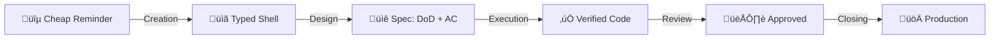

# Issue Lifecycle Router

[[life-vision]]

Issues are the single source of truth for all work. They're fed from multiple sources — email, WhatsApp, transcripts, conversations — some captured manually, some automatically (e.g., agents turning transcripts into tasks).

Issues move from cheap reminders to finished deliverables through progressive refinement. This document defines what each stage of that refinement means, what comes out of it, and which position is accountable.

The system captures everything because capturing is nearly free. Everything after capture is refinement.

---

## Refinement Pipeline

| Stage | Output |
|-------|--------|
| **Creation** | Issue with type label (shell + context) |
| **Design** | DoD + AC in tracking.md |
| **Execution** | Code on branch, backpressure verified, merged to staging |
| **Review** | Business-approved on staging |
| **Closing** | Merged to production, issue closed |

> **Gap:** Currently, issues close after merge to staging (not production). The system doesn't yet distinguish staging-merged from production-deployed.

**At epic level:** Same refinement, different scope. See [Epic Lifecycle](#epic-lifecycle) below.

---

## Foundational Principles

### Issues Are Cheap

*"We cannot rely on anybody to be aware of anything. The system must be aware of everything."*

Creating an issue is the cheapest thing in the system. The simpler it is, the more likely someone creates it. Work only exists when it's tracked.

| Principle | Meaning |
|-----------|---------|
| **Immediate capture** | Work → issue immediately. No "I'll remember." |
| **Fast closing** | Issues should close quickly, not linger |
| **Cascade creation** | Closing one → spawn next if needed |
| **No floating context** | Nothing lives outside the system |

### Closure Clarity

Every issue has clear "when is this done?"

| Type | Done When |
|------|-----------|
| **maker/spec-design** | Artifact created (design doc, follow-up issue) |
| **maker/spec-implement** | DoD + AC verified + merged to staging |

---

## Work Types

| Type | Meaning | Context |
|------|---------|---------|
| **maker/spec-design** | Creates specifications | Needs context OUTSIDE the issue |
| **maker/spec-implement** | Implementable directly | Everything needed is IN the issue |

**At task level (primary):** The Developer owns both types. Spec-design = define DoD + AC. Spec-implement = build it.

**At epic level (within an epic):** The JA creates a spec-design sub-issue — producing a design doc through extraction passes. Same work type, different position, different level. The SA ensures design quality but the JA does the extraction work.

**Undefined:** JA work type label encoding — how is spec-design at JA level signaled in tooling and on the board? Does the JA sub-issue get a `maker/spec-design` label, a position-specific label, or is the sub-issue relationship to the epic sufficient signal?

**Key insight:** Type describes what KIND of refinement is happening. Position determines who does it. Level determines scope.

### Developer Entry Points

1. **From epic** → decompose design doc into tasks → enter at Creation
2. **From cheap reminder** → enter at Creation directly

Not everything is an epic. A cheap reminder can be a task directly.

---

## Epic Lifecycle

An epic is a business outcome. It represents a single meaningful effort — client deliverable or internal initiative — that lives on the board from identification to completion. Epics are created when work is identified, not born from a design phase. All positions contribute sub-issues to the same epic: the JA designs within it, the Developer builds within it, the Dev Lead reviews within it.

### What IS an Epic

An epic is a GitHub Issue that serves as both a task container and a knowledge container:

- **Task container:** Sub-issues represent the work — each position creates sub-issues relevant to their accountability
- **Knowledge container:** Transcripts, emails, and meeting notes centralize here — the epic stays stable while sub-issues can move, change, or be recreated

**Creating an epic is cheap but rare.** The shell costs nothing (What and Why only), but each epic is a commitment to deliver a business outcome. Issues are created often — they're reminders. Epics are created rarely — they're promises.

**Two diagnostic signals:**
- **Too many Active epics** = capacity overcommit. You've promised more than you can deliver.
- **Creating epics too frequently** = strategic fragmentation. Business outcomes should be stable commitments, not reactions. If you're spawning epics weekly, you're not thinking at the right level — epics are too granular or strategy isn't guiding decisions.

**GitHub mapping:**

| Signal | Mechanism |
|--------|-----------|
| **Title prefix** | `Epic: {name}` — human-scannable in any list |
| **Label** | `epic` — programmatically filterable, board views can group by it |
| **Sub-issues** | Linked via `gh sub-issue` — structural parent-child relationship |

The epic board shows only epics. The sub-issue progress bar (X of Y) provides at-a-glance status. Manager tasks live on a separate operational board.

**Epics do NOT have:**
- Acceptance criteria or tracking.md — the epic is a container, not a verifiable unit
- A GitHub assignee — only sub-issues get assigned to the position executing them

### Epic Creation

VP/Delivery creates epics when a business outcome is identified. The epic enters the board in **Not Started** as a shell — What and Why only. No sub-issues yet.

**Routing within the epic:** VP/Delivery (or SA acting on VP/Delivery's behalf) decides whether the business outcome needs a design doc (JA creates a spec-design sub-issue) or can be built directly (Developer creates spec-implement sub-issues). This routing decision determines which position creates the first sub-issue.

**Context partitioning:** Each sub-issue has its own trace line (comments, commits, conversations). The JA's extraction pass comments live on the JA's sub-issue — the Developer never needs to read them. Context is partitioned by sub-issue, not by issue lifecycle.

**Undefined:** Data artifact centralization — where do raw artifacts (spreadsheets, PDFs, test data) live across the JA-to-Developer handoff? Options: hippocampus project directory as anchor (both JA and Developer reference it), epic body (centralized but GitHub-limited), or sub-issue tracking dirs (current pattern, but orphans on close).

### Per-Position Accountability

Each position has a distinct accountability toward the same epic. All positions contribute sub-issues — ownership is per sub-issue, not per epic.

| Position | Epic-Level Accountability | Sub-Issue Work |
|----------|--------------------------|----------------|
| **VP/Delivery** | Creates epic, moves to Done | Owns epic board transitions |
| **SA** | Design quality standards | Reviews JA's design doc output |
| **JA** | Creates spec-design sub-issue, produces design doc | Works within Active phase |
| **Dev Lead** | Moves epic to Validating, review queue processing | Comprehension gates, staging witness |
| **Developer** | Creates spec-implement sub-issues from design doc | Builds, verifies, deploys |

**Decomposition is still the Developer's act — not the JA's.** The JA's spec-design sub-issue produces a design doc. The Developer reads it and creates sibling spec-implement sub-issues. The Dev Lead's starting-point gate measures Developer comprehension — if the JA pre-decomposes, the gate becomes a rubber stamp.

**Dev Lead gates are comprehension signals.** The starting-point review and tracking.md review measure whether the Developer understands the design doc — not just whether tasks were completed. A poor decomposition signals either a design doc clarity problem (JA) or a comprehension gap (Developer growth opportunity).

### Gate Signal Mechanism

The `review` label signals "ready for review." It appears twice on the epic (bookending the work) and once per sub-issue gate:

**Epic level (main board → Review column):**

| When | Gate | Sub-issue progress |
|------|------|--------------------|
| **Start** — Developer just created sub-issues | Decomposition review: "Does Developer understand the design doc?" | 0 of N complete |
| **End** — all sub-issues delivered | SA final look before epic closure | N of N complete |

**Sub-issue level (Dev Lead Review Queue → dedicated project):**

| When | Gate |
|------|------|
| Spec complete (DoD + AC in tracking.md) | Spec quality review |
| Deployed to staging | Human witness on staging |

The Developer adds `review`; the reviewer removes it after approval.

#### Dev Lead Review Queue

A dedicated GitHub Project that surfaces sub-issue gates without cluttering the main board. The main board stays clean (epics only). Sub-issues with `review` auto-appear here, grouped by parent epic.

**Project Setup:**

| Setting | Value |
|---------|-------|
| **Project name** | Dev Lead Review Queue |
| **Layout** | Table (not board — this is a processing list, not a workflow pipeline) |
| **Auto-add workflow** | Filter: `is:issue label:review` — repo: `DaveX2001/deliverable-tracking` |
| **Auto-archive** | On close — keeps the table clean after processing |

**Table Fields:**

| Field | Purpose |
|-------|---------|
| **Parent Issue** | Groups sub-issues under their parent epic (reads sub-issue metadata — parent does not need to be on this project) |
| **Title** | Sub-issue title (linked) |
| **Assignee** | Which Developer's work is up for review |
| **Date Added** | Enables FIFO sort (oldest first = highest priority) |

Group by: Parent Issue. Sort by: Date Added (ascending).

**Processing Workflow:**

1. Developer completes spec or deploys to staging → adds `review` label to sub-issue
2. Sub-issue auto-appears in the Review Queue, grouped under its parent epic
3. Dev Lead processes items FIFO (top to bottom, oldest first)
4. **Approval:** Dev Lead removes `review` label. Sub-issue proceeds to next stage.
5. **Rejection:** Dev Lead removes `review` label + posts comment with feedback. Developer fixes, re-adds `review` when ready. Sub-issue re-enters the queue.

**Automation (GitHub Action):**

A single GitHub Action on the `label` event provides two signals:

| Trigger | Action |
|---------|--------|
| `review` label added | Count previous `review` add/remove cycles on this issue. Post comment: "Review cycle {N}." At cycle 3: "⚠️ Review cycle 3 — potential design doc clarity issue." |
| Daily schedule | Scan open issues with `review` label older than 2 business days. Post ⚠️ comment: "In review queue for {N} days (SLA: 2 days)." |

The review cycle counter makes rejection frequency visible on the sub-issue itself — both Dev Lead and Developer see it. At cycle 3, the signal shifts from Developer comprehension to design doc clarity (routes back to JA). The SLA monitor is a self-accountability check — visible when opening any stale item.

### Starting-Point Sub-Issues

The Developer reads the design doc and creates the first sub-issues they can see. This is not a full decomposition — it's a starting point. More sub-issues emerge naturally as work progresses.

- **Simple epics** (e.g., 3 clear workstreams): The starting point may be the full set of sub-issues
- **Complex epics** (e.g., design doc with evolving scope): The starting point is the first 1-2 actionable sub-issues — the rest spawns from doing the work

Creating ten sub-issues where seven will be closed is bad practice. The Developer should look as far as they can see and start doing.

**Undefined:** Detailed decomposition mechanics for complex epics — pending empirical evidence from applying this to issue #373.

### Board Architecture

Two boards serve different audiences at different cadences:

| Board | Audience | Cadence | Content |
|-------|----------|---------|---------|
| **Commitments Board** | VP/Delivery, SA, Dev Lead | Weeks/months | Business outcomes only |
| **Work Board** | Developer, Dev Lead | Days | Sub-issues, manager tasks, review processing |

The Work Board includes review processing views (filtered by `review` label, FIFO sort) for the Dev Lead to process sub-issue gates. See [Gate Signal Mechanism](#gate-signal-mechanism).

**The Commitments Board is a capacity signal.** The number of Active epics tells you how many business outcomes you've committed to. 119 issues tells you nothing about capacity. 10 Active epics tells you "we're overcommitted." The board becomes a commitment dashboard — a forcing function for saying no to new work.

### Commitments Board Columns

| Column | Meaning | Trigger | Owner |
|--------|---------|---------|-------|
| **Not Started** | Epic identified, no work begun | Default | VP/Delivery creates |
| **Active** | Work happening (any position) | First sub-issue starts | Automated |
| **Validating** | All implementation done, final look | Dev Lead moves | Dev Lead |
| **Done** | Business outcome delivered | VP/Delivery closes | VP/Delivery |

"Active" replaces "In Progress" — signals long-running work without implying it should be quick. Epics may be Active for weeks or months. The sub-issue progress bar (X of Y) is the primary signal, not the column.

**Sprint boundaries:** GitHub milestones scope sub-issues to touch-point windows (e.g., "Archibus — Sprint March 10"). Milestones are orthogonal to the epic hierarchy — no additional nesting level required.

**How milestones connect to client cadence:**

| Source | What It Provides | Cadence |
|--------|-----------------|---------|
| **Monthly plan** | Project priorities, deadlines, capacity allocation | Monthly |
| **Client touch points** | Natural sprint boundaries (meetings, reviews, workshops) | Every 1-3 weeks |
| **Milestone** | Scoped sub-issues for the next touch point | Per touch point |

Before each client meeting, the milestone shows what was completed and what remains. After the meeting, unfinished sub-issues move to the next milestone. The monthly plan sets the strategic frame; milestones execute within it.

**Undefined:** Milestone sufficiency vs release epics — are milestones alone enough for sprint-boundary cadence, or do time-bound release epics (like the CCI pattern) provide better intermediate review checkpoints? Pending empirical evidence from running the milestone pattern on active projects.

### Work Board Columns

| Column | Meaning |
|--------|---------|
| **To Do** | Ready to start |
| **In Progress** | Being worked on |
| **Review** | Waiting for Dev Lead review (`review` label) |
| **Done** | Complete |

Same columns as the current board — these work for fast-moving items. The `review` label auto-adds items to a filtered review processing view (FIFO sort by date added) for the Dev Lead.

### Conversation Audit Trail

Developer sessions (Claude Code conversations) are pushed to a shared repository ([claude-code-conversation-store](https://github.com/MariusWilsch/claude-code-conversation-store)) and linked from epic comments. This gives the Dev Lead forensic-level access to investigate decisions point-in-time using the conversation-reader skill, without relying on the Developer's account of what happened.

### Epic Closure

All sub-issues complete = mechanical closure signal. VP/Delivery confirms the business outcome was delivered before closing. This is user authority — no formal verification criteria on the epic itself.

---

## Stage 1: Creation

**What happens:** Work is identified as needing tracking. A shell is created with a type label.

**Output:** Issue with type label + initial context (What, Why, Notes).

**Key concept:** The shell is a reminder, not a specification. It exists to track that work was identified. Refinement happens in later stages.

*Currently implemented via:* `deliverable-tracking` skill creates shell + type label in GitHub Issues.

---

## Stage 2: Design

**What happens:** The issue gets refined from a reminder into a specification.

**Output (by type):**

| Type | Output |
|------|--------|
| **maker/spec-design** | Artifact (design doc, follow-up issue). Design IS execution for this type — no separate Stage 3. |
| **maker/spec-implement** | DoD + AC defined in tracking.md. Ready for execution. |

**Decision point (spec-implement):** After DoD + AC are defined, the issue is ready for execution.

*Currently implemented via:* rubber-duck (externalization), ac-create (DoD + AC). Detailed procedure in Developer Operations Manual.

**Concept links:**
- [AC DoD Framework](https://mariuswilsch.github.io/public-wilsch-ai-pages/global/ac-dod-framework) — DoD vs AC distinction
- [task-lifecycle-reference](https://mariuswilsch.github.io/public-wilsch-ai-pages/global/task-lifecycle-reference) — Phase overview

---

## Stage 3: Execution

**What happens:** The specification becomes working code with backpressure verification.

**Output:** Code on branch, verified through automated backpressure (sanity checks, AC verification), merged to staging.

**Key concept:** Valid outcomes include documented failure. "This approach doesn't work" is a valid execution result when documented.

*Currently implemented via:* Worktree creation, clarity workflow, implementation + verification sessions. Detailed procedure in Developer Operations Manual.

**Concept links:**
- [Ship with Confidence](https://mariuswilsch.github.io/public-wilsch-ai-pages/global/ship-with-confidence) — Testing pyramid (AC → Smoke → Human Witness)

---

## Stage 4: Review

**What happens:** Quality gate before closing. Two review types:

- **Spec quality** (Dev Lead position) — "Does the design make sense?"
- **Business witness** (VP/Delivery position) — "Is this what I wanted?"

Both happen asynchronously. Developer continues to next work.

*Currently implemented via:* `review` label triggers async review. Detailed procedure in Developer Operations Manual.

---

## Stage 5: Closing

**What happens:** Work is complete. The issue is closed and may trigger cascade creation.

**Output (by type):**

| Type | Closing Action |
|------|----------------|
| **maker/spec-design** | Artifact determines next (SA decides): |

**Spec-design closing (sub-issue within an epic):**
The JA's spec-design sub-issue closes when the design doc is complete. The design doc links from the epic body. The Developer then creates sibling spec-implement sub-issues from the design doc. No new epic is created — the epic already exists.

**Spec-design closing (standalone, outside an epic):**
1. **→ Spec-implement issue** — simple scope, Developer handles directly (cascade).
2. **→ Client deliverable** — external output. Send to client. No cascade.

| **maker/spec-implement** | Merge to production. Deploy. Issue closed. |

*Currently implemented via:* `done` label, PR merge, deployment.

---

## Related Documents

- [Primary Aim - Life Vision](https://mariuswilsch.github.io/public-wilsch-ai-pages/global/primary-aim-life-vision)
- [Strategic Objective - Wilsch AI Services](https://mariuswilsch.github.io/public-wilsch-ai-pages/global/strategic-objective-wilsch-ai-services)
- [Organization Chart - Wilsch AI Services](https://mariuswilsch.github.io/public-wilsch-ai-pages/global/organization-chart-wilsch-ai-services)
- [Developer Operations Manual](https://mariuswilsch.github.io/public-wilsch-ai-pages/global/developer-operations-manual-wilsch-ai-services)
- [AC DoD Framework](https://mariuswilsch.github.io/public-wilsch-ai-pages/global/ac-dod-framework)
- [Ship with Confidence](https://mariuswilsch.github.io/public-wilsch-ai-pages/global/ship-with-confidence)

---

## Source

- E-Myth Management Strategy interview (2026-02-06) — ILR reconciliation with Operations Manual
- Original Issue Lifecycle Router (2026-01)
- Framework: Michael Gerber, *The E-Myth Revisited*, Chapter 15
- Epic Lifecycle extraction pass (2026-02-16) — definition, per-position accountability, lifecycle stages
- Session: /Users/verdant/.claude/projects/-Users-verdant-Documents-projects-00-WILSCH-AI-INTERNAL--soloforce/3762438b-6817-44d9-ae03-f45006c7917e.jsonl
- Evidence: Issue #789 (simple epic), Issue #373 (complex epic), ADR epic/sub-issue pattern
- Dev Lead observability extraction pass (2026-02-17) — gate signal mechanism, review queue design
- Session: /Users/verdant/.claude/projects/-Users-verdant-Documents-projects-00-WILSCH-AI-INTERNAL--soloforce/478e31b8-5f19-4f85-b370-7fa437440795.jsonl
- Review Queue config spec extraction pass (2026-02-19) — table layout, processing workflow, rejection flow, SLA automation
- Session: /Users/verdant/.claude/projects/-Users-verdant-Documents-projects-00-WILSCH-AI-INTERNAL--soloforce/e139408b-3821-499e-95dc-5f5e7f164176.jsonl
- Epic model restructure extraction pass (2026-02-24) — epic = business outcome, two-board architecture, position accountability recalibration, milestone sprint boundaries
- Session: /Users/verdant/.claude/projects/-Users-verdant-Documents-projects-00-WILSCH-AI-INTERNAL--soloforce/73be003e-98a7-4deb-851f-9764a04081d9.jsonl
- Research: SAFe, Atlassian, GitHub April 2025 sub-issues GA — validated epic-as-business-outcome model
