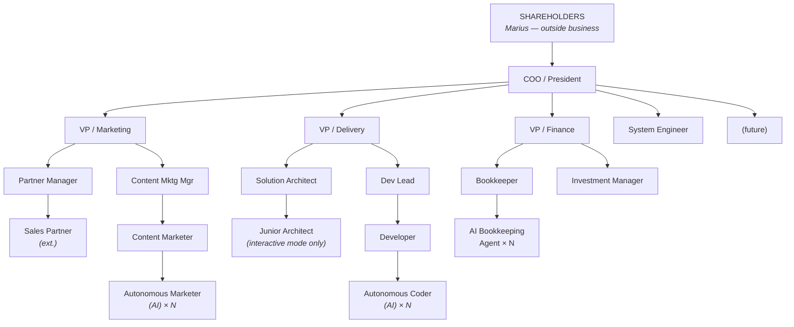

# Organization Chart - Wilsch AI Services

[[life-vision]]

The Organization Chart for Wilsch AI Services at **done state** — when the founder operates as Shareholder, outside the business. Framework: Michael Gerber, *The E-Myth Revisited*, Chapter 14.

---

## Core Principle

**Organize around functions, not personalities.**

> "Most companies organize around personalities rather than around functions. That is, around people rather than accountabilities or responsibilities. The result is almost always chaos."

---

## The Chart



---

## Position Summary

### Executive Level (Reports to Shareholders)

| Position | Accountable For | Direct Reports |
|----------|-----------------|----------------|
| **COO/President** | Overall achievement of Strategic Objective | VP/Marketing, VP/Delivery, VP/Finance, System Engineer |

### VP Level (Reports to COO)

| Position | Accountable For | Direct Reports |
|----------|-----------------|----------------|
| **VP/Marketing** | Finding clients + brand awareness | Partner Manager, Content Marketing Manager |
| **VP/Delivery** | All projects shipped successfully | Solution Architect, Dev Lead |
| **VP/Finance** | Cash flow, assets, compliance | Bookkeeper, Investment Manager |
| **System Engineer** | Claude Code Operating System (Improvement Loop) | None (affects all AI agents company-wide) |

### Manager Level

| Position | Reports To | Accountable For | Direct Reports |
|----------|------------|-----------------|----------------|
| **Partner Manager** | VP/Marketing | Sales partner relationships | Sales Partners (external) |
| **Content Marketing Manager** | VP/Marketing | Content strategy + lead gen | Content Marketer |
| **Solution Architect** | VP/Delivery | Design doc quality + standards | Junior Architect × N |
| **Dev Lead** | VP/Delivery | Code quality + delivery | Developer |
| **Bookkeeper** | VP/Finance | Operational finance, Xolo interface | AI Bookkeeping Agents |
| **Investment Manager** | VP/Finance | Asset allocation, interest optimization | None |

### Worker Level

| Position | Reports To | Accountable For | AI Mode |
|----------|------------|-----------------|---------|
| **Sales Partner** | Partner Manager | Closing deals | None (external) |
| **Content Marketer** | Content Marketing Manager | Content production | Interactive + Orchestration |
| **Junior Architect** | Solution Architect | Individual design docs | Interactive only |
| **Developer** | Dev Lead | Code production + AI review | Interactive + Orchestration |

### AI Agent Level

| Agent Type | Orchestrated By | Work |
|------------|-----------------|------|
| **Autonomous Marketer** | Content Marketer | Content drafts, graphics, video |
| **Autonomous Coder** | Developer | Code production in non-interactive mode |
| **AI Bookkeeping Agent** | Bookkeeper | Invoice processing, expense categorization |

---

## AI Agent Pattern

**Innovation:** AI agents are explicit on the org chart because they produce important work.

### Two Modes of Working with AI

| Mode | Description | Human Limit |
|------|-------------|-------------|
| **Interactive** | Human works WITH AI (pair programming, collaborative design) | 3-4 sessions max |
| **Non-Interactive (Orchestration)** | Human spawns autonomous agents, reviews output | Scales vertically (N agents per human) |

### Position AI Modes

| Position | Interactive | Orchestration |
|----------|-------------|---------------|
| **Junior Architect** | ✅ Yes | ❌ No (design requires human thinking) |
| **Developer** | ✅ Yes | ✅ Yes (Autonomous Coders) |
| **Content Marketer** | ✅ Yes | ✅ Yes (Autonomous Marketers) |
| **Bookkeeper** | ✅ Yes | ✅ Yes (AI Bookkeeping Agents) |

### Scaling Model

- 1 Human = 3-4 interactive sessions max
- 1 Human = N autonomous agents (limited by review capacity)
- Need more capacity? Add another human at that position
- Humans scale horizontally, AI agents scale vertically

---

## Work Levels

| Level | IN the system (tactical) | ON the system (strategic) |
|-------|--------------------------|---------------------------|
| **Worker** | ✅ Yes | ❌ No |
| **Manager** | ✅ Yes (some) | ✅ Yes |
| **VP** | ❌ No | ✅ Yes only |
| **COO** | ❌ No | ✅ Yes only |
| **Shareholder** | ❌ No | ✅ Oversight only |

**Climbing the chart:** Each level you climb, you shed tactical work and take on more strategic work.

---

## Special Positions

### System Engineer (Reports to COO)

**Why it exists:** The Claude Code Operating System must be centralized. If each position improves AI behavior independently, you get N divergent systems.

**Accountable for:**
- Improvement Loop (programming wrong AI behavior → deterministically right)
- Unified AI behavior across ALL positions
- Affects: Autonomous Coders, Autonomous Marketers, AI Bookkeeping Agents

**Work type:** Strategic only (ON the system, not IN it)

### Sales Partners (External)

**Why external:** Sales comes through partnerships with people who have industry connections (Thomas, Ulrich, future partners).

**Managed by:** Partner Manager (internal)

**Model:** Partners find and close deals. Wilsch AI delivers.

### Xolo (External Service Provider)

**What Xolo is:** All-in-one platform for Estonian e-Residency businesses. External service provider, not an employee.

**What Xolo does:**
- Monthly accounting and bookkeeping
- VAT reporting
- Salary tax reporting
- Annual reporting
- Legal address (contact person provider)
- Statistics Estonia submissions

**What Xolo does NOT do:**
- Investment management
- Cash flow strategy
- Financial decision-making

**Interface:** Bookkeeper (internal) provides Xolo with documents, invoices, receipts. Xolo processes and reports.

**Model:** Operational finance outsourced to Xolo. Strategic finance (investment, asset allocation) stays internal.

---

## Handoff Sequence

Prototype from the **bottom up**, hand off, climb the chart:

### VP/Delivery Path
```
1. Developer (you now) → hand off → move up
2. Dev Lead → hand off → move up
3. Solution Architect → hand off → move up
4. VP/Delivery → hand off → move up
5. COO → hand off → Shareholder
```

### Current State (2026-02)

**Mohamed** being trained as: Developer

**Founder (Marius) holds ALL other positions:**

| Function | Positions Held |
|----------|----------------|
| **Executive** | Shareholder, COO/President |
| **Marketing** | VP/Marketing, Partner Manager |
| **Delivery** | VP/Delivery, Solution Architect, Dev Lead |
| **Finance** | VP/Finance, Bookkeeper (Xolo interface), Investment Manager |
| **System** | System Engineer |

**First handoff in progress:** Developer → Mohamed

---

## Derivation Chain

```
Strategic Objective
      ↓
FUNCTIONS (what categories of work?)
      ↓
RESULTS (what must each function produce?)
      ↓
POSITIONS (who's accountable?)
```

| Function | Result | VP |
|----------|--------|-----|
| Finding clients | Signed contracts, revenue | VP/Marketing |
| Delivering projects | Finished AI projects deployed | VP/Delivery |
| Managing money | Cash flow, asset growth | VP/Finance |
| Improving AI system | Deterministically correct AI behavior | System Engineer |

---

## Next Steps

1. **Position Contracts** — For each position, define:
   - Results to be achieved
   - Work accountable for
   - Standards for evaluation
   - Signature line

2. **Sign contracts** — Founder signs for all positions currently held

3. **Prototype from bottom** — Start with Developer position (Mohamed)

---

## Related Documents

- [Primary Aim - Life Vision](https://mariuswilsch.github.io/public-wilsch-ai-pages/global/primary-aim-life-vision)
- [Strategic Objective - Wilsch AI Services](https://mariuswilsch.github.io/public-wilsch-ai-pages/global/strategic-objective-wilsch-ai-services)
- [Organizational Strategy (Component #3)](https://mariuswilsch.github.io/public-wilsch-ai-pages/global/organizational-strategy-lifecycle)

---

## Reference Materials

| Resource | Purpose |
|----------|---------|
| [EMyth Organizational Chart Guide (PDF)](https://github.com/MariusWilsch/soloforce/blob/main/.claude/tracking/issue-668/artifacts/EMyth%20Organizational%20Chart%20Guide.pdf) | 8-step process |
| [EMyth Writing Position Agreements (PDF)](https://github.com/MariusWilsch/soloforce/blob/main/.claude/tracking/issue-668/artifacts/EMyth%20Writing%20Position%20Agreements.pdf) | Position Contract template |

---

## Source

- E-Myth Organizational Strategy interview (2026-02-04)
- Framework: Michael Gerber, *The E-Myth Revisited*, Chapter 14
