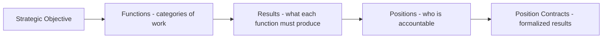
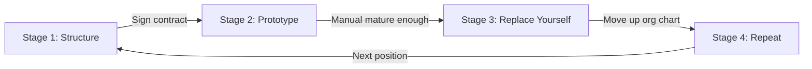
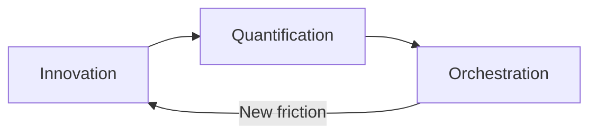

# Position Build Process

[[life-vision]]

How to build any position from scratch. Cross-component process spanning Organizational Strategy (Chapter 14) and Management Strategy (Chapter 15).

**Goal:** Make the pipeline flow. Each position feeds the next. No starvation downstream.

---

## Derivation Chain

Every position traces back to the Strategic Objective through this chain:



**Mindset:** Franchise designer. Top-down from Strategic Objective, not bottom-up from experience. You don't need to know HOW to do the work to know WHAT it must produce. The Entrepreneur designs the system; the Technician does the work.

---

## The Four Stages



---

## Stage 1: Structure (WHAT)

**Component:** Organizational Strategy (Chapter 14)
**When:** Day zero. Before any work. Can always be written first because it defines WHAT, not HOW.

### Step A: Organization Chart

Batch-designed. All positions when "done." Designed once, updated rarely.

> "What functions must exist to deliver the Strategic Objective?"

### Step B: Derive WHY

When zooming into a specific position to build it:

| Question | Purpose |
|----------|---------|
| **What result do I expect from this position?** | Define the output |
| **Who receives this result?** | Connect to downstream position or client |
| **What SO content creates the need?** | Trace back to Strategic Objective |

If the SO can't answer → revisit SO and Org Chart first.

**Example (Solution Architect):**
- Result: Complete design docs from Knowledge Extraction (Phase 0)
- Receiver: Developer (Mohammed) — needs specs to execute
- SO connection: "Pflichtenheft before POC. Always." + Phase 0 system component

### Step C: Position Contract

| Element | Definition |
|---------|-----------|
| **Results to be achieved** | What outcomes must this position produce? |
| **Work accountable for** | What activities is this position responsible for? |
| **Standards for evaluation** | How do we measure if results are achieved? |
| **Signature** | Person signs, accepting accountability |

> "A Position Contract is not a job description. It is a contract between the company and an employee, a summary of the rules of the company's game."

**You sign it first.** The founder signs every Position Contract before anyone else does. You're committing to produce those results NOW. Accountability starts with you. At Stage 3, the hire signs the same contract — accountability transfers.

Position Contracts are **long-lived** because they define results, not tasks.

**Reference:** [EMyth Writing Position Agreements](https://mariuswilsch.github.io/public-wilsch-ai-pages/project/soloforce/emyth-chapters/emyth-writing-position-agreements)

---

## Stage 2: Prototype (HOW)

**Component:** Management Strategy (Chapter 15)
**When:** After signing the Position Contract. Continuous until Operations Manual is mature enough to hand off.

### The Dual Hat

| Hat | What you do | Mindset |
|-----|------------|---------|
| **IN** the position | Actually do the work | Technician — doing |
| **ON** the position | Study how you do the work, improve it, document it | Manager/Entrepreneur — designing |

> "As Murray goes to work *in* the position of Salesperson, he also goes to work *on* the position of Salesperson as Vice-President/Marketing." (Ch 14, p.137)

### The BDP Loop (Working ON)

Working ON the position = the improvement loop. Not just documenting — **improving.**



#### Book Definitions (Chapter 10)

| Step | Book Definition | Core Question |
|------|----------------|---------------|
| **Innovation** | "Creativity thinks up new things. Innovation does new things." | "What is the best way to do this?" |
| **Quantification** | "The numbers related to the impact an Innovation makes." | "Did the Innovation work? Before vs after." |
| **Orchestration** | "The elimination of discretion at the operating level." | "If it works, standardize it. Every single time." |

#### Personal Definitions (Wilsch AI Services)

| Step | Personal Definition | Tool |
|------|-------------------|------|
| **Innovation (identify)** | Flag friction: "What's the problem? Why did this go wrong?" | `/flag-for-improvement` (Session A) |
| **Innovation (solve)** | "How can we do this differently?" Not the commodity, the process. | `/improve-system` (Session B) |
| **Quantification** | Verify the fix: "Is the behavior working or not?" Redo, observe, measure. | Session C verification |
| **Orchestration** | Merge into the toolkit. No more choice — AI follows the new rule. | `git push` to main |

**Key insight:** The CCI pipeline (`/flag-for-improvement` → `/improve-system` → verify) IS the BDP loop for the System Engineer position. The same pattern applies to every position — only the subject of innovation changes.

### The Operations Manual

**Output of Stage 2.** A collection of all systems for the position.

| Concept | Definition |
|---------|-----------|
| **Operations Manual** | The full book for a position. "How we do it here." |
| **System** | An individual process within the manual |
| **9-Step Systems Guide** | Template for documenting each system consistently |

#### 9-Step Systems Guide (per system)

1. **Specify the result** and name the system
2. **Diagram** the system (box-and-arrow)
3. **Write steps** as clearly stated benchmarks
4. **Assign accountabilities** (to roles, not people)
5. **Determine timing** (when each benchmark must be achieved)
6. **Identify required resources** (staffing, tools, information)
7. **Determine quantification** (how to measure if the system works)
8. **Establish standards** (quantity, quality, behavior thresholds)
9. **Document** the system (it's not done until it's documented)

**Reference:** [EMyth Systems Guide](https://mariuswilsch.github.io/public-wilsch-ai-pages/project/soloforce/emyth-chapters/emyth-systems-guide)

---

## Stage 3: Replace Yourself

**When:** Operations Manual is mature enough to hand off. Hire a novice, not an expert.

### Phase A: Before Hire

- You own: Tactical (doing the work) + Strategic (prototyping the system)

### Phase B: During Transition

- Hire signs the Position Contract
- Hire learns the Operations Manual
- You: Training, oversight, ensuring the system works

### Phase C: Fully Transitioned

- Hire owns tactical work + can suggest improvements
- You move UP to the position above on the org chart

> "Only when the Sales Operations Manual is complete does Murray run an ad for a salesperson. But not for someone with sales experience. Not a Master Technician. But a novice. A beginner." (Ch 14, p.138)

---

## Stage 4: Repeat

Continue up the org chart until you reach **Shareholder** — outside the business, owning no tactical work. Strategic oversight only.

---

## Transition Example: Developer → Solution Architect

```
Before Hire (Developer):
  Developer position: You do tactical (coding) + strategic (documenting)

During Transition (Developer → Mohammed):
  Developer: Mohammed doing tactical, you training
  Dev Lead + SA: You now doing tactical + strategic HERE

Fully Transitioned:
  Developer: Mohammed owns it
  SA: You prototype THIS position next (Stage 1 → Stage 2)
```

---

## Related Documents

- [Organization Chart - Wilsch AI Services](https://mariuswilsch.github.io/public-wilsch-ai-pages/global/organization-chart-wilsch-ai-services)
- [Organizational Strategy (Component #3)](https://mariuswilsch.github.io/public-wilsch-ai-pages/global/organizational-strategy-lifecycle) — Stage 1 artifacts
- [Strategic Objective - Wilsch AI Services](https://mariuswilsch.github.io/public-wilsch-ai-pages/global/strategic-objective-wilsch-ai-services) — derivation source
- [Primary Aim - Life Vision](https://mariuswilsch.github.io/public-wilsch-ai-pages/global/primary-aim-life-vision)
- [Developer Operations Manual](https://mariuswilsch.github.io/public-wilsch-ai-pages/global/developer-operations-manual-wilsch-ai-services) — Stage 2 output example
- [/improve-system Architecture](https://mariuswilsch.github.io/public-wilsch-ai-pages/global/improve-system-architecture) — BDP loop implementation

## Reference Materials

| Resource | Purpose |
|----------|---------|
| [EMyth Organizational Chart Guide](https://mariuswilsch.github.io/public-wilsch-ai-pages/project/soloforce/emyth-chapters/emyth-organizational-chart-guide) | Stage 1: Org Chart + Position templates |
| [EMyth Writing Position Agreements](https://mariuswilsch.github.io/public-wilsch-ai-pages/project/soloforce/emyth-chapters/emyth-writing-position-agreements) | Stage 1: Position Contract template |
| [EMyth Systems Guide](https://mariuswilsch.github.io/public-wilsch-ai-pages/project/soloforce/emyth-chapters/emyth-systems-guide) | Stage 2: 9-step system documentation |
| [EMyth Operations Manual Guide (MG-0080)](https://mariuswilsch.github.io/public-wilsch-ai-pages/project/soloforce/emyth-chapters/emyth-operations-manual-guide) | Stage 2: Building and maintaining the Operations Manual |

---

## Source

- E-Myth Organizational Strategy interview (2026-02-04) — Stage 1 artifacts
- Position Build Process rubber-duck session (2026-02-07) — Full lifecycle, BDP mapping, derivation chain
- Framework: Michael Gerber, *The E-Myth Revisited*, Chapters 10, 14, 15, 18
