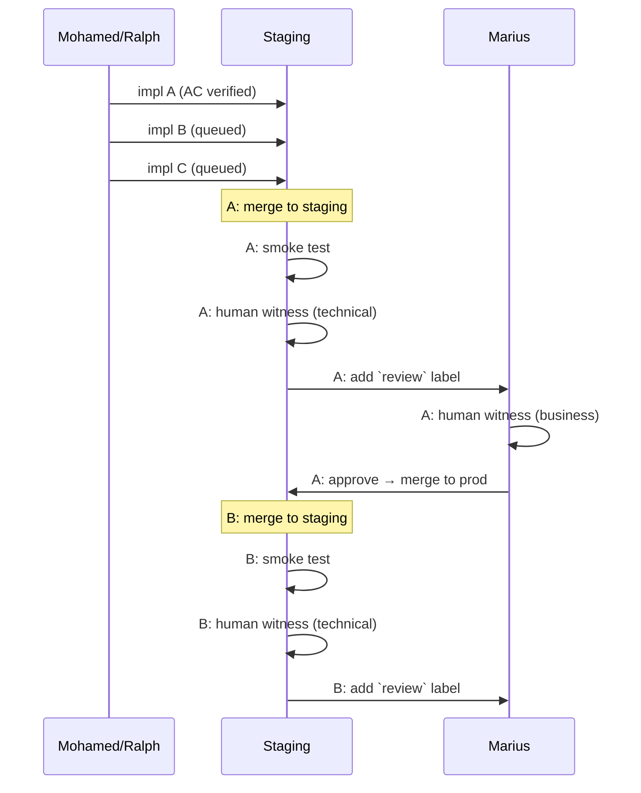

# Ship with Confidence
[[testing-methodology]]

## Overview

This document defines the testing workflow between automated AC verification and production deployment. It establishes staging as the environment for human verification (UAT) before production release.

## Problem Statement

**Merge paralysis occurs when:**
- Automated tests pass (ACs verified)
- But no environment exists to witness actual output
- Local environment is fragile (missing configs, dependency issues)
- Production feels too risky (real users affected)

**Result:** Features pile up in worktrees, nothing gets merged.

## Why Human Witness Layer

**Reference:** [Don't Waste Your Backpressure](https://banay.me/dont-waste-your-backpressure/)

**Backpressure** = automated feedback that lets agents self-correct without human intervention. AC verification is backpressure for AI development.

**But AC verification has limits:**

| Layer | Tests | Blind Spot |
|-------|-------|------------|
| **AC Verification** | "Does it match the spec?" | Unspecified behavior |
| **Human Witness** | "Does this feel right?" | Nothing - catches unknowns |

**Three purposes of human witness layer:**

1. **Break AI-AI Bias Loop**
   - AI implementing → AI verifying = same "alliance" with implementation
   - Even with fresh context, AI tests what AI built
   - Human perspective is truly independent

2. **Test Experience (Not Spec)**
   - ACs verify "code behaves as specified"
   - Humans verify "this is what I wanted"
   - Emergent behaviors, UX issues, "feels wrong" moments

3. **Trust Building**
   - Psychological: can't confidently ship code you've never seen run
   - "I witnessed it work" → confidence to merge
   - Even if AC passes, human needs to see it

**AC Verification Scope (based on analysis of verification.jsonl patterns):**

AC verification is MORE comprehensive than "isolation testing":
- Tests multi-service integration (FDW, OAuth, storage)
- Verifies end-to-end data flows
- Runs against real backends (Supabase, APIs)

**What AC does NOT test:**

AC tests what the spec says. Nothing more.

The spec cannot anticipate:
- Weird bugs that only appear when a real user clicks through
- Edge cases nobody thought to specify
- "It works but something feels off" moments
- Interactions between features that weren't in scope

**Learned the hard way:** It's tempting to think comprehensive ACs test everything. They don't. They test exactly what you specified - and specs always have blind spots. Human witness catches the unspecified weirdness.

## Testing Pyramid

```
              /\
             /  \  Human Witness - Freeform: catches unspecified weirdness
            /----\
           /      \  (Developer: technical, Product Owner: business perspective)
          /--------\
         / Smoke    \ - Backpressure: "Does infrastructure work?" (automated)
        /  Test      \
       /--------------\
      /  ACs (AI)      \ - Backpressure: "Does it match spec?" (automated)
     /------------------\
```

| Layer | Type | Tester | What It Does | Catches |
|-------|------|--------|--------------|---------|
| **ACs** | Backpressure | AI | Verify spec (GWT) | What's specified |
| **Smoke Test** | Backpressure | Script | Infrastructure regression | "Did we break services?" |
| **Human Witness** | NOT backpressure | Human | Freeform discovery | Unspecified weirdness |

**Key distinction:** ACs and Smoke Test are **backpressure** - automated feedback that lets agents self-correct. Human Witness is fundamentally different - it catches what automation CAN'T anticipate.

**Role perspectives in Human Witness:**
- **Developer (Mohamed):** Technical validation - "Does this work as expected?"
- **Product Owner (Marius):** Business validation - "Is this what I wanted?"

Same freeform process, different eyes. Issues found → comment on GitHub issue → fix in new session.

Testing happens on staging. Sequential by design - human attention is the bottleneck.

**Future upgrade:** When testing queue becomes a bottleneck, add ephemeral environments for parallel testing. See [Scaling: Ephemeral Environments](#scaling-ephemeral-environments).

## Workflow

### Overview: Parallel Dev → Sequential Testing

Development is parallel (AI can run multiple worktrees). Testing is sequential (human attention is the bottleneck - by design).

```
┌─────────────────────┐     ┌────────────────────┐     ┌─────────────┐
│   DEV (parallel)    │     │   TESTING QUEUE    │     │   MARIUS    │
│   AI + worktrees    │     │   (sequential)     │     │   (async)   │
│                     │     │                    │     │             │
│  Issue A ───────────┼────►│ [A: smoke + UAT]   │     │             │
│  Issue B ───────────┼────►│ [B: waiting]       │     │             │
│  Issue C ───────────┼────►│ [C: waiting]       │     │             │
│                     │     │                    │     │             │
│                     │     │  A done ───────────┼────►│ A: review   │
│                     │     │  B: smoke + UAT    │     │             │
│                     │     │  B done ───────────┼────►│ B: review   │
└─────────────────────┘     └────────────────────┘     └─────────────┘
```

### Sequence: Handoffs Over Time



### What Can Be Parallel

| Activity | Who | Parallel? | Why |
|----------|-----|-----------|-----|
| Implementation | AI (Ralph) | ✅ Yes | Multiple worktrees |
| AC Verification | AI | ✅ Yes | Can run multiple |
| Smoke Test | Mohamed | ❌ Sequential | Human attention |
| Human Witness | Mohamed/Marius | ❌ Sequential | Human attention |

**Key insight:** Testing grabs human attention (backpressure). That's the point - it forces the developer to actually witness their work.

## Testing Artifacts

### AC (Automated)

**Format:** Given/When/Then

**Tester:** AI

**Created:** Issue creation or just before implementation

**Purpose:** Verify code behaves as specified

```gherkin
AC2.1: URL Asset Detection
Given: A VGT with asset path starting with "https://"
When: Video generation is triggered
Then: Asset is downloaded to temp location
And: Video uses the downloaded local file
```

### Smoke Test (Fixed per Project)

**Format:** Checklist

**Tester:** Developer

**Created:** When core flow exists (project-level, not per-feature)

**Purpose:** Regression check - did we break the core flow?

**Example:** [Paul Platform SMOKE-TEST.md](https://github.com/MariusWilsch/christmas-paul-package/blob/main/SMOKE-TEST.md)

```markdown
## Smoke Test: [Project Name]
Environment: Staging
Frequency: Every deploy

### Steps:
1. [Step to trigger core flow]
2. [Wait for completion]

### Verify:
[ ] [Core output exists]
[ ] [Core behavior works]
[ ] [No obvious errors]

### Verdict:
PASS → continue to Human Witness
FAIL → investigate before proceeding
```

**Evolution:** Update when critical path changes. Keep <5 minutes.

### Human Witness (Freeform per Feature)

**Format:** Freeform discovery - click through, notice things, comment issues

**Tester:** Developer (technical) or Product Owner (business)

**Purpose:** Catch unspecified weirdness that automation can't anticipate

**Process:**
1. Click through the feature on staging
2. If something feels wrong → comment on GitHub issue
3. Fix in new implementation session
4. If nothing wrong → proceed to add `review` label

**Role perspectives:**
- **Developer witness:** "Does this work as expected?" (technical validation)
- **Product Owner witness:** "Is this what I wanted?" (business validation)

**Artifact:** The GitHub issue comment trail IS the artifact. No separate document needed.

## Rollback Strategy

**Premise:** Worktree workflow ensures each feature = one PR = one squash commit. This makes rollback atomic by design.

**If production breaks after deploy:**

```bash
# 1. Identify the problematic commit
git log --oneline -10  # Find the PR squash commit that caused the issue

# 2. Revert that specific commit
git revert {commit-hash}

# 3. Push to staging branch
git push

# 4. On server: pull and redeploy
ssh WILSCH-AI-SERVER
cd ~/projects/billable/{project}/
git pull && make deploy
```

**Why this works:**
- Each PR = one squash commit = one revert target
- `git revert` creates a NEW commit (doesn't rewrite history)
- Works even if other commits came after the bad one
- The revert itself can be reverted once proper fix is ready

**After rollback:** Create new issue to properly fix the bug, go through normal workflow.

## Role Responsibilities

| Role | Creates | Tests | Approves |
|------|---------|-------|----------|
| **Product Owner (Marius)** | Issues, ACs, Witness hints | Human Witness (business) | Production merge |
| **Developer (Mohamed)** | Code, AC verification | Smoke test, Human Witness (technical) | Staging merge |
| **AI (Ralph)** | - | AC verification | - |

### Handoff Model

**Industry standard:** Developers can self-merge to staging. Production requires approval.

**Specific authority:**

| Actor | Staging Merge | Production Merge |
|-------|---------------|------------------|
| **Mohamed** | ✅ Self-merge allowed | ❌ Requires Marius approval |
| **Ralph** | ❌ Requires human (Mohamed/Marius) | ❌ Requires Marius approval |
| **Marius** | ✅ Full access | ✅ Final gatekeeper |

**Handoff signal:** Add `review` label when Human Witness (technical) passes → Marius notified for Human Witness (business).

## Staging Environment Requirements

Staging must be:
- **Isolated** from production (separate containers, ports, volumes)
- **Production-like** (same services, same architecture)
- **Safe to break** (no real users, easy rollback)
- **Accessible** for testing (can run actual workflows)

## Scaling: Ephemeral Environments

See: [[ephemeral-environments]] - Full documentation for future upgrade path.

## Related Documents

- [[feature-branching-environment-isolation]] - Environment architecture
- [[session-type-model-impl-vs-verify]] - AC verification methodology
- [[caddy-conf-subdomain-deployment-pattern]] - Deployment patterns
