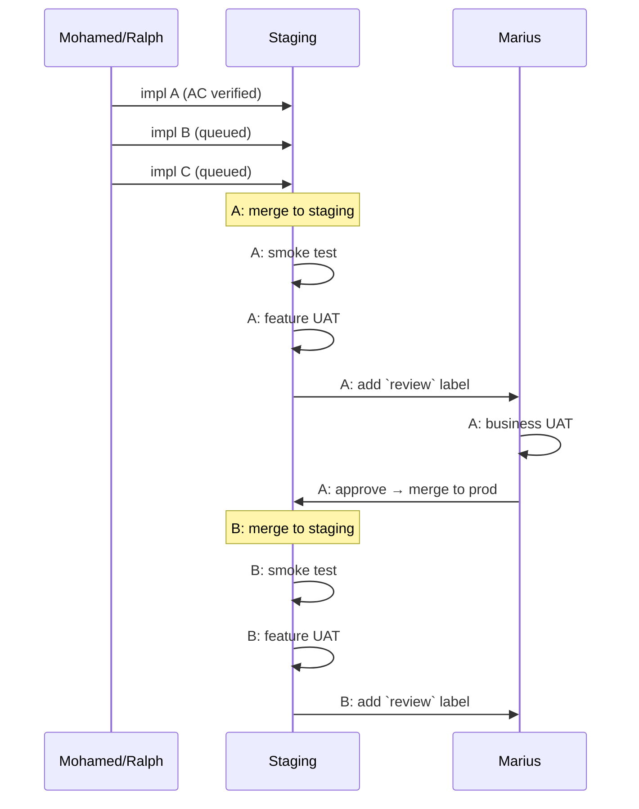

# Staging + UAT Workflow
[[testing-methodology]]

## Overview

This document defines the testing workflow between automated AC verification and production deployment. It establishes staging as the environment for human verification (UAT) before production release.

## Problem Statement

**Merge paralysis occurs when:**
- Automated tests pass (ACs verified)
- But no environment exists to witness actual output
- Local environment is fragile (missing configs, dependency issues)
- Production feels too risky (real users affected)

**Result:** Features pile up in worktrees, nothing gets merged.

## Why Human Witness Layer

**Reference:** [Don't Waste Your Backpressure](https://banay.me/dont-waste-your-backpressure/)

**Backpressure** = automated feedback that lets agents self-correct without human intervention. AC verification is backpressure for AI development.

**But AC verification has limits:**

| Layer | Tests | Blind Spot |
|-------|-------|------------|
| **AC Verification** | "Does it match the spec?" | Unspecified behavior |
| **Human Witness** | "Does this feel right?" | Nothing - catches unknowns |

**Three purposes of human witness layer:**

1. **Break AI-AI Bias Loop**
   - AI implementing → AI verifying = same "alliance" with implementation
   - Even with fresh context, AI tests what AI built
   - Human perspective is truly independent

2. **Test Experience (Not Spec)**
   - ACs verify "code behaves as specified"
   - Humans verify "this is what I wanted"
   - Emergent behaviors, UX issues, "feels wrong" moments

3. **Trust Building**
   - Psychological: can't confidently ship code you've never seen run
   - "I witnessed it work" → confidence to merge
   - Even if AC passes, human needs to see it

**AC Verification Scope (based on analysis of verification.jsonl patterns):**

AC verification is MORE comprehensive than "isolation testing":
- Tests multi-service integration (FDW, OAuth, storage)
- Verifies end-to-end data flows
- Runs against real backends (Supabase, APIs)

**What AC does NOT test:**

AC tests what the spec says. Nothing more.

The spec cannot anticipate:
- Weird bugs that only appear when a real user clicks through
- Edge cases nobody thought to specify
- "It works but something feels off" moments
- Interactions between features that weren't in scope

**Learned the hard way:** It's tempting to think comprehensive ACs test everything. They don't. They test exactly what you specified - and specs always have blind spots. Human witness catches the unspecified weirdness.

## Testing Pyramid

```
         /\
        /  \  Business UAT - Non-technical feedback: "Is this good?"
       /----\
      / Feat \  Feature UAT - Human witness: click through, validate
     /  UAT   \
    /----------\
   / Smoke Test \ - Regression: "Does core flow still work?"
  /--------------\
 /  ACs (AI)      \ - Spec verification: "Does it match what we specified?"
/------------------\
```

| Layer | Tester | What They Do | Where |
|-------|--------|--------------|-------|
| **ACs** | AI | Verify code matches spec (Given-When-Then) | Feature branch |
| **Smoke Test** | Developer | Run fixed checklist, check core flow works | Ephemeral → then Staging |
| **Feature UAT** | Developer | Click through as user, catch unspecified weirdness | Ephemeral → then Staging |
| **Business UAT** | Non-technical | Give feedback: "Is this what I wanted?" | Staging only |

**Two-stage testing (Ephemeral → Staging):**

| Stage | Purpose | Bug expectation |
|-------|---------|-----------------|
| **Ephemeral** | Discovery - find bugs, iron them out | High |
| **Staging** | Confirmation - final check before production | Low |

Ephemeral is where bugs get caught and fixed. By the time code reaches staging, it should be clean - ephemeral already validated it. Staging smoke/UAT is confirmation, not discovery.

## Workflow

### Overview: Parallel Dev → Sequential Testing

Development is parallel (AI can run multiple worktrees). Testing is sequential (human attention is the bottleneck - by design).

```
┌─────────────────────┐     ┌────────────────────┐     ┌─────────────┐
│   DEV (parallel)    │     │   TESTING QUEUE    │     │   MARIUS    │
│   AI + worktrees    │     │   (sequential)     │     │   (async)   │
│                     │     │                    │     │             │
│  Issue A ───────────┼────►│ [A: smoke + UAT]   │     │             │
│  Issue B ───────────┼────►│ [B: waiting]       │     │             │
│  Issue C ───────────┼────►│ [C: waiting]       │     │             │
│                     │     │                    │     │             │
│                     │     │  A done ───────────┼────►│ A: review   │
│                     │     │  B: smoke + UAT    │     │             │
│                     │     │  B done ───────────┼────►│ B: review   │
└─────────────────────┘     └────────────────────┘     └─────────────┘
```

### Sequence: Handoffs Over Time



### What Can Be Parallel

| Activity | Who | Parallel? | Why |
|----------|-----|-----------|-----|
| Implementation | AI (Ralph) | ✅ Yes | Multiple worktrees |
| AC Verification | AI | ✅ Yes | Can run multiple |
| Smoke Test | Mohamed | ❌ Sequential | Human attention |
| Feature UAT | Mohamed | ❌ Sequential | Human witness |
| Business UAT | Marius | ❌ Sequential | Async from Mohamed |

**Key insight:** Testing grabs human attention (backpressure). That's the point - it forces the developer to actually witness their work.

### Future: Ephemeral Environments

When the testing queue becomes a bottleneck (deployment blocked >1x/week), upgrade to ephemeral environments:

- Each feature gets its own staging-like environment
- Testing can happen in parallel
- See: [Scaling: Ephemeral Environments](#scaling-ephemeral-environments)
- Implementation: [#527](https://github.com/DaveX2001/deliverable-tracking/issues/527)

## Testing Artifacts

### AC (Automated)

**Format:** Given/When/Then
**Tester:** AI
**Created:** Issue creation or just before implementation
**Purpose:** Verify code behaves as specified

```gherkin
AC2.1: URL Asset Detection
Given: A VGT with asset path starting with "https://"
When: Video generation is triggered
Then: Asset is downloaded to temp location
And: Video uses the downloaded local file
```

### Smoke Test (Fixed per Project)

**Format:** Checklist
**Tester:** Developer
**Created:** When core flow exists (project-level, not per-feature)
**Purpose:** Regression check - did we break the core flow?

```markdown
## Smoke Test: [Project Name]
Environment: Staging
Frequency: Every deploy

### Steps:
1. [Step to trigger core flow]
2. [Wait for completion]

### Verify:
[ ] [Core output exists]
[ ] [Core behavior works]
[ ] [No obvious errors]

### Verdict:
PASS → continue to Feature UAT
FAIL → investigate before proceeding
```

**Evolution:** Update when critical path changes. Keep <5 minutes.

### Feature UAT (Variable per Feature)

**Format:** Checklist + Exploratory
**Tester:** Developer
**Created:** At staging deploy (per-feature)
**Purpose:** Verify new feature works as expected

```markdown
## Feature UAT: [Feature Name]
Environment: Staging

### Guided Checks (from issue UAT hints):
[ ] [Specific thing to verify]
[ ] [Edge case to try]

### Exploratory:
- Tried: [what you explored]
- Noticed: [anything unexpected]

### Verdict:
PASS → notify Product Owner
FAIL → fix in worktree, re-merge
```

### Business UAT (Judgment)

**Format:** Minimal checklist + subjective judgment
**Tester:** Product Owner
**Created:** At staging deploy
**Purpose:** Business acceptance - "Would I ship this?"

```markdown
## Business UAT: [Feature Name]
Environment: Staging

### Quick Check:
[ ] Watched actual output
[ ] Business logic correct
[ ] Would ship to client

### Verdict:
APPROVE → merge to production
REJECT → [specific feedback]
```

## Key Distinctions

| | ACs | Smoke Test | Feature UAT | Business UAT |
|--|-----|------------|-------------|--------------|
| **Scope** | Defined behavior | Core flow regression | New feature | Business value |
| **Method** | Scripted (GWT) | Fixed checklist | Guided + exploratory | Subjective judgment |
| **Catches** | What's specified | Regressions | Unexpected issues | "Not what I wanted" |
| **Misses** | Unspecified behavior | Feature-specific issues | Business judgment | - |

## Rollback Strategy

| Situation | Action |
|-----------|--------|
| Staging breaks (quick fix <30 min) | Fix on staging, redeploy |
| Staging breaks (complex) | Revert PR, fix in worktree, re-merge |
| Production breaks | Revert to previous version, fix in staging first |

## Role Responsibilities

| Role | Creates | Tests | Approves |
|------|---------|-------|----------|
| **Product Owner (Marius)** | Issues, ACs, UAT hints | Business UAT | Production merge |
| **Developer (Mohamed)** | Code, AC verification | Smoke test, Feature UAT | Staging merge |
| **AI (Ralph)** | - | AC verification | - |

### Handoff Model

**Industry standard:** Developers can self-merge to staging. Production requires approval.

**Specific authority:**

| Actor | Staging Merge | Production Merge |
|-------|---------------|------------------|
| **Mohamed** | ✅ Self-merge allowed | ❌ Requires Marius approval |
| **Ralph** | ❌ Requires human (Mohamed/Marius) | ❌ Requires Marius approval |
| **Marius** | ✅ Full access | ✅ Final gatekeeper |

**Handoff signal:** Add `review` label when smoke test passes → Marius notified for business UAT.

**Workflow:**
```
VERIFY_COMPLETE
    ↓
Developer (Ralph/Mohamed):
    - PR toolkit review + fixes
    - Merge to staging (one feature at a time)
    - Run smoke test
    - Add `review` label when passes
    ↓
Marius:
    - Business UAT (if critical path)
    - Merge to main approval
```

**Concurrency:** Sequential staging (one feature at a time) appropriate for team size. Upgrade to ephemeral environments when deployment queue blocks work >1x/week.

## Staging Environment Requirements

Staging must be:
- **Isolated** from production (separate containers, ports, volumes)
- **Production-like** (same services, same architecture)
- **Safe to break** (no real users, easy rollback)
- **Accessible** for testing (can run actual workflows)

## Scaling: Ephemeral Environments

### Core Insight: Human Attention is the Bottleneck

Human attention is the scarcest resource, not compute. Every layer of automated feedback (backpressure) preserves human attention for things only humans can judge.

**The Backpressure Stack:**

| Layer | Catches | Automated? | Human Attention |
|-------|---------|------------|-----------------|
| **Sanity checks** | Build fails, missing deps | ✅ Yes | ❌ Not needed |
| **AC verification** | Spec violations | ✅ Yes | ❌ Not needed |
| **Rebase (integration)** | Merge conflicts | ✅ Yes | ❌ Not needed |
| **Ephemeral test** | Runtime failures | ✅ Yes | ❌ Not needed |
| **Human witness** | Experience issues | ❌ No | ✅ ONLY HERE |

**The principle:** *Every automatable check that catches issues before human witness = human attention preserved.*

### Why Ephemeral Environments?

**The bottleneck problem:**
- Developer receives 3-5 issues
- Implementation + AC verification can run in parallel (worktrees)
- But staging is sequential → bottleneck
- Local testing is unreliable (missing configs, "works on my machine")

**Why not local-first?**
- Same investment as server ephemeral
- Only solves reliability, not velocity or isolation
- Developer machines differ in CPU, memory, network

### Why Rebase-First?

**Test the true state, not a lie:**

| Approach | What you test | Reality gap |
|----------|---------------|-------------|
| **Pure isolation** | Feature alone | ❌ State never exists in production |
| **Integration preview** | Feature + staging | ✅ This IS what production will see |

**Rebase = integration backpressure:**
- Merge conflict is automated feedback
- AI gets immediate signal: "this won't integrate cleanly"
- Resolves before wasting time testing something that can't merge

**Martin Fowler's recommendation:** Always rebase into preview first, otherwise you're testing a hypothetical state.

### Conflict Resolution as Collaboration

When rebase fails:
1. Script returns error to AI
2. AI + developer resolve together (pair programming)
3. Resolution may reveal deeper design issues
4. Re-run script after resolution

**The conflict IS the signal** - you can't spin up ephemeral until integration is clean.

### Implementation Pattern

```bash
./ephemeral-up.sh {issue}
    ↓
git fetch origin staging
git rebase origin/staging
    ↓
IF conflict → Return error, AI + developer resolve
IF success → docker compose -p paul-{issue} up -d
```

**Routing:** Caddy wildcard → `paul-{issue}.wilsch-deployment.com`

**Port allocation:** 8000 + issue_number

### When to Upgrade from Sequential Staging

- Deployment queue blocks work >1x/week
- Features break each other in staging
- Team approaches 7-10 developers

**Reference:** [DaveX2001/deliverable-tracking#527](https://github.com/DaveX2001/deliverable-tracking/issues/527) - Paul implementation

## Related Documents

- [[feature-branching-environment-isolation]] - Environment architecture
- [[session-type-model-impl-vs-verify]] - AC verification methodology
- [[caddy-conf-subdomain-deployment-pattern]] - Deployment patterns
