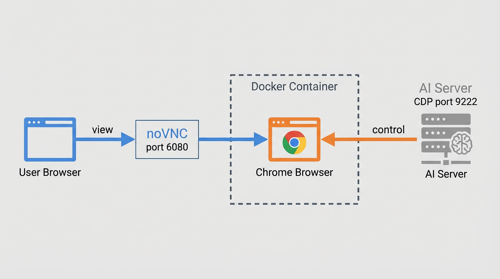
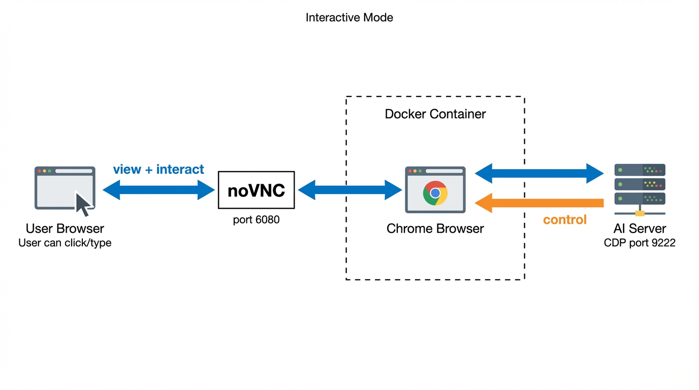

# ADR: Use noVNC + Docker for Remote Browser Viewing
[[client-archibus]]

## Status
**Created** | Date: 2025-12-16

## Context
- FM Assistant (#265) requires "AI acts → User sees" capability
- User must see work requests AI creates in Bruce BEM interface
- Partners need zero-install access (browser-only)
- MVP scope: read-only viewing (user watches, doesn't interact)
- Future scope: user interaction (clicking) must be possible
- Must support server-side hosting (no client machine dependencies)

## Decision
We will use **noVNC + Docker** (chromote image) to stream a server-side Chrome browser to users via any web browser, with AI control via Chrome DevTools Protocol (CDP) on port 9222.

**Architecture - View-Only Mode (MVP):**

**Architecture - Interactive Mode (Future):**

**Key configuration:**
- Chrome `--kiosk` or `--app` flags for clean UI (no address bar)
- VNC view-only mode for MVP (disables user interaction)
- `--shm-size 2g` required for Chrome stability

## Consequences

### ✅ Positive
- Zero client installation (HTML5 browser-only)
- Turnkey solution (pre-built Docker images exist)
- Dual-channel architecture (view + control separated)
- Extensible to user interaction (disable view-only later)
- VNC protocol designed for streaming (unlike CDP)

### ❌ Negative
- ~2GB RAM per container instance
- 10-30 FPS streaming (adequate for forms, not video)
- Container orchestration needed at scale
- Chrome instance per user session

### ⚪ Neutral
- Port management for multi-user (6080-6089, 9222-9231)
- Container lifecycle management (spawn/destroy on demand)
- Bruce BEM login handling in Chrome session (separate concern)

## Alternatives Considered

| Alternative | Rejection Reason |
| --- | --- |
| Browserless.io | Live viewing is paid feature; self-hosted similar complexity |
| CDP Screencast | Frame-by-frame delivery (choppy), requires custom WebSocket relay |
| Apache Guacamole | Full remote desktop stack - overkill for browser-only viewing |
| Puppeteer-stream | Requires ffmpeg, designed for recording not live streaming |

## Scaling Model

| Server (16-core 64GB) | Light Usage | Medium Usage |
| --- | --- | --- |
| Containers | 8-12 | 4-8 |
| RAM per container | 2GB | 3GB |
| Use case | Static forms | JS-heavy pages |

## Gap Analysis (Open Items)

### Covered by This Architecture

| Requirement | Status |
| --- | --- |
| User sees what AI creates | Done - noVNC streams Chrome display |
| No client install | Done - HTML5 viewer in any browser |
| Read-only MVP | Done - VNC view-only mode |
| AI navigates to link | Done - CDP navigate_page via port 9222 |
| Hosted server-side | Done - Docker container |
| Hide Chrome UI (kiosk) | Done - Chrome kiosk or app flags |
| User clicking (future) | Done - Disable view-only = enabled |

### Not Yet Addressed (MVP Doesn't Require)

| Gap | Why It Matters at Scale | MVP Impact |
| --- | --- | --- |
| User to Container routing | LibreChat needs to know which container port 9222 to connect to | None (single container) |
| noVNC URL routing | User browser must be directed to their container noVNC port | None (single URL) |
| Container lifecycle | When to spawn/destroy containers, pool vs on-demand | None (always running) |
| Bruce BEM login in session | Chrome must have valid Bruce BEM session to display work requests | Shelved (user has solution) |

### External Dependencies

| Dependency | Owner | Status |
| --- | --- | --- |
| API returns direct link to work request | Rein | Testing (Dec 12 message) |
| Standalone chat interface | Architecture decision | Not started |
| LibreChat to MCP integration | Marius | Existing |

---

**Key Resources:**
- [chromote Docker image](https://github.com/igolaizola/chromote)
- [chrome-novnc Docker image](https://github.com/vital987/chrome-novnc)
- [noVNC project](https://github.com/novnc/noVNC)
- [Chrome DevTools Protocol](https://chromedevtools.github.io/devtools-protocol/)
- Related: Issue #265 (Hybrid Environment Capability)
