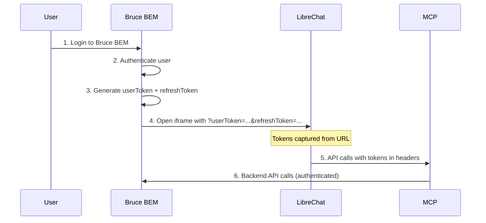
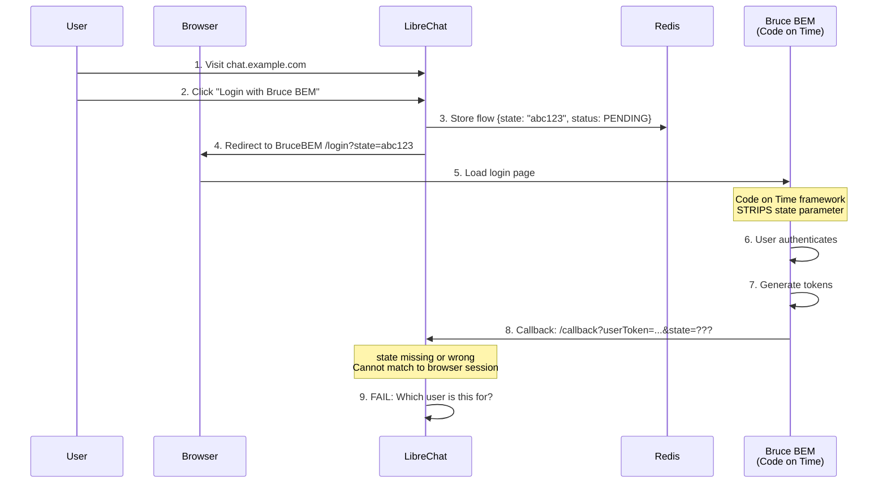
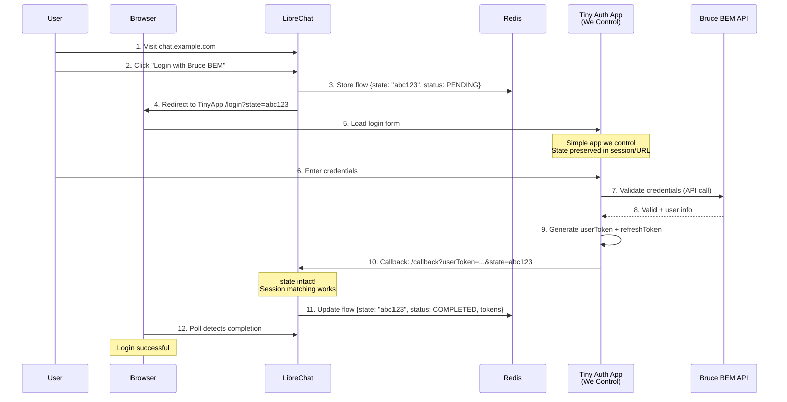

# Authentication Approaches Comparison

[[client-archibus]]

## Approach A: Iframe (Current - Working)

**Why it works:** Bruce BEM controls iframe creation. Tokens passed directly via URL params. No OAuth redirect = no state parameter needed.

---

## Approach B: Standalone OAuth (Blocked)

**Why it fails:** Code on Time framework strips "irrelevant" query params during internal redirect to login form. State parameter lost = session matching impossible.

---

## Approach C: Tiny Auth App (Rein's Proposal)

**Why it works:** Tiny app is outside Bruce BEM UI. We control it completely. No Code on Time framework = state parameter preserved.

---

## Key Difference

| Aspect | Approach B (OAuth) | Approach C (Tiny App) |
|--------|-------------------|----------------------|
| Login UI | Bruce BEM's login page | Our own login form |
| Framework | Code on Time (strips state) | None (we control) |
| Auth validation | Bruce BEM handles internally | Tiny app calls Bruce BEM API |
| Token generation | Bruce BEM creates tokens | Tiny app creates tokens |
| State preservation | Broken | Works |

---

## Open Questions for Rein

1. **Auth validation:** Does Bruce BEM expose an API to validate credentials? Or does the tiny app need direct DB access?

2. **Token format:** What format should userToken be? Does it need to match what Bruce BEM's API expects?

3. **Hosting:** Where would the tiny app live? Same server as Bruce BEM? Separate?

4. **SSO consideration:** Rein mentioned "if we want SSO services as well, this must be a little more complex." What does he envision for SSO?
