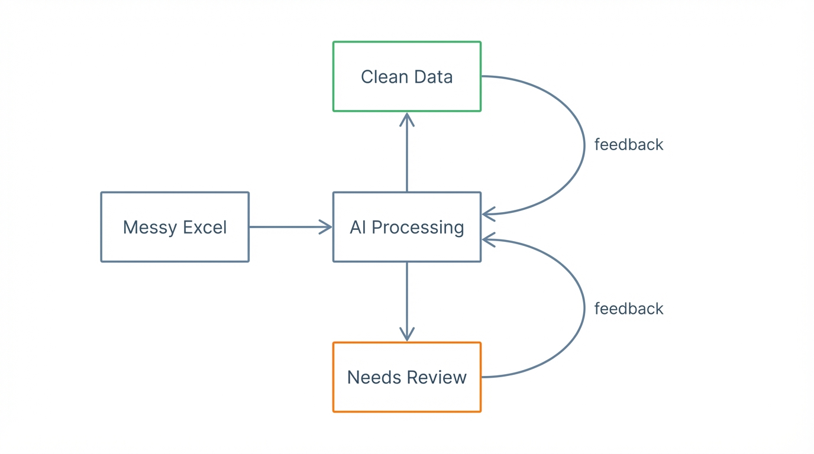

# Chain 1B: AI Bulk Data Entry - Design Document
[[client-archibus]]

## Problem Statement

**The gap between client data and system schema is the implementer's burden.**

Populating Bruce BEM's background data requires understanding the client's hierarchy, mapping their columns to schema fields (35 fields for the asset table alone), and filling data level-by-level — fixing validation errors at each step. Today the implementer carries this end-to-end. AI takes over the process; the implementer only resolves what AI cannot.

**The process requires three steps:**
1. **Understand the hierarchy** — which levels does this client use? (subset of 9 possible)
2. **Map the input** — client column names → Bruce BEM schema fields
3. **Fill level-by-level** — parents must exist before children, resolving gaps row by row

An **importer** already exists — it inserts data when the input matches the schema perfectly. But client data is never perfect: inconsistent columns, missing values, varying formats.

**The gap:** imperfect client data needs to become perfect importer input. Today, the implementer fills this gap manually.

**Roles of responsibility with AI:**
- **Schema** provides backpressure — automated feedback on what's valid and why it's rejected
- **AI** carries the 3-step process and the correction loop
- **Implementer** intervenes only where AI cannot proceed — missing data or business context

**Scope:** The proof of concept focuses on the asset table with hierarchical location data (the hardest case). If this pattern is solved, the remaining 12+ background data tables are simpler variants.

## Mental Model: Backpressure

**Schema as automated feedback mechanism.**

From [Don't Waste Your Backpressure](https://banay.me/dont-waste-your-backpressure/):
- Backpressure = automated feedback that lets AI self-correct without human intervention
- Expressive constraints make invalid states unrepresentable
- Quality error reporting guides correction
- Automated verification loops enable autonomous iteration

**In this project:**
- **Schema = the backpressure mechanism** (accepts/rejects with actionable reason)
- **Mapping = connecting input TO the backpressure mechanism** (Step 2)
- **Validation = executing the backpressure** (Step 3: insert → reject → fix → retry)

**Insertion order options:**

| Mode | Description | Trade-off |
|------|-------------|-----------|
| Level-by-level | Insert all Properties → all Buildings → all Floors → all Rooms | Parallelizable, but partial progress across entire tree |
| Tree-walk per branch | Insert one full branch (Property → Building → Floor → Room) then next branch | Completion feeling per branch, sequential |

*Open: Which mode fits better depends on input data structure. Design decision pending.*

## Success Definition

> "AI carries the 3-step process (understand hierarchy, map input, fill level-by-level) for populating Bruce BEM background data. The implementer's role shifts from executor to collaborator."

| Element | Definition |
|---------|------------|
| Goal | Fill schema as much as possible (not perfection) |
| Success | Asset hierarchy populated following the client's hierarchy structure from the input data |
| Failure mode | Actionable — schema rejects with reason, AI self-corrects |
| AI role | Setup (Steps 1-2) + Processing (Step 3) + backpressure loop |
| Implementer role | Confirms hierarchy, validates mappings, answers genuine gaps |

**Key insight from Ian:**
> "It doesn't mean that the data has to be 100% complete. The principle is if we can speed up that data entry and validation process..."

## The 3-Step Process

**Setup Phase** (one-time per import job)

### Step 1: Understand the hierarchy

Determine which of the 9 possible levels (Campus → Site → Complex → Property → Building → Floor → Storewell → Suite → Room) the client uses. Each client has a different hierarchy, but always from this finite list. AI proposes, implementer confirms.

**What we know:**
- 9 levels, flexible per client (subset)
- AI proposes, implementer confirms

**What we don't know:**
- Exact interaction pattern for hierarchy confirmation

---

### Step 2: Map the input

Map client column names to Bruce BEM schema fields. AI infers semantically, implementer confirms. This mapping pattern is reusable across all 12+ background data tables.

**What we know:**
- 35 schema fields, required/optional marked
- AI infers mapping, implementer confirms
- Pattern reusable across 12+ tables

**What we don't know:**
- Rein hasn't marked AI-filled vs API-filled fields yet
- #605 mapping pattern pending

---

**Processing Phase** (bulk — where the real value lives)

### Step 3: Fill level-by-level

With hierarchy and mapping established, AI processes all rows top-down. Schema provides backpressure for autonomous self-correction. Implementer only intervenes on genuine gaps.

**What we know:**
- Insert top-down: parents before children (parent_id linking)
- Schema backpressure enables autonomous self-correction
- Thousands of rows — this is the bulk value step

**What we don't know:**
- Insertion API doesn't exist yet — Rein needs to build it
- Checkpoint/revert mechanism not yet designed

## Target Audience

**Primary: Partners/Implementers**
- Repeatable pain (every implementation)
- Low-margin work that AI can make profitable
- Bottleneck that holds up implementations

**Secondary: End-users**
- Benefit from faster onboarding
- Cleaner data in system
- One-time pain (their onboarding)

## Component Decomposition

### Component 1: Schema

**What it is:** Bruce BEM background data tables — starting with the asset table for location-based assets.

**Hierarchy (9 levels):**
Campus → Site → Complex → Property → Building → Floor → Storewell → Suite → Room

*Each client uses a different subset. Hierarchy is flexible but always from this finite list.*

**Asset schema:** 35 fields including:
- Core: `name`, `asset_type`, `parent_id`
- Identification: `other_code`, `serial_number`, `barcode`, `qr_code`
- Location: `address`, `city`, `state`, `postal_code`, `country`, `location_description`
- Dates: `date_manufacture`, `date_purchased`, `date_active_service`, `warranty_from`, `warranty_to`
- Areas: `area_interior_m2`, `area_total_m2`, `area_rentable_m2`
- Contacts: `main_contact_name`, `main_contact_phone`, `main_contact_email`

**Field responsibility:**
- **Required vs optional:** marked by Rein
- **AI-filled vs API-filled:** process of elimination (API fills context fields like `owner_id`, AI fills rest). Exact split is iterative.

**Background data tables (12+):**
Assets, resources_employees, resources_workteams, workteam_members, business_units, departments, pm_procedures, pm_steps, bruce_members, spare_parts, spare_part_categories, service_catalogue

**Proof of concept scope:** Location-based assets only. Equipment (facility-based assets) comes later.

**Why this matters:** Schema IS the backpressure mechanism.

### Component 2: Inputs

**What it is:** The data needed to start the process.

**Two required inputs:**

1. **Client data file** — Excel/CSV with the actual data to import
2. **Client's requested hierarchy** — which of the 9 levels they want

*Target schema mapping is a processing step (Step 2), not an input.*

**Available samples (dated 2026-01-28 in hippocampus):**
- `cafm-asset-upload-sample-2026-01-28.xlsx`
- `fmm-asset-data-sample-2026-01-28.xlsx`
- `asset-import-schema-2026-01-28.csv`

### Component 3: AI-Powered Mapping

**What it is:** Step 2 — mapping client data columns to the Bruce BEM schema.

**The goal:** Client column names and values → matching Bruce BEM asset table fields. Human-in-the-loop for confirmation.

**Process:**
- AI reads client columns + values, proposes semantic mapping
- Implementer confirms or corrects
- Finalized mapping used in Step 3

**Dependencies:** #605 (Asset Code Generation) may provide the mapping pattern.

**What we don't know:** Exact mapping mechanics pending #605.

### Component 4: Validation Rules

**What it is:** The backpressure loop — schema rejects with reason, AI self-corrects.

**Two types of correctness:**

| Type | Question | Mechanism |
|------|----------|-----------|
| STRUCTURE | Is format right? | Schema rejects → AI self-corrects |
| VALUE | Is content right? | Business logic or human judgment |

**Key update:** Validation rules emerge from the **insert mechanism**. The API will forward database-level errors and business-level errors. We need to design this mechanism to understand exact validation behavior.

**What we don't know:** Insert mechanism doesn't exist yet — Rein needs to build it. Validation rules will become clear once we see it in practice.

### Component 5: Context Engineering

**What it is:** How to encode the schema into AI context so it can reason about mapping and validation.

**Hypothesis confirmed:** Background data tables are KNOWN and STABLE → encode into AI context.

**We now have:**
- Full asset schema: 35 fields with data types and required/optional markings
- Hierarchy enum: 9 levels (Campus → Room)
- Real sample data for testing (CAFM, FMM samples)
- Rein's import template showing target format

**Approach:** Pre-load schema knowledge into AI context. AI doesn't discover the schema through trial and error — it knows the target structure upfront.

**Open:** Exact encoding format (JSON schema? Natural language description? Both?). Design decision pending implementation.

### Components 6-9: Design Decisions

| # | Component | Decision Type | Options |
|---|-----------|---------------|---------|
| 6 | Exception Handling | UX | Silent flag / Ask immediately / Batch report |
| 7 | Question Generation | AI Design | Every uncertainty / Only blockers / Suggest+confirm |
| 8 | Output Format | UX | JSON / Excel / Dashboard / Report |
| 9 | Loop Mechanism | Architecture | Batch / Streaming / Interactive |

These are implementation-specific.
