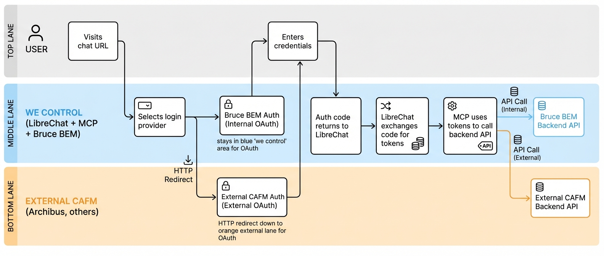

# ADR: Standalone AI Chat Authentication Architecture

[[client-archibus]]

## Status
**Proposed** | Date: 2025-12-16

## Context
- AI chat interface (LibreChat) currently embedded as iframe within CAFM applications (Bruce BEM)
- Iframe approach passes authentication tokens from host application to chat
- Strategic goal: Standalone chat interface accessible via dedicated URL
- Must support multiple CAFM backends (Bruce BEM, Archibus, future systems)
- Users should authenticate once and be routed to appropriate backend
- Token passthrough to MCP server already proven functional
- Various backends may use different authentication mechanisms

## Proposal
We propose the **OAuth Multi-Provider Pattern** where LibreChat acts as an OAuth client and each CAFM backend serves as its own Identity Provider (IdP). User routing to the correct backend is implicit via login button selection ("Login with Bruce BEM" / "Login with Archibus").

### Core Architecture



**Ownership Boundaries:**
- **Blue (We Control):** LibreChat + MCP + Bruce BEM
- **Orange (External):** Archibus and other CAFM systems
- **White (User):** End user interacting with the system

### Key Principle
**No central Identity Provider required.** Each CAFM backend IS the IdP for its users. The login button selection IS the routing decision.

## Authentication Pattern Compatibility

| Pattern | Ease | Support Path |
|---------|------|--------------|
| **OAuth 2.0 / OIDC** | Easy | Native LibreChat support; ideal path |
| **SAML** | Easy | LibreChat converts to internal token |
| **API Keys** | Easy | Simple; less granular than user auth |
| **Magic Links / Passwordless** | Easy | Different UX; still yields token |
| **MFA / 2FA** | Easy | Transparent layer on OAuth flow |
| **Session / Cookie** | Medium | Requires proxy pattern (see below) |
| **LDAP / Active Directory** | Indirect | Typically wrapped in OAuth/SAML by enterprise IdP |
| **Mutual TLS (mTLS)** | Complex | Certificate management overhead; rare for user auth |

### Session-Based Authentication Workaround

When a backend supports only session/cookie authentication (no tokens):

**Problem:** Session cookies are domain-bound. MCP server on different domain cannot use backend's session cookie.

**Solution - Proxy Pattern:**
```
    ┌─────────────────────────────────────────────────────────────────┐
    │                    PROXY PATTERN FOR SESSION AUTH               │
    └─────────────────────────────────────────────────────────────────┘

    ┌─────────┐       ┌─────────────────┐       ┌─────────────────┐
    │   MCP   │──────▶│   YOUR PROXY    │──────▶│   BACKEND       │
    │ SERVER  │ calls │   SERVER        │ with  │   (session)     │
    │         │       │                 │ cookie│                 │
    └─────────┘       │ holds session   │       └─────────────────┘
                      │ cookie per user │
                      └─────────────────┘
```

**Recommendation:** Prefer OAuth path. If backend lacks OAuth, request backend owner add token-based API auth before implementing proxy.

## Future Scalability

The implicit routing pattern (user picks login button = backend selection) works well for 2-3 backends. When scaling beyond this, evolve to **JWT Claims + Tenant Catalog**:

### When to Evolve

| Trigger | Why It Matters |
|---------|----------------|
| 5+ backend systems | Login page becomes cluttered with buttons |
| User belongs to multiple backends | Need automatic routing, not manual selection |
| White-label deployments | Different clients need different default backends |
| Single sign-on requirement | User logs in once, system routes automatically |

### Evolution Path

```
CURRENT: Implicit Routing (2-3 backends)
─────────────────────────────────────────
User → picks provider → OAuth → tokens include provider info
                                         │
                                         ▼
                               MCP knows backend from token issuer

FUTURE: JWT Claims + Tenant Catalog (5+ backends)
─────────────────────────────────────────────────
User → single login → catalog lookup → determines backend
                           │
                           ▼
              JWT issued with claims: tenant_id, backend_system
                           │
                           ▼
              MCP reads claims → routes to correct API endpoint
```

### What the Catalog Adds

- **Tenant database:** Maps user/org → backend system → API endpoint
- **Claim injection:** JWT tokens include `backend_system` claim
- **Dynamic routing:** MCP reads claim, routes without hardcoded logic
- **Admin UI:** Manage tenant-to-backend mappings without code changes

### Migration Triggers

Revisit this section when ANY of these occur:
- Adding 4th+ CAFM backend
- Client requests "remember my system" across sessions
- Need to support users with accounts in multiple backends

## Consequences

### Positive
- No central IdP infrastructure to build or maintain
- Leverages existing user accounts in each CAFM system
- Scales to additional backends via configuration only
- Token passthrough to MCP already validated
- Industry-standard OAuth patterns; extensive documentation available
- LibreChat provides built-in multi-provider OAuth support

### Negative
- Each backend must expose OAuth endpoints (or equivalent)
- Session-only backends require proxy implementation
- Backend owner cooperation needed for client credentials
- Per-backend configuration in LibreChat required

### Neutral
- Login UX changes from seamless (iframe) to explicit provider selection
- User must know which system they belong to
- Token refresh handling shifts to LibreChat (already supported)

## Alternatives Considered

| Alternative | Rejection Reason |
|-------------|------------------|
| **Central IdP (Keycloak/Auth0)** | Adds infrastructure complexity; users must create new accounts or federate existing |
| **JWT Claims + Tenant Catalog** | More scalable for many backends but premature; implicit routing via provider selection sufficient for 2-3 backends |
| **Continue Iframe Pattern** | Blocks hybrid environment capability (visual feedback loop requires standalone interface we control) |

## Prerequisites for Backend Integration

For each CAFM backend to support this pattern:

1. **OAuth 2.0 Endpoints** - Authorization URL, Token URL, (optional) UserInfo URL
2. **Client Registration** - Client ID and Client Secret for LibreChat
3. **Redirect URI Allowlist** - Backend must permit redirect to chat domain
4. **Token Scopes** - Define what permissions tokens grant for API access

## Gap Analysis

### Covered in This ADR

| Topic | Coverage | Notes |
|-------|----------|-------|
| OAuth multi-provider pattern | Complete | Core architecture proposal |
| LibreChat as OAuth client | Complete | Validated LibreChat supports this |
| Auth pattern compatibility matrix | Complete | 8 patterns analyzed |
| Session vs token tradeoffs | Complete | Proxy workaround documented |
| Backend prerequisites | Complete | 4 requirements listed |
| Alternative approaches | Complete | 4 alternatives with rejection rationale |

### Not Covered (Deferred)

| Topic | Reason Deferred | Follow-up Needed |
|-------|-----------------|------------------|
| **Multi-backend user** | Edge case; most users single-backend | Define UX if user has accounts in both |
| **MCP routing logic** | Will emerge from implementation | How does MCP know which API endpoint to call? |
| **Token refresh edge cases** | LibreChat handles; detail for implementation | Test mid-conversation expiry |
| **New client onboarding ops** | Operational concern, not architecture | Who configures new OAuth providers? |
| **Security audit** | Requires implementation first | Token storage, scope review, HTTPS |

### Questions for Backend Owner (Rein)

| Question | Purpose |
|----------|---------|
| Does Bruce BEM expose OAuth 2.0 endpoints? | Confirms easy path |
| What are the OAuth URLs? (authorize, token, userinfo) | Configuration data |
| What scopes should we request? | Permission model |
| Can you provide client_id and client_secret? | Registration step |

---

**Key Resources:**
- [LibreChat OAuth Configuration](https://www.librechat.ai/docs/configuration/authentication/OAuth2-OIDC)
- [OAuth 2.0 Specification](https://oauth.net/2/)
- [OpenID Connect](https://openid.net/connect/)

**Related Documentation:**
- [[rain-token-dynamic-auth]] - Current iframe token passthrough implementation (what exists today)
- [[fm-assistant-extension-architecture]] - Feature gating and permission enforcement patterns
