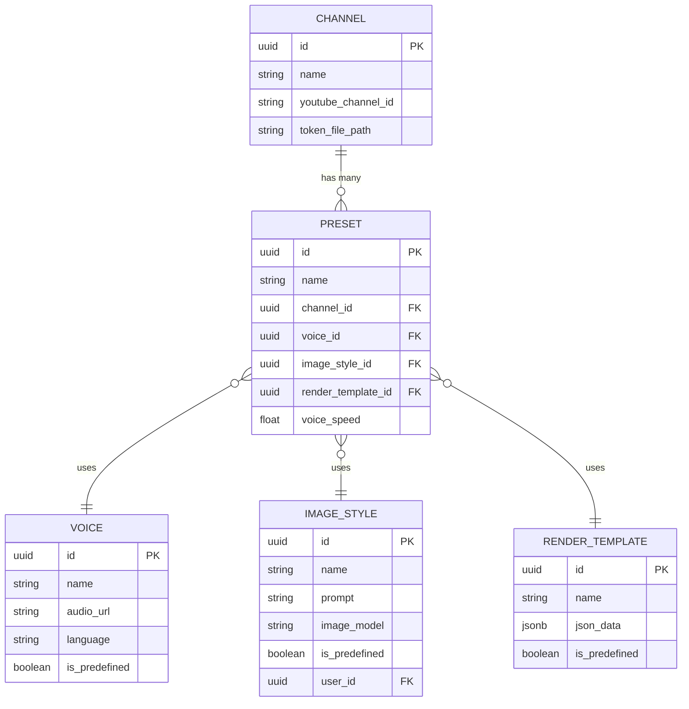
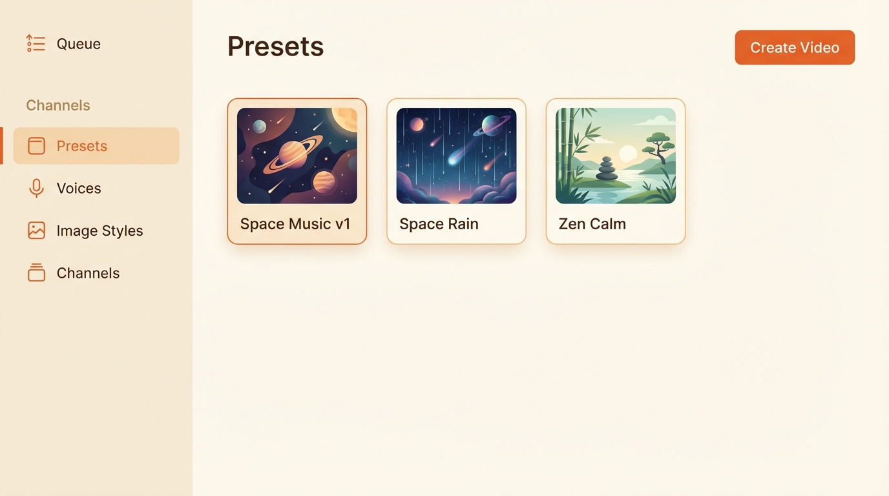
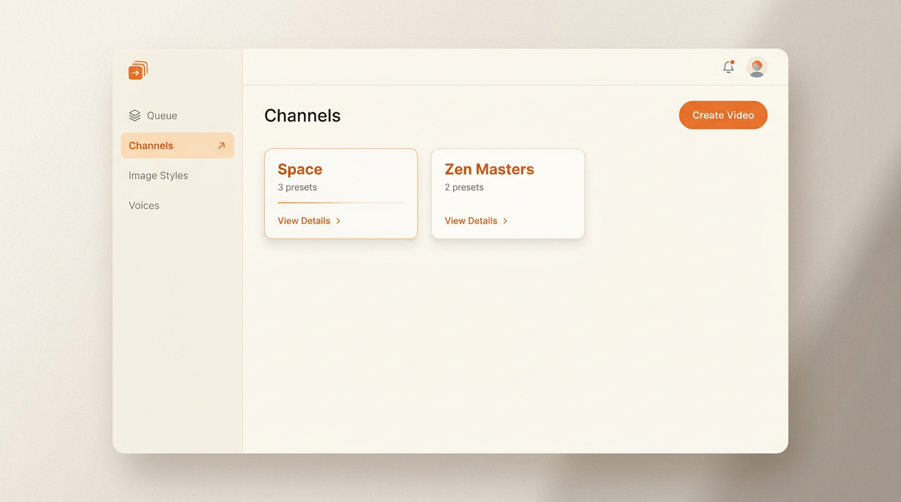
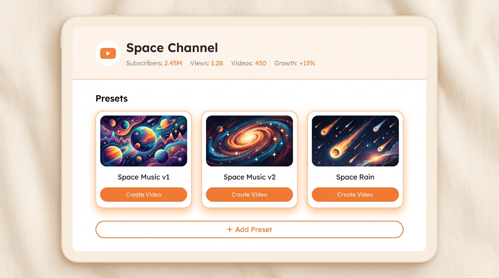

# Paul v2 Data Model & UI Design
[[client-paul]]

---
publish: true
date: 2026-01-06
source: Rubber-duck session analyzing Jan 6 Paul call transcript
issue: "#353"
---

## Overview

This document captures the data model clarification and UI design decisions for Paul v2, derived from analyzing the Jan 6, 2026 call transcript and deep-diving into v1 schema.

**Key Terminology Clarification:**
- **v1 "Niche"** = **v2 "Preset"** = `templates` table (configuration bundle)
- **v1 "Video Template"** = **v2 "Render Template"** = `video_gen_template` table (JSON config)

---

## 1. Data Model

### Entity Relationship Diagram



### Key Relationships

| Relationship | Cardinality | Notes |
|--------------|-------------|-------|
| Channel → Preset | 1:N | One channel has many presets |
| Preset → Voice | N:1 | Many presets can use same voice |
| Preset → Image Style | N:1 | Many presets can use same style |
| Preset → Render Template | N:1 | Many presets can use same render config |

### What Each Entity Represents

| Entity | What It Is | User Can |
|--------|-----------|----------|
| **Channel** | YouTube identity (OAuth, upload target) | View, connect OAuth |
| **Preset** | Configuration bundle for video creation | Select (predefined only in Tier One) |
| **Voice** | TTS voice configuration | View, select (predefined only) |
| **Image Style** | Image generation rules + prompt | Create, edit, delete (custom) |
| **Render Template** | Video rendering config (overlays, music, effects) | Admin only |

---

## 2. v1 Schema Reference

### channels table
```sql
CREATE TABLE channels (
    id                  SERIAL PRIMARY KEY,
    youtube_channel_id  TEXT UNIQUE NOT NULL,
    display_name        TEXT,
    token_file_path     TEXT NOT NULL,
    is_active           BOOLEAN DEFAULT TRUE,
    type                channel_type_enum,
    created_at          TIMESTAMPTZ,
    updated_at          TIMESTAMPTZ
);
```

### templates table (= presets)
```sql
CREATE TABLE templates (
    id SERIAL PRIMARY KEY,
    name TEXT NOT NULL,
    channel_id INTEGER REFERENCES channels(id),
    voice_id INTEGER REFERENCES voice(id),
    voice_speed FLOAT,
    image_style_id INTEGER REFERENCES image_style(id),
    video_gen_template_id INTEGER REFERENCES video_gen_template(id),
    prompt_configuration INTEGER REFERENCES prompt_configuration(id),
    -- ...other fields
);
```

### video_gen_template table (= render templates)
```sql
CREATE TABLE video_gen_template (
    id SERIAL PRIMARY KEY,
    name TEXT NOT NULL,
    json_data JSONB,        -- The render config (overlays, music, effects)
    is_video_loop BOOLEAN DEFAULT FALSE
);
```

---

## 3. v2 Schema Alignment

### Current State

| v2 Table | Status | Gap |
|----------|--------|-----|
| `channels` | Exists | OK |
| `templates` | Exists | Rename to `presets` |
| `voices` | Exists | OK |
| `image_styles` | Exists | OK |
| `video_gen_templates` | Exists | **Missing `json_data` JSONB column** |

### Required Migration

```sql
-- 1. Rename templates → presets
ALTER TABLE templates RENAME TO presets;

-- 2. Add json_data to video_gen_templates
ALTER TABLE video_gen_templates ADD COLUMN json_data JSONB;
```

---

## 4. UI Design Options

### Current v2 Sidebar
The current v2 UI has separate sections: Templates, Voices, Image Styles, Channels.

### Option A: Keep Separate Sections (Renamed)



**Structure:**
- Sidebar: Queue → Channels section (Presets, Voices, Image Styles, Channels)
- Presets page shows all presets in flat grid
- Presets from different channels mixed together

**Pros:** Familiar structure, quick access to all presets
**Cons:** Doesn't reflect data relationship (presets belong to channels)

### Option B: Channels-First (Recommended)



**Structure:**
- Sidebar: Queue → Channels → Image Styles → Voices
- Channels page shows channel cards with preset count
- Click channel to see its presets (detail page)

**Pros:**
- Matches Paul's mental model ("I work with my Space channel")
- Reflects actual data relationship
- Cleaner sidebar (fewer items)

**Cons:** More clicks to see all presets

### Channel Detail Page (Option B drilldown)



Shows:
- Channel name + YouTube stats
- All presets for this channel as visual cards
- Each preset has "Create Video" button
- "+ Add Preset" button for creating new presets

---

## 5. v1 vs v2 Navigation Comparison

### v1 Flow (Niche-Centric)
```
"Create Niche" form:
├── Niche Name
├── Channel URL
├── Video Template (dropdown)
└── YouTube Channel (dropdown) ← Channel selected ON the form

"Create Video" wizard:
└── Select Niche (dropdown) ← Channel implicit from niche
```

### v2 Flow (Channel-Centric)
```
Channels page:
├── Space (3 presets) → [View Details]
└── Zen Masters (2 presets) → [View Details]

Channel Detail page:
├── YouTube OAuth status
└── Presets: [Space Music] [Space Rain] [Space Calm]
              └── [Create Video]

"Create Video" wizard:
└── Select Preset (grouped by channel in dropdown)
```

**Key Difference:** v2 inverts the UI relationship. Instead of "Create preset, pick channel," it's "Go to channel, see its presets."

---

## 6. v2 → v1 Integration

### How v1 Consumes Data

```
v2 Wizard → sends template_id (preset) → v1 Flask
                                          ↓
                            v1 reads from templates table:
                            ├── voice_id → Voice table
                            ├── image_style_id → ImageStyle table
                            └── video_gen_template_id → VideoGenTemplate.json_data
```

### Per-Video Override (Step 3)

v1 supports voice/speed override via Step 3 upload:
- v2 collects voice selection in Step 3
- v2 should send `voice` and `speed` params to v1
- v1 uses override if provided, else template default

**Current Gap:** v2 collects but doesn't send voice override to v1. Fix needed in `triggerStep3Upload()`.

---

## 7. Open Issues / Deliverables

| Issue | Scope | Priority |
|-------|-------|----------|
| Rename `templates` → `presets` | DB migration + UI rename | High |
| Add `json_data` to `video_gen_templates` | DB migration | High |
| Channel detail page UI | Frontend (Option B) | High |
| Fix voice override in Step 3 | v2 integration | Medium |
| RCAB Implementation | Admin roles, voice upload | Medium |
| UI Polishing | Competitor benchmark styling | Low |

---

## Related Documents

- [Light Tier v2 Feature Scope](./light-tier-v2-feature-scope.md)
- [Video Creation ERD](./video-creation-erd.md)
- [v2 Wizard Architecture Snapshot](./v2-wizard-architecture-snapshot-2026-01-04.md)
- [Strangler Pattern ADR](./adr-strangler-pattern-sequencing.md)
