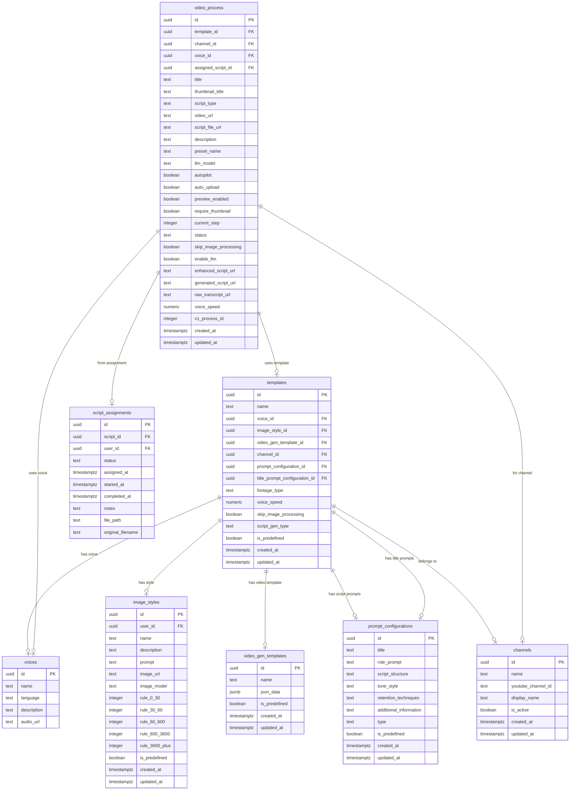

# Video Creation ERD (v2 Target State)
[[client-paul]]

**Purpose:** Complete schema for video creation flow in v2 Supabase.

**Last Updated:** 2026-01-04

---

## Entity Relationship Diagram

---

## Table Summary

| Table | Purpose | Tier One Scope |
|-------|---------|----------------|
| **channels** | YouTube channel config | Unlimited, full CRUD |
| **voices** | TTS voice presets | Select only (~16 predefined) |
| **image_styles** | Image generation config | Predefined + custom CRUD |
| **video_gen_templates** | Video rendering config | Select only (predefined) |
| **prompt_configurations** | LLM prompt templates | Select only (predefined) |
| **templates** | Config bundle (hub) | Select only (predefined) |
| **video_process** | Video job records | Full CRUD |
| **script_assignments** | Script workflow | NOT IN Tier One |

---

## Key Relationships

### Templates as Hub
Templates bundles configuration from 6 other tables:
- `voice_id` → voices
- `image_style_id` → image_styles
- `video_gen_template_id` → video_gen_templates
- `prompt_configuration_id` → prompt_configurations (script prompts)
- `title_prompt_configuration_id` → prompt_configurations (title prompts)
- `channel_id` → channels

### video_process Flexibility
video_process can reference:
- `template_id` → Use template config (preset mode)
- OR direct FKs (`voice_id`, `channel_id`) → Wizard mode

This supports both template-based and wizard-based video creation.

---

## FDW Integration

For v1 backend to read v2 data via postgres_fdw:

| Foreign Table | Source | Purpose |
|---------------|--------|---------|
| voices_fdw | voices | TTS voice lookup |
| image_styles_fdw | image_styles | Image generation config |
| templates_fdw | templates | Full config bundle |
| video_gen_templates_fdw | video_gen_templates | Video rendering config |

---

## v1 Integration Constraint

**Critical:** v1 backend REQUIRES `template_id` (integer). All config flows through the template relationship.

| v1 Field Access | Source |
|-----------------|--------|
| voice_id, voice_speed | template.voice_id, template.voice_speed |
| image_style_id | template.image_style_id |
| prompt configs | template.prompt_configuration, template.title_prompt_configuration |

**v1 VideoProcess has NO direct config fields** - only template relationship.

**Tier One:** Simple mapping (v2 preset UUID → v1 template_id integer) works because templates are predefined/fixed.

**Future constraint:** If templates become customizable, requires architectural investment (FDW + v1 code changes, or sync mechanism).

---

## ID Strategy

All tables use **UUID** primary keys:
- Generated via `gen_random_uuid()`
- Enables distributed ID generation
- Compatible with Supabase Auth (`auth.users.id`)

---

## Source References

- [Tier One Feature Scope](https://mariuswilsch.github.io/public-wilsch-ai-pages/project/paul_youtube_fullstack/light-tier-v2-feature-scope)
- [v2 Wizard Architecture](https://mariuswilsch.github.io/public-wilsch-ai-pages/project/paul_youtube_fullstack/v2-wizard-architecture-snapshot-2026-01-04)
- Issue: DaveX2001/deliverable-tracking#421
