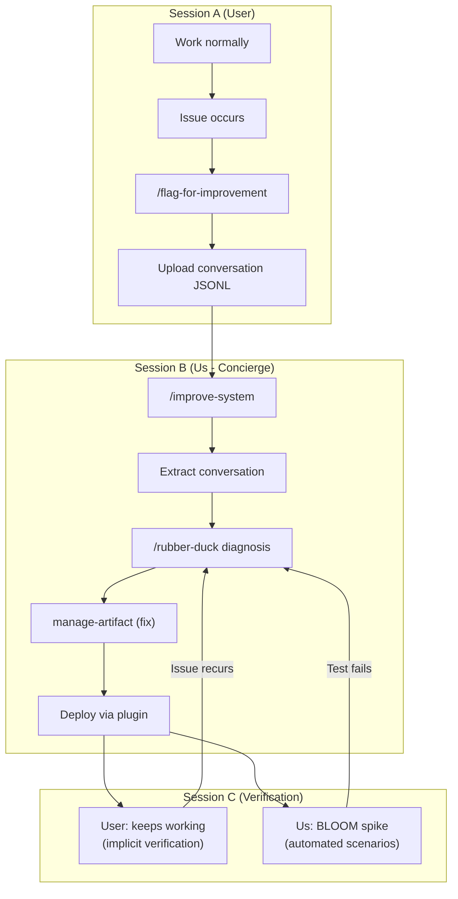

# PERIAN Architecture
[[client-perian]]

Living architecture document for the PERIAN product. Consolidates strategic decisions from Dec 21 session and Dec 23 rubber duck refinement.

---

## 1. Target Customer

**Decision:** Developers working alone or in very small teams (2-10 people)

**Why developers:**
- Company-wide Claude Code solutions don't exist - everyone builds their own local setup
- Claude Code / CLI adoption is far lower than expected
- Tools are "cutting-edge" only on personal level, not organizational
- Teams lack shared, persistent workflows
- Developers as GTM wedge because:
  - We know them (we ARE them)
  - Fast feedback loops
  - Binary success criteria (code works or doesn't)
  - Narrow, controlled ecosystem (Git, IDE, terminal)

**NOT initially:**
- Enterprise (too slow feedback, too many stakeholders)
- Creative/Marketing (too subjective, long feedback loops)
- Individual hobbyist coders (don't pay, high support)

**Prerequisite:** Claude Code / Claude Max subscription

---

## 2. Core Job to Be Done

**Job:** Frictionless code production

**Positioning:** We compete on least friction, not best AI.

**Key insight:** "Worse at beginning → best after use"

**Metaphor:** "We don't build an opinionated framework. It becomes YOUR opinionated framework."

**What this means:**
- The deliverable IS code
- We don't compete on "better AI" - we compete on better execution through interaction
- Core metric: "Teach AI once, never again"

**User pain points we address:**
- "It keeps forgetting stuff"
- "I have to re-explain everything"
- "Every setup is fragile"
- "CLI friction is too high"

---

## 3. Core Hypotheses

### H1: Fast Feedback Loops > Model Intelligence

> Fast feedback loops that build YOUR context + AI that adapts to that context beats smarter models with generic knowledge. The user just flags—the system engineers the context.

**What we DON'T do:**
- Wait for smarter models from Anthropic/OpenAI
- Compete on model capability
- Require users to learn Claude Code internals (hooks, skills, protocols)

**What we DO:**
- Build a system where user feedback rapidly improves the AI's context
- Create a "playbook" (skills, hooks, protocols) that adapts to YOUR patterns
- Abstract away complexity: user flags → system creates appropriate artifact

**Why it wins - The UV/pip Example:**

Smart Model + Generic Context (FAILS):
```
Session 1: AI uses pip → Error
Session 2: You explain uv → AI uses uv pip (still wrong)
Session 47: "WHY ARE YOU STILL USING PIP"
Result: You're the teacher. Forever.
```

Dumb Model + YOUR Context + Adaptation (WINS):
```
Session 1: AI uses pip → You /flag-for-improvement
System: Creates hook blocking pip
Session 2: AI tries pip → Hook blocks → AI uses uv run
Session 47: AI automatically uses uv run
Result: You taught once. Done.
```

### H2: Scale AI for Test-Time Compute

> We are the Scale AI of AI adoption - but for test-time compute, not pre-training. Users pay us while generating data that improves inference-time context.

| | Scale AI | PERIAN |
|---|----------|--------|
| **Target** | Pre-training | Test-time compute |
| **Output** | Labeled datasets | Context/skills/playbooks |
| **When applied** | Before deployment | During inference |

### H3: Binary Feedback > Complex Learning

> Binary signal + context extraction beats complex labeling. The conversation transcript IS the labeled data.

| Approach | User effort | Data quality |
|----------|-------------|--------------|
| Complex labeling | High (user explains) | Inconsistent |
| Binary + context | Low (one flag) | High (full conversation) |

---

## 4. Our Wedge

| Angle | Statement |
|-------|-----------|
| **Flywheel** | Users pay while generating data that makes their AI better at inference. |
| **Adaptation** | A dumb model with YOUR context beats a smart model without it. |
| **Friction** | Flag once, never explain—system reads conversation and fixes itself. |
| **Team Consistency** | AI becomes the enforcement layer—no need to hope teammates follow best practices, the system ensures it. |

**Key insight for teams:** You don't need disciplined employees, you need disciplined AI. Skills and hooks encode best practices; every team member's AI follows them automatically.

---

## 5. Session Flow (Three-Session Model)

**Architecture:** [improve-system-architecture.md](../../global/improve-system-architecture.md)



**Key insight:** For users, Session C is invisible—it's just their next work session. We verify on our side using automated behavioral testing.

---

## 6. Skills vs Plans

| Term | Definition |
|------|------------|
| **Plan** | Clarity workflow: rubber-duck → requirements → implementation → evaluation |
| **Skill** | Pre-packaged HOW, invoked during Execute phase after plan is complete |

**Rule:** A skill is for WHEN the task is clear. Never use a skill to figure out WHAT the task is.

---

## 7. MVP Scope (Concierge)

**Approach:** Concierge MVP - we manually run the improvement loop for users.

| Actor | Does |
|-------|------|
| **User** | Flags issues, uploads JSONL, keeps working |
| **Us** | Diagnose, fix, deploy via plugin marketplace |

**Parallel spike:** BLOOM (Anthropic's behavioral evaluation framework) for automated Session C verification.

**MVP Users:**
- David (already onboarded)
- Roland (colleague)
- External: recruitment strategy TBD

---

## 8. Tech Stack

| Component | Decision |
|-----------|----------|
| **Platform** | Raw Claude Code (user's subscription) |
| **Upload** | GitHub repo (auto-push from /flag-for-improvement) |
| **Deployment** | Claude Code plugin marketplace |
| **Billing** | User's Claude Max subscription |

**Deferred (post-validation):**
- Anthropic Agent SDK
- Model flexibility / multi-model routing
- Custom UI

---

## 9. Open Questions

Items requiring further discussion:

1. **Agent SDK + Model Flexibility** - long-term implications of Claude lock-in
2. **External User Recruitment** - strategy to find validation users beyond internal network
3. **Success Metrics** - how to measure H1/H2/H3 validation (recurrence rate? resolution time? satisfaction?)

---

## References

- [Session Decisions 2025-12-21](session-decisions-2025-12-21.md) - Original strategic session
- [Three-Session Model ADR](../../global/three-session-instruction-artifact-improvement.md)
- [Improve System Architecture](../../global/improve-system-architecture.md)
- [BLOOM Framework](https://github.com/safety-research/bloom/) - Potential Session C automation
