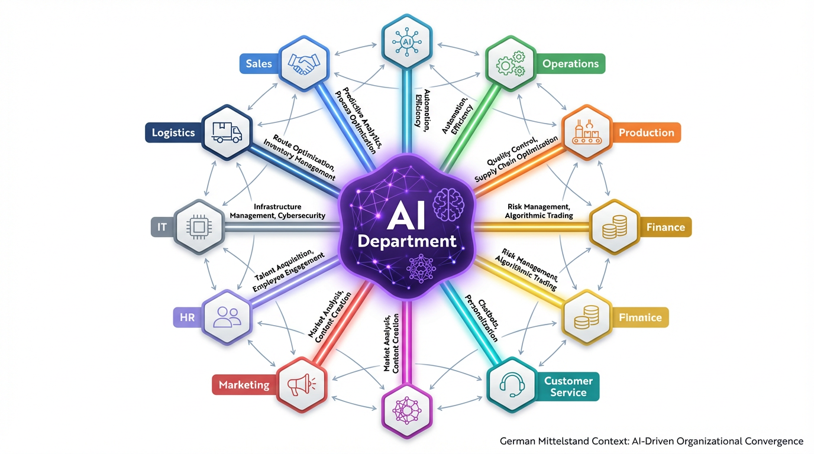
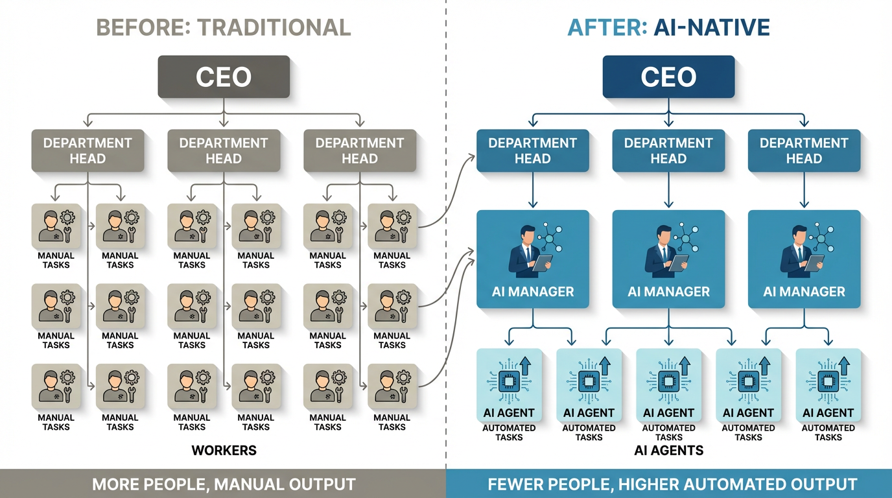

# Ihre KI-Abteilung — Ohne Sie Selbst Aufzubauen
[[project-index-847]]

Kurzfassung für Ulrich und sein Kundennetzwerk im deutschen Mittelstand. Drei Einstiegsvarianten zum Testen, welche am besten ankommt.

---

## Einstieg A: Problem → Lösung

Jedes Unternehmen braucht KI-Kompetenz — sie wird so grundlegend wie Marketing oder Buchhaltung. Die meisten mittelständischen Unternehmen können diese Kompetenz nicht intern aufbauen: Die Fachkräfte sind rar, die Technologie entwickelt sich zu schnell, und Fehlentscheidungen sind teuer.

Sie müssen keine eigene KI-Abteilung aufbauen. Sie können sie auslagern.

Wilsch AI Services arbeitet als Ihre externe KI-Abteilung — wir liefern Ergebnisse, keine Werkzeuge.

---

## Einstieg B: Nutzen zuerst

Eine KI-Abteilung, ohne sie selbst aufzubauen.

Wilsch AI Services gibt Ihrem Unternehmen Zugang zu KI-gestützter Leistungsfähigkeit in jeder Abteilung — Produktion, Marketing, Finanzen, Kundenservice. Sie erhalten ein Team mit KI-Orchestrierungstechnologie, das monatlich messbare Ergebnisse liefert. Kein Recruiting. Kein interner Aufbau. Kein Standardprodukt, das Sie selbst konfigurieren müssen.

---

## Einstieg C: Vision → Angebot

Die Unternehmen, die in fünf Jahren ihre Märkte anführen, sind diejenigen, in denen jeder Mitarbeiter mit KI arbeitet — wo Mitarbeiter von manueller Ausführung zu KI-gestütztem Prozessmanagement wechseln und Firmenwissen im System bleibt, auch wenn Mitarbeiter gehen.

Wilsch AI Services macht diesen Wandel möglich. Wir arbeiten als Ihre ausgelagerte KI-Abteilung: Möglichkeiten in Ihrer Organisation identifizieren, Ergebnisse liefern und gleichzeitig die KI-Kompetenz Ihres Teams von innen heraus aufbauen.

---

## Was Sie bekommen: Eine ausgelagerte KI-Abteilung

Anders als KI-Softwaretools, die Ihr Team selbst erlernen, konfigurieren und pflegen muss, liefern wir eine Funktion. Ihre ausgelagerte KI-Abteilung übernimmt die KI-Methodik, Orchestrierung und Umsetzung — Sie konzentrieren sich auf Ihr Geschäft.

Was diese Abteilung einzigartig macht: KI-Kompetenz berührt jede andere Abteilung. Marketing, Betrieb, Finanzen, Produktion, Kundenservice — in jeder gibt es Prozesse, die KI transformieren kann. Wenn eine Abteilung die Ergebnisse sieht, wollen die anderen nachziehen.

**Wie das in der Praxis aussieht:**

- **Engineering / IT:** [KI-Entwicklung mit vollständiger Datensouveränität](https://mariuswilsch.github.io/public-wilsch-ai-pages/project/wilsch-group/local-ai-development-customer) — lokale Installation auf Ihrer eigenen Infrastruktur, keine Daten verlassen Ihr Unternehmen
- **Betrieb / Onboarding:** KI-gestützter Massendatenimport, der Tage manueller Datenaufbereitung auf Minuten reduziert — die KI ordnet unstrukturierte Tabellen Ihrem System-Schema zu, validiert jeden Eintrag und stellt Rückfragen statt falsch zu raten ([Demo ansehen](https://www.youtube.com/watch?v=XeEejHLOTt8))
- **Produktion:** In einem Projekt, das für die Softwareabteilung geplant war, bat die Produktionsabteilung nach dem ersten Workshop um Aufnahme — sie sahen Möglichkeiten, die niemand erwartet hatte

> *„Du bist ein Zahnrad im Schweizer Uhrwerk"* — ein Kunde, der das Retainer-Modell für den dauerhaften strategischen Zugang gewählt hat

Das ist keine Beratung. Das ist kein Projekt, das endet. Es ist eine laufende Funktion, die wächst, je mehr Ihr Unternehmen entdeckt, was mit KI möglich ist.

---

## Wie wir liefern

Ihr Team schrumpft nicht — es wächst über sich hinaus. Jeder Mitarbeiter wechselt von manueller Ausführung zu KI-gestütztem Prozessmanagement. Firmenwissen bleibt im System, nicht in einzelnen Köpfen. Wenn Mitarbeiter wechseln, bleibt die Kompetenz erhalten.

Wir arbeiten als Methodikarchitekt mit mehreren parallelen Mandanten — von außen liefernd, nicht in Ihr Unternehmen eingebettet. Das KI-Liefersystem produziert einen vollständigen Audit-Trail: jede Aktion, jede Entscheidung ist nachvollziehbar. Diese Transparenz ersetzt den Stundennachweis — sie ist nachvollziehbarer als jeder Mensch es sein könnte.

## Preismodell: Gleichgerichtete Interessen

Eine Vollzeit-KI-Fachkraft kostet €70.000–80.000+ im Jahr — für eine Person, eine Abteilung. Unsere ausgelagerte KI-Abteilung deckt mehrere Abteilungen ab, zu einem Bruchteil der Kosten.

Jedes Engagement hat zwei Komponenten:

- **Basisretainer** — garantierter Zugang zum KI-Liefersystem und einem Operator. Denken Sie daran wie an Betriebskosten, nicht Projektkosten — ein laufender Betriebsaufwand, wie Ihre IT- oder Buchhaltungsfunktion.
- **Erfolgsbeteiligung** — ein Anteil am wirtschaftlichen Ergebnis, das die Arbeit ermöglicht. Wir verdienen, wenn Sie verdienen. Das sind keine zusätzlichen Kosten — es ist verdienter Wert, gebunden an messbare Ergebnisse.

## Was uns unterscheidet

| | KI-Softwaretools | Ihre KI-Abteilung (Wilsch AI) |
|--|------------------|-------------------------------|
| **Was Sie bekommen** | Ein Tool zum Selbstkonfigurieren | Eine Funktion, die Ergebnisse liefert |
| **KI-Expertise nötig** | Ja — Ihr Team muss es lernen | Nein — wir bringen die Methodik mit |
| **Datensouveränität** | Cloud-abhängig | Lokale Installation verfügbar |
| **Skalierbarkeit** | Preis pro Nutzer | Funktion wächst mit Ihrem Bedarf |
| **Beispiele** | tune.eco (€149/Monat), heronos (€375/Monat), mindgpt | Basisretainer + Erfolgsbeteiligung |

## Loslegen

Starten Sie mit einem kostenlosen Scoping-Workshop — wir identifizieren Ihr KI-Potenzial in einer fokussierten Sitzung, ohne Verpflichtung. Von dort entwickeln wir ein Engagement, das zu Ihren Anforderungen passt.

**Kontakt:** marius@wilsch-ai.com

---

*Ausgerichtet an aktuellen rechtlichen Rahmenwerken für KI-gestützte Dienstleistungen.¹*

¹ Mayer Brown, „Contracting for Agentic AI Solutions: Shifting the Model from SaaS to Services," Februar 2026.

---

## Quelle

**Design Doc:** [Contract Strategy & Retainer Model Design](https://mariuswilsch.github.io/public-wilsch-ai-pages/project/soloforce/contract-strategy-retainer-model-design)

**Transkripte:**
- [Ulrich-Strategiegespräch (21.02.2026)](https://app.fireflies.ai/view/01KHZAY46HFBGAYCS168WKZD0V) — Agenturpositionierung, Retainer-Modell
- [Doru/Needed Tech (21.02.2026)](https://app.fireflies.ai/view/01KHZGZN8JG04A8JP1K0PSJZDX) — Positiver Case, Trainingsprogramm-Einstieg
- [Mayer Brown — Contracting for Agentic AI (Feb. 2026)](https://www.mayerbrown.com/en/insights/publications/2026/02/contracting-for-agentic-ai-solutions-shifting-the-model-from-saas-to-services)

**Session:** `/Users/verdant/.claude/projects/-Users-verdant-Documents-projects-00-WILSCH-AI-INTERNAL--soloforce/360645e1-6da9-4573-ae3c-4c97363148d9.jsonl`
