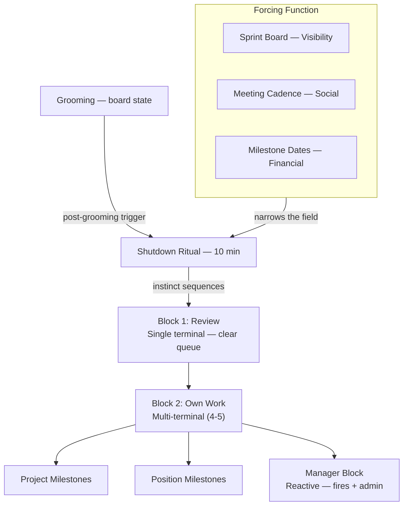

# Monthly Planning System — Design Doc (April 2026)
[[coo-position]]

April redesign of the monthly planning methodology. Replaces the Package Model with a three-lens evaluation framework after March practice invalidated the project-position coupling. Previous design: [Feb–Mar 2026](monthly-planning-system-design).

---

## Problem Statement

The March Monthly Planning System solved instinct-driven daily decisions by introducing packages (project + position = unit). Five extraction passes produced a coherent methodology: packages narrowed the space, the Shutdown Ritual enforced it, milestones drove urgency.

March practice invalidated the package coupling. Position work advanced independently of project contexts — driven by organizational bottlenecks, not project friction. Multiple positions were exercised within single projects. CCI position epics required week-scale human judgment, not session-scale package selection. The package prerequisite ("a position needs a project to justify its timeslot") became the constraint the system outgrew.

The monthly plan's core principle survives: pre-decide direction so daily decisions become evaluations, not deliberations. What changes is the organizing unit and the evaluation lens.

**Preconditions:**
- Package Model (v1) documented across 5 extraction passes — stable reference
- March daily log (23 entries) + shutdown ritual commits (15) provide empirical evidence of the shift
- Position work demonstrated independent urgency (CCI #600, #602 — organizational bottleneck)
- Design Partner model emerging (#847) — changes what "client" means
- March revenue €18,736 vs €8K target — survival constraint met, enabling strategic focus alongside cash flow

---

## Success Definition

| Element | Definition |
|---------|-----------|
| **Goal** | The monthly plan evaluates each client through three lenses (cash flow, validation, IP) and each position commitment independently — producing a context window that makes daily decisions trivial evaluations |
| **Success** | The per-client walkthrough produces a weighted scoring that replaces the docket. Position work appears on the plan as a first-class citizen alongside project work. The Shutdown Ritual selects from both streams without requiring package coupling. |
| **Done test** | The April 2026 plan artifact validates the methodology — produced using v2, reviewed at month-end. If the plan held through April without reverting to instinct-driven daily decisions → design is complete. |

---

## Approach

### Part 1: The Three-Lens Framework

The package model assumed project and position form a single unit — "working on Archibus automatically means improving the Developer position." Practice invalidated this: position work advanced independently, multiple positions were exercised within single projects, and urgency drove daily selection, not package affinity.

**Three lenses replace the package as the organizing principle.** Each client engagement is evaluated through:

| Lens | What it measures | Example |
|------|-----------------|--------|
| **Cash Flow** | Retainer stability — trading hourly rate for predictable monthly income. Success fee as uplift. | Archibus: €3,720/mo retainer through Aug |
| **Validation** | Does this client prove the AI-native model works? Position system as AI workforce, Design Partner as engagement pattern, observation system as improvement loop. | Archibus: DP origin. IITR: low — classic agency. |
| **IP** | What stays proprietary? Three-slice ownership: Agent + Improvement Loop always Wilsch AI. Methodology that travels client to client. | Positions, agents compound across engagements |

**Position work is a first-class citizen.** No longer a byproduct of project delivery — it has its own terminals, its own forcing function (organizational bottleneck visibility), and dedicated maker time. CCI board dissolves; position epics move to the Commitments Board alongside client epics. Both axes are independent commitments, governed by the same milestone mechanics.

**The monthly plan is a context window.** Each daily decision conditioned on the monthly direction — "where we want to be at end of month." The Shutdown Ritual, sprint board visibility, and milestone-driven forcing functions (social + financial consequences of client meetings) turn the plan into a live evaluation filter. Instinct prioritizes within this forced field — it is flavor, not the engine.

**The docket may dissolve.** Without packages, the per-client three-lens walkthrough replaces package formation. The monthly plan evaluates each engagement on cash flow, validation, and IP contribution (weighted), and each position commitment independently.

**Undefined:** Design Partner model — validation lens's proof point and company direction. → [#847](https://github.com/DaveX2001/deliverable-tracking/issues/847) (handoff posted)

**Undefined:** Per-client scoring schema — the weighted evaluation replacing the docket. → Next extraction pass.

### Part 2: Position Work as First-Class Citizen

The v1 design stated: "Position improvement is a byproduct of project delivery, not a standalone activity." This inverted in practice.

**The E-Myth evolution path:**
- **February:** Marius owns everything — developer, JA, dev lead, system engineer. The entire VP of Delivery path. Unscalable.
- **March:** David takes worker positions (developer, JA). Marius becomes reviewer only — 4 hours morning Block 1, clearing the review queue. The system works: "the issue was never finding people, it was finding my system first."
- **April target:** Review bottleneck removed. One dedicated reviewer handles review continuously (not a 4-hour morning block). Ralph drives autonomous implementation. Marius and David freed for #847 (Design Partner / company direction).

**The capacity model shift:**
- **Current (1-to-4):** One operator, four interactive terminals. Context-switching between terminals in a maker session.
- **Target (1-to-N):** One reviewer, N autonomous agents in non-interactive sessions. Capacity limited only by review throughput. "As soon as the implementation moves autonomous, we can have as many as we want — blocked only by review."

**Position work gets its own forcing function.** Not client meeting dates — organizational bottleneck visibility. CCI #600 and #602 are urgent because they unblock the next capacity step: #600 (ILR redesign) must land so #602 (Ralph system) can live inside it, which unblocks JA decomposition, which massively increases capacity. The urgency is structural, not calendar-driven.

**Confirmation bias separation.** The person who implements should not also review — the builder carries confirmation bias about their own work. This drives the dedicated reviewer role: Ralph implements, a separate person reviews. Same principle as Session C (blind verification) in the CCI model.

### Part 3: The Forcing Function

The sprint board does not drive urgency — it drives visibility. Urgency comes from the social and financial consequences attached to milestones.

**Five drivers** (from [Stakes Visibility](https://mariuswilsch.github.io/public-wilsch-ai-pages/global/stakes-visibility-forcing-function)): financial incentives, social consequences, structural clarity, visibility, ownership. Three are active in the current model:

1. **Visibility** — the sprint board shows all milestones and their sub-issues. The board's value is making everything observable at once, not driving any specific action.
2. **Social consequences** — "I don't want to go into the meeting with nothing to show." Client meeting dates create accountability that exists regardless of the plan.
3. **Financial consequences** — commitments per milestone, retainer obligations, contract deliverables.

**Instinct is flavor, not the engine.** After the forcing function narrows the field (what's visible, what has consequences), instinct prioritizes: "not all things are equal." Instinct informed by system knowledge — what's working well, what's not — breaks ties. The v1 design worried that instinct alone produces "smart instincts, not strategy." The v2 position: instinct within a forced field IS strategy. The forcing function provides the field; instinct selects within it.

**Milestones give visibility; meeting cadence gives consequences.** The milestone itself doesn't create urgency — it shows when something is due. The meeting cadence creates the social and financial pressure that makes the milestone matter. Both are needed: visibility without consequences is a dashboard nobody acts on; consequences without visibility is stress without direction.

### Part 4: The Monthly Plan as Context Window

The monthly plan is not an activity list — it is a context window. Like an autoregressive model where each token is conditioned on prior tokens, each daily decision is conditioned on the monthly direction: "where do we want to be at end of month?"

**What it pre-decides:**
- Which clients are active and what each contributes (cash flow, validation, IP — from the three-lens walkthrough)
- Which position commitments are active this month (independent of client work)
- Binary pre-decisions (leads yes/no, capacity investments yes/no)

**What it does NOT pre-decide:**
- Which issues to work on (milestones + instinct handle this daily)
- Which position to work on in a given session (urgency-driven, not planned)
- The split between project work and position work (emerges from the forcing function, not allocated top-down)

**The Shutdown Ritual is the enforcement layer.** Post-grooming, the ritual walks milestones from both streams — project milestones and position milestones — and sequences tomorrow's blocks. The sprint board provides the visibility; the ritual converts it into action. The plan is the context that makes the ritual's selections coherent across days.

**The walkthrough methodology changes.** The v1 walkthrough asked five questions ending in "project + position = package." The v2 walkthrough walks each client through the three lenses (cash flow, validation, IP) and evaluates each position commitment independently. The output is not a docket of packages but a weighted evaluation per engagement plus a list of active position commitments.

**Undefined:** The walkthrough's concrete steps — how the three-lens evaluation is conducted per client, what the output artifact looks like. → Next extraction pass (per-client walkthrough).

### Part 5: Enforcement — Shutdown Ritual

The ritual walks milestones from both streams. Forcing function narrows: visibility (sprint board) + social (meeting dates) + financial (commitments). Instinct sequences within the narrowed field.

**Block 1 — Review.** Single terminal. Clear the review queue — delivery and review are no longer distinguished as separate activities. What's in review gets reviewed.

**Block 2 — Own Work.** Multi-terminal (4-5). Project milestones and position milestones sit side by side as independent terminals. Selection by milestone proximity and bottleneck urgency.

**Manager Block.** Reactive. Manager-labeled issues, fires, admin. Context-switching expected, short tasks normal.

---

## Source

- **v1 Design Doc:** [Monthly Planning System Design](monthly-planning-system-design)
- **v1 Monthly Plan:** [Feb 23 – Mar 31, 2026](https://mariuswilsch.github.io/public-wilsch-ai-pages/project/soloforce/monthly-plan-2026-02-23-to-2026-03-31)
- **Issue:** [#884 Monthly Capacity Plan](https://github.com/DaveX2001/deliverable-tracking/issues/884)
- **Session:** `/Users/verdant/.claude/projects/-Users-verdant-Documents-projects-00-WILSCH-AI-INTERNAL--soloforce/402c5530-e86a-489c-987f-204d1f1bb764.jsonl` (extraction pass 1 — root question: what replaces the package model)
- **Fireflies:** [Kate meeting (2026-04-05)](https://app.fireflies.ai/view/01KNEQ3KWRD2YPAS490WVP8WYT) — cash flow / validation / IP framing, Design Partner as test bed, three contract scenarios
- **Data Artifacts:**
  - [Stakes Visibility: Forcing Function](https://mariuswilsch.github.io/public-wilsch-ai-pages/global/stakes-visibility-forcing-function)
  - [CCI Board Structure Design](monthly-planning-system-design) (local — `~/.claude/hippocampus/project/soloforce/cci-board-structure-design.md`)
  - [Contract Strategy Design](contract-strategy-retainer-model-design) (local — unpublished)
  - [#847 Contract Strategy](https://github.com/DaveX2001/deliverable-tracking/issues/847) — Design Partner handoff posted
  - [#1308 Jeremy Design Partner](https://github.com/DaveX2001/deliverable-tracking/issues/1308) — handoff posted
  - [#1336 Lead System Agent](https://github.com/DaveX2001/deliverable-tracking/issues/1336) — lead handling handoff

---

© 2026 Wilsch AI Services OÜ. All rights reserved. Licensed under [CC BY-NC-ND 4.0](https://creativecommons.org/licenses/by-nc-nd/4.0/).

